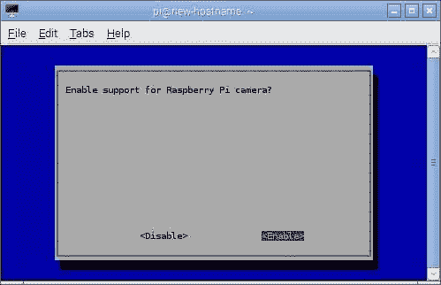
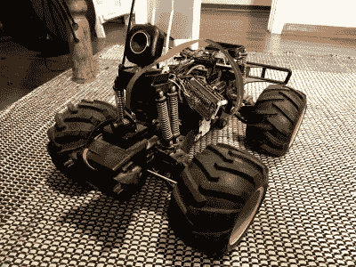

# 构建一个覆盆子 Pi 漫游者:我的大胖 Linux 周末

> 原文：<https://hackaday.com/2019/05/09/building-a-raspberry-pi-rover-my-big-fat-linux-weekend/>

Linux！这样一个美妙、丰富、强大的操作系统保佑了我们，而这一切都是为了绝对免费的低成本。它在无数服务器、计算机、电话和嵌入式设备的保护下，是当你想正确完成工作时的首选解决方案。那么，为什么它如此诅咒我？

## 序言

The penguin giveth, and the penguin taketh away.

我和全能企鹅的经历可以追溯到 90 年代末。脸书还没有被发明出来，所以大多数周末都用来安装最新的电脑杂志封面上的东西。我希望我是在开玩笑，但我真的不是。

很久以前，我们这些孩子会将最新的 Red Hat 或 Fedora 发行版加载到我们的二手奔腾 ii 上，尽量不要在这个过程中意外地擦除我们的硬盘。限于拨号上网和很少的帮助资源，你花几个小时看进度条，结果却没有可用的鼠标，或者 X 服务器根本拒绝启动，这是很常见的。我说过我们做这些是为了好玩吗？

## 努力完成一些工作

当然，长大后，真正的生活和真正的责任接管。现在，如果我在用 Linux，那是因为我有工作要做，而不仅仅是因为这个周末卡通频道没有什么好看的。我认为自己是一个相当中级的用户。我已经成功地编译了一些东西，了解了如何使用各种包管理器，并且曾经，仅仅一次，甚至成功地从命令行连接到无线网络。在这个领域里，已经没有太多让我心动的东西了。

在过去的几年里，[我一直在慢慢地研究一辆名为 TKIRV 的小型漫游者，以树莓皮](https://hackaday.com/2016/08/08/hackaday-prize-entry-solar-wifi-rover-roves-at-night/)为动力。早就该升级相机了，因为我已经用了太久的微软旧网络摄像头了。我订购了一台漂亮的 1080p Raspberry Pi 相机，自然地，这些零件在它们的盒子里浸泡了好几年。最后，在拖延了很久之后，我急切地想让我的小车重新上路。

这仅仅是我周末猎杀嵌入式 Linux 龙的开始。

## 重新配置全新安装

我坐了下来，很高兴看到一切都没有太多的麻烦。我保留了默认的密码，并重新配置了 Raspberry Pi 来连接 WiFi，因为我大约每 10 个月就搬家一次。我打开相机，插上扁平软电缆，然后…什么都没有！我不容易惊慌，平静地开始排除故障。

> 啊，启动摄像头需要一个工具。raspi-config……这应该能帮我解决问题。

It should have been this easy.

我很乐观，渴望用我的漫游者的新相机看到我的实验室的清晰高清。尽管我努力了，照相机仍然不能工作。我的眉头紧锁，因为我认真研究了论坛帖子不断扩大的网络。在这种情况下，许多人会建议做一些家务来整理东西。我敲了几下键盘，指示软件包管理器更新…和升级。我是多么愚蠢。

## 麻烦的最初迹象

在软件包管理器完成之后，我决定重启，这是惯例。启动时，我收到了一个登录提示。这通常不会引起警报，但是我的 Pi 被特别配置为*不这样做。**没关系，*我嘀咕着，我的眉毛抽动着，汗水在我的额头上串起。我输入了我的登录凭证，准备…

…登录屏幕再次出现。我眨了眨眼。肯定是打印错误。又来了。再一次。我反复检查了默认凭证，但还是失败了。屏幕将会空白，并返回到登录提示符。这简直令人抓狂，我再次向论坛求助。

我设法回到命令行，而桌面仍然是地平线上遥远的绿洲。又过了两个小时，我徒劳地试图清洗各种“~/”。剖析”文件和按摩“Xauthority”回到形状。尽管我尽了最大努力，但我所做的一切都无法让我重新振作起来。

迄今为止，我一直避免从头开始。虽然重新安装 Raspbian 是一项相当快速的工作，但我还是按照自己喜欢的方式进行了设置。我本想避免这种情况，但我别无选择。我下载了最新的图像，喷到 8GB 的 SD 卡上，然后深吸了一口气。我的考验肯定会很快结束。

## 他们当然不是

插入新的 SD 卡，我启动一切，等待。有了 Pi，就不会像以前的电脑那样发出咔哒声、哔哔声、嗡嗡声或呼呼声。你只需盯着一个闪烁的小 LED，看着启动序列飞快地过去。有点没有灵魂，但这是现代的方式。X 服务器给了我一个正常工作的桌面，我可以尽情地呼气了。

我掰着手指头，打开终端，决心开始工作。是时候开始重新安装 Python、Gstreamer 和大约 15 个其他有用的实用程序了，没有时间可以浪费了。在我做这些之前，我需要上网。

最初的 Pi Zero 没有板载 WiFi，所以 USB 加密狗是一个不错的选择。通常这是一个即插即用的事情，但是当然，Linux 还没有让我厌烦。如果你在这里遵循一般的主题，*我把它插上，它不工作。*

This rabbit-eared demon was the cause of much consternation. If you change the chipset, please change the model number. Help us all out.

我选择了 TP-Link WN-822N WiFi 适配器，它有几个版本，里面都有不同的硬件。在深入研究并发现我有一个采用 Realtek rtl8192cu 芯片组的版本 3 后，我发现 Raspbian 默认情况下没有安装相关的驱动程序。

很容易解决，对吧？错了——而且大错特错。看，在 Linux 中安装驱动程序并不总是那么容易。你必须首先找到驱动程序，如果你幸运的话，有人会为你的架构和你使用的发行版的精确版本编译它。否则，事情会变得棘手。当然，你也可以自己编译。这当然需要使用某些工具。这些可以很容易地安装，当你连接到互联网，也就是说。不幸的是，我没有。

TKIRV sits waiting, dying to explore once again…

在花了几个小时试图找到某种可以拷贝到 USB 驱动器上并安装的预编译驱动程序后，我快要崩溃了。幸运的是，事实证明我可以连接我的 iPhone，并上网足够长的时间来使用软件包管理器为 WiFi 加密狗安装合适的驱动程序包。就这样，Pi 重新上线了，我可以回去工作了。

## 收场白

可惜，此时，周末已经结束了。我有足够的时间安装几个软件包，并验证，是的…相机工作。现在，没有什么比这更好的了——我还有一大堆实用程序和库需要重新安装，一想到这些我就不寒而栗。但是相机还能用，我告诉自己现在这样就够了。

我的漫游者仍然静静地躺在我的书桌上。

你会再次滚动，wheely 博伊，我向你保证。

你会再次翻滚。