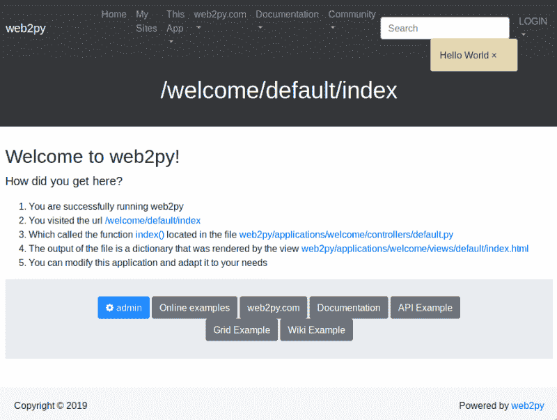

# 为物联网小工具构建简单的 Python API

> 原文：<https://hackaday.com/2019/02/21/building-a-simple-python-api-for-internet-of-things-gadgets/>

众所周知，我更喜欢将东西连接到互联网上，以获得乐趣和利润。我在这个过程中学到的一个技巧是构建简单的 API，这些 API 可以在构建项目原型时使用。这很容易做到，也很容易理解，所以我很乐意分享对我有用的东西，以 Web2Py 为例(有来自 ESP8266 和 NodeMCU 的客串)。

除了时代[我只是在犯傻](http://hackaday.com/2018/11/20/the-linux-throwie-a-non-spacefaring-satellite/)，有两个原因我可能会这样做。最常见的情况是，我需要从设备上收集数据，通常是为了以后的分析而存储，但偶尔也会触发云中服务器上的一些操作。不太常见的是，我需要一个设备根据从互联网上收到的指令来改变它的行为。


[Etherscan](http://etherscan.io) is an example of an API that saves me a lot of work, letting me pull data from Ethereum using a variety of devices.

在前一种情况下，我的第一选择一直是[使用物联网框架](http://hackaday.com/2017/10/31/review-iot-data-logging-services-with-mqtt/)，如 [Thingsboard](http://thingsboard.io/) 或 [Ubidots](http://ubidots.com/) 来接收和显示数据。它们的优点是易于使用，并且具有丰富的功能。它们甚至可以对数据做出反应，并向设备发回指令。在后一种情况下，我通常发现自己在使用应用编程接口(API)——互联网上开放的一些服务，我的设备可以轻松地从这些服务中请求数据，例如天气、区块链交易或新电子邮件通知。

有时，我会遇到一种需要处理的数据，或者这种数据的结构不适合存储在这些服务上，或者我需要一种设备来请求私有数据或目前没有人提供的数据。最常见的情况是，我需要更改几个相连器件的一些参数，而不必麻烦地找到它们，打开所有外壳，并对它们全部重新编程。

在这些时候，能够构建简单、短命的服务来填补原型开发过程中的这些空白是非常有用的。远不是一个安全的或消费者现成的产品，我们只是需要一些我们可以尝试的东西，看看一个想法是否值得进一步发展。有许多有效的方法可以做到这一点，但是我的第一选择是 [Web2Py](http://www.web2py.com/) ，这是一个用 Python 开发 Web 应用程序的相对容易使用的开源框架。它支持 Python 2.7 和 3.0，尽管我们今天将使用 Python 3。

## 初始设置:启动 Linux 服务器

在我们开始之前，我们需要两件东西:一个谷歌云计算虚拟机或运行 Ubuntu 或 Debian 的等效服务器，以及一个域名。目前，谷歌提供了一个免费层以及相当数量的免费信用，这两者都将为我们今天所做的事情提供足够的资源。一个域名大约需要 10 美元，可以从任何域名注册商处获得。在本文中，我们称之为“yourdomain.com”。

一旦你有了它，通过你的注册商提供的任何接口把你的域名记录指向你的服务器。然后，通过 SSH 或同等工具登录到您的服务器，并创建一个自签名证书，以便稍后启用 HTTPS:

```

$openssl genrsa -out server.key 2048
$openssl req -new -key server.key -out server.csr
$openssl x509 -req -days 365 -in server.csr -signkey server.key -out server.crt

```

我们需要启用 HTTPS，因为 Web2Py 不允许远程管理员登录。接下来，我们将安装在 Python 3 中运行 Web2Py 所需的包。Python 3 的虚拟环境可能是更好的方法，但是在我的例子中，我并不真的需要它。

```

$sudo apt-get update
$sudo apt-get install python3-setuptools
$sudo easy_install3 pip
$sudo apt-get install python3-dev

```

然后我们通过[在这里下载源代码](http://www.web2py.com/init/default/download)，解压文件，并运行它来设置 Web2Py 本身:

```
$python3 web2py.py -a 'youradminpassword’ -c /path/to/server.crt -k /path/to/server.key -i 0.0.0.0 -p 8000
```



Well hello to you too, world!

在本例中，我们将为 Web2Py 使用端口 8000，因此作为设置的最后一步，我们需要确保该端口对 TCP 流量开放。在 Google Cloud 中，你可以在网络–> VPC 网络–>防火墙规则下完成这项操作。

如果访问`[https://www.yourdomain.com:8000](https://www.yourdomain.com:8000)`导致一个欢迎页面，一切正常。

您可能希望在关闭 SSH 会话后保持 Web2Py 运行，在这种情况下，我建议使用 [tmux](http://hackernoon.com/a-gentle-introduction-to-tmux-8d784c404340) 。

## 存储设备中的数据

现在我们有了一个工作环境，我们将开始设置我们的第一个系统——一个允许我们存储设备数据的系统。Web2Py 使用了一个[模型-视图-控制器架构](http://en.wikipedia.org/wiki/Model%E2%80%93view%E2%80%93controller)。当我们创建一个名为“rxdata”的新应用程序时，它已经有了一个名为 db.py 的默认模型、一个名为 default.py 的默认控制器和一个名为 default/index.html 的默认视图。

我们将从定义一个简单的 SQLite 数据库模型来存储数据开始。我们打开 db.py 并在文件末尾添加以下内容:

```

service = Service()
db.define_table('mydata',
    Field('device', type='string', length=30, default=None,required=False, unique=False),
    Field('rxtime', type='string', length=30, default=None,required=True, unique=False),
    Field('datastore','text',label=T('Device Data'),requires = [IS_NOT_EMPTY(error_message='Data Field is Required')]))

```

这为我们提供了三个字段——一个用于标识数据来自哪里，另一个用于标识数据接收时间，最后一个字段包含数据本身。

现在，我们保存该文件并打开控制器 default.py 来定义用户将如何访问和处理我们的数据。Web2Py 有一个叫做 smartgrid 的简洁特性，它为我们提供了一个简单的 GUI 来处理创建、读取、更新和删除数据(CRUD)。请注意，我在这里特意添加了“user_signature=False”来禁用用户身份验证——当您完成测试时，您可能希望启用它。

```

import time
import datetime
def index():
    response.view = 'generic.html' # use a generic view
    grid = SQLFORM.smartgrid(db.mydata, deletable=True, editable=True, user_signature=False)
return dict(grid=grid)

```

接下来，我们需要定义一个服务，允许我们的物联网设备将数据插入数据库。注意，为了简洁起见，我在这里没有包括任何认证或加密，但是将我在上一篇文章中概述的一些技术应用于 HTTPS 而不是 MQTT 不会太难。

```

@service.run
def receive(chipid,newdata):
    time = str(datetime.datetime.now()).split('.')[0]
    ins = db.mydata.validate_and_insert(device=chipid,rxtime=time,datastore=newdata)
return newdata

def call():
    session.forget()
    return service()

```

使用该服务，您可以将通过 HTTPS 请求传递的数据放入数据库。函数“rxdata”有两个参数，chipid 和 newdata。提供这些参数有两种格式，通过访问`[https://www.yourdomain.com:8000/rxdata/default/call/run/receive/chipid/newdata](https://www.yourdomain.com:8000/rxdata/default/call/run/receive/chipid/newdata)`
或使用
`[https://www.yourdomain.com:8000/rxdata/default/call/run/receive?chipid=chipid&newdata=newdata](https://www.yourdomain.com:8000/rxdata/default/call/run/receive?chipid=chipid&newdata=newdata)`

让我们看看如何在运行 NodeMCU 的 ESP8266 上使用后一种格式实现这一点。请注意，您将需要使用 TLS 支持进行编译，以允许 HTTPS 为此工作:

```

function senddata()
    chipid = node.chipid()
    data = “This is the data you are sending”
    print(data)
    url = &quot;https://yourdomain.com:8000/rxdata/default/call/run/receive?chipid=&quot; .. chipid .. &quot;&amp;amp;amp;amp;amp;amp;amp;amp;amp;newdata=&quot; .. data
    print(url)
    http.get(url, nil, function(code, data)
    if (code &amp;amp;amp;amp;amp;amp;amp;amp;lt; 0) then
        print(&quot;HTTP request failed&quot;)
        function_if_failed()
    else
        print(code, data)
        function_if_successful()
    end
    end)
end

```

由于服务返回参数“newdata”，当我们查看 ESP8266 控制台时，应该会看到类似`200 <same data we sent>`的确认，以及在 [https://www.yourdomain.com:8000/rxdata](https://www.yourdomain.com:8000/rxdata) 访问时数据库中的一些新条目:


The search functions in the GUI are really quite useful, and you can export data in various formats.

## 控制设备是一个简单的调整

刚才，我们通过请求一个包含我们要发送的数据的 URL 从一个设备发送数据，并收到来自网站的回显数据的响应。如果我们是在请求命令而不是发送数据呢？原来一个简单的实现只需要在我们的 default.py 控制器中定义一个稍微不同的服务:

```

@service.run
def command():
    command = 1
    return command

def call():
    session.forget()
    return service()

```

当设备访问`[https://www.yourdomain.com:8000/rxdata/default/call/run/command](https://www.yourdomain.com:8000/rxdata/default/call/run/command)`时，它将接收到命令‘1’。我们可以这样实现:

```

function startup()
    url = &quot;https://www.yourdomain.com:8000/rxdata/default/call/run/chan&quot;
    http.get(url, nil, function(code, data)
    if (code &amp;amp;amp;amp;amp;amp;amp;amp;lt; 0) then
        print(&quot;HTTP request failed. Retrying.&quot;)
    else
        print(code, data)
        command = data
        carry_on()
    end
    end)
end

```

此外，在设备端，我通常会根据收到的命令配置一些操作模式，或者允许命令设置一些参数的值，如采样率、授权用户、深度睡眠时间，或者我可能需要在原型中频繁更改的任何内容，将来有一天原型会有更完整的后端。

我应该提到的是，这让我可以把我的烤面包机和更多的东西联系起来，因为很遗憾，这就是我的幽默感发挥作用的方式。这可能是另一天的故事，所以…做好准备。