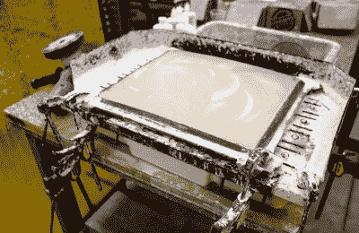

# 建造复制品 Amigas 以保存数字艺术品

> 原文：<https://hackaday.com/2021/02/17/building-replica-amigas-to-preserve-digital-artwork/>

几年前，安迪·沃霍尔博物馆遇到了一个不寻常的问题。他们想展示这位流行艺术家在 20 世纪 80 年代用他的 Amiga 1000 创作的数字作品，但把老式电脑放在地板上，让公众在上面闲逛并不是一个真正的选择。因此[【ion tank】团队的任务是创造一个互动显示器，使*看起来*像一个真正的 Amiga](https://www.iontank.com/projects/warhol-amiga) ，但在引擎盖下使用了所有现代技术。

不幸的是，电子设备方面的技术细节有点少，因为[Iontank]网站上的页面只是说所有的内部部件都被替换为“固态硬件”和 Amiga 仿真器。对我们来说，这听起来像是树莓皮现在正在取代 Amiga 的原始主板，但这只是一种猜测。该页面确实指出，他们经历了确保原始鼠标和键盘仍然工作的麻烦，因此有理由认为几个微控制器也在一起做翻译工作。

Milling the curved display lens.

虽然我们对计算机了解不多，但[Iontank]确实提供了一些有趣的见解，有助于开发位于非 Amigas 之上的人造 CRT。早期进行了一些有前途的背投实验，但最终，他们决定在研磨的丙烯酸透镜后面使用标准的 LCD。这不仅完美契合了最初的显示器外壳，还赋予了屏幕现代平板显示器所没有的凸起深度。

最终的结果看起来两全其美，结合了 LCD 的清晰明亮图像和一丝复古失真。在组合中使用扫描线发生器，这项技术将是一种很好的方式来模拟 T2 在拱廊橱柜中的 CRT 显示器的外观，尽管无可否认的是，对于大多数家庭游戏玩家来说，能够磨出合适尺寸的丙烯酸透镜是一项艰巨的工作。

感谢德里克的提示。]