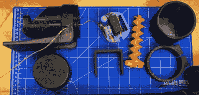

# 建造附近最高科技的池塘

> 原文：<https://hackaday.com/2022/08/11/building-the-most-high-tech-pond-in-the-neighborhood/>

听到池塘这个词你会想到什么？如果你和大多数人一样，它会让你联想到地上一个简单的充满水的洞，也许还会添加一些鱼。但(安德斯·约翰逊)不是——他的池塘是一个技术奇迹，[使用了更多独特的硬件和软件](https://github.com/boanjo/poseidon)超过了多年来为这些项目增光添彩的许多更传统的项目。

事实上，这是一个如此宏大的项目，以至于我们在这里发表的任何总结都无法做到公正。名副其实的“海神号”项目由几个模块化组件组成，从自动喂鱼器到监测水质的传感器阵列。有多少其他池塘可以通过 MQTT 发布它们当前的水位、pH 值和氧饱和度？

The ESP8266 fish feeder is just one element of Poseidon

[Anders]提供了构建在池塘中的所有各种系统的原理图、3D 模型和源代码，但文档才是这个项目真正的亮点。每一个模块都有自己的详细介绍，如果你想重新创作或重新混合他的作品，这将为你提供足够多的指导。即使你只使用他组装的一两个模块，与那些不得不用传统方式维护池塘的傻瓜们相比，你仍然领先于这个游戏。

在过去，我们已经看到了解决[Anders]开发的一些独立元素的项目，如 3D 打印的喂鱼器，但在搜索了档案后，我们找不到任何像海神号一半雄心勃勃的东西。至少对池塘来说不是。[它让我们想起了一个非常先进的水产养殖设施](https://hackaday.com/2013/01/16/no-sleep-till-brooklyn-aquaponics-installation-is-complete/)，我们想知道这是否可能不是未来核心项目的副产品。