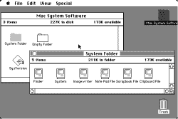
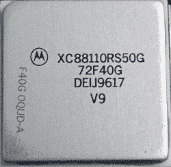
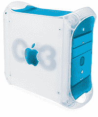
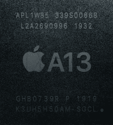

# 不断变化的系统架构和苹果公司对 ISAs 的蝶式方法的复杂性

> 原文：<https://hackaday.com/2020/07/13/changing-system-architectures-and-the-complexities-of-apples-butterfly-approach-to-isas/>

苹果电脑将从英特尔芯片转向自己的基于 ARM 的设计。作为一家公司，苹果的一个有趣之处在于，它从未觉得有必要将自己与特定的系统架构或 ISA 捆绑在一起。尽管像微软这样的公司大多将其命运与英特尔的 x86 体系结构联系在一起，并且 IBM、Sun、惠普和其他巨头更喜欢垂直集成，但苹果公司目前正在向其自公司成立以来的第五个计算机系统体系结构迈进。

然而，使这一最新变化可能独一无二的是，苹果不再依赖外部供应商提供 CPU 和外围 IC，他们现在的目标是垂直集成方法。虽然 ARM ISA 是由 Arm Holdings 授权给苹果的，但苹果 ARM 处理器中使用的“苹果硅”设计是他们自己的，由苹果自己的工程师生产，由苹果委托的代工厂生产。

在这篇文章中，我想回顾一下苹果几十年来的架构决策，以及这些决策是如何让苹果走向垂直整合的。

## 时代的产物

The Apple I. Wooden board not included in delivery.

20 世纪 70 年代无疑是计算机进入美国起居室的时代，宠物准将、坦迪·TRS-80 和 Apple II 微型计算机是 20 世纪 70 年代末的标志。就在 Apple II 发布前一年左右，史蒂夫·沃兹尼亚克和史蒂夫·乔布斯新成立的合作伙伴生产了 Apple I 电脑。后者以 666.66 美元(2019 年为 2995 美元)的裸组装 PCB 出售，售出约 200 台。

像 Apple I 一样，Apple II 和 Commodore PET 都基于 [MOS 6502](https://en.wikipedia.org/wiki/MOS_Technology_6502) MPU(微处理器单元)，这基本上是[摩托罗拉的 6800](https://en.wikipedia.org/wiki/Motorola_6800) MPU 的更便宜和更快的版本， [Zilog Z80](https://en.wikipedia.org/wiki/Zilog_Z80) 是另一种流行的 MPU 选项。让 Apple II 与众不同的是沃兹尼亚克降低硬件成本的工程捷径，使用各种技巧来节省单独的 DRAM 刷新电路，并消除对单独视频 RAM 的需求。根据沃兹尼亚克在 1977 年 5 月的一次字节采访中所说，“[..]个人电脑应该小巧、可靠、使用方便、价格低廉

通过 Apple III，苹果看到了为 Apple II 提供向后兼容性的需要，这很容易，因为前者保持了相同的 6502 MPU 和兼容的硬件架构。然而，苹果的工程师们确实设置了限制，防止模拟的 Apple II 系统访问 Apple III 的 RAM 和其他硬件的一小部分以上。

## 32 位摩托罗拉时代

随着命运多舛的苹果 Lisa (1983)和成功得多的苹果 Macintosh (1984)，苹果过渡到摩托罗拉 68000 (m68k)架构。Macintosh 是第一个采用经典 Mac OS 系列操作系统的系统，当时被富有想象力地命名为“ [System 1](https://en.wikipedia.org/wiki/System_1) ”。作为进入 32 位、基于 GUI、鼠标驱动的桌面这个美丽新世界的第一步，它并没有关注向后兼容性。经通货膨胀调整后，它的价格也远远超过 6000 美元。

Welcome to the future of home computing.

基于 m68k 的麦金塔系统的统治一直持续到 1995 年麦金塔 LC 580 的发布。该系统的特色是一个运行频率为 33 MHz 的摩托罗拉 [68LC040](https://en.wikipedia.org/wiki/Motorola_68040#Variants) 。LC 580 中的特定 CPU 有一个缺陷，在与软件 FPU 仿真器一起使用时会导致不正确的操作。尽管 68LC040 的固定版本于 1995 年中期推出，但为时已晚，无法阻止许多 LC 580s 与有缺陷的 CPU 一起发货。

在 LC 580 发布的前一年，在苹果与 IBM 合作开发 PowerPC 系列芯片几年后，第一款 Power Macintosh 系统已经发布。这种转变的原因主要可以从 CISC m68k 架构的疲弱性能中找到，苹果担心该行业正在转向性能更好的 RISC 架构，这些架构来自 IBM (POWER)、MIPS、Sun (Sparc)和惠普(HP)。这让苹果别无选择，只能寻求 m68k 平台的替代品。

## 获得权力或垂直发展

后来被称为 [Power Macintosh](https://en.wikipedia.org/wiki/Power_Macintosh) 系列系统的开发始于 1988 年，苹果公司曾短暂地考虑过制造自己的 RISC CPU，直到他们购买了一台 Cray-1 超级计算机来协助设计工作。最终，由于缺乏这方面的专业知识，他们被迫取消了这个项目，需要寻找可能的合作伙伴。

苹果将考虑 Sun、MIPS、英特尔(i860)和 ARM 的可用 RISC 产品，以及摩托罗拉的 88110(88000 RISC 架构)。除了摩托罗拉之外，所有的产品最初都被拒绝:Sun 没有能力生产足够多的 CPU，MIPS 与微软有联系，英特尔的 i860 太复杂，IBM 可能不想将其 POWER1 core 授权给第三方。与此同时，苹果确实收购了 ARM 43%的股份，并将在其牛顿个人数字助理中使用 ARM 处理器。

Motorola 88110, or what could have been Apple’s future.

在“美洲虎”项目的名字下，开发了一个使用摩托罗拉 88110 的系统，但当苹果产品部门总裁( [Jean-Louis Gassée](https://en.wikipedia.org/wiki/Jean-Louis_Gass%C3%A9e) )离开公司时，该项目被取消。对 88110 的再次怀疑导致苹果和 IBM 代表之间安排了一次会议，其想法是将 POWER1 的七个芯片合并成一个单芯片解决方案。摩托罗拉也出席了这次会议，会议同意建立一个联盟，这将导致 PowerPC 601 芯片。

苹果的 System 7 操作系统被改写为使用 PowerPC 指令，而不是 m68k 指令，这使得它可以用于第一台基于 PowerPC 的 Macintosh，即 [Power Macintosh 6100](https://en.wikipedia.org/wiki/Power_Macintosh_6100) 。由于当时 PowerPC 相对于 m68k 具有更高的性能，所有 PowerPC Macs 附带的 [Mac 68k 仿真器](https://en.wikipedia.org/wiki/Mac_68k_emulator)实用程序足以提供向后兼容性。更高版本使用动态重新编译来提供更高的性能。

## 权力的十年

Who doesn’t miss this Apple?

PowerPC 时代可能是所有苹果设计中最与众不同的，彩色的一体化 iMac G3 和 Power Macintosh G3 和 Power Mac G4 以及 Power Mac G5 仍然是苹果系统与“个人电脑”的明显区别。不幸的是，到了 PowerPC CPUs 的 G4 和 G5 系列，它们的性能已经落后于 Intel 和 AMD 基于 x86 的产品。尽管在所谓的“MHz 战争”中，英特尔在 Netburst(奔腾 4)架构上犯了一个代价高昂的错误，但这并没有阻止 PowerPC 越来越落后。

Power Mac G5 及其水冷 G5 CPUs 很难跟上竞争，并且性能功耗比很低。IBM 和苹果之间关于是专注于 PowerPC 还是 IBM 的名为“Power”的服务器 CPU 的演变的挫折在这里没有帮助。这让苹果得出了一个显而易见的结论:未来在 CISC，在英特尔 x86 架构下。随着 2006 年基于英特尔的 Mac Pro 的推出，苹果的第四次架构转型开始了。

正如 90 年代早期从 m68k 到 PPC 的过渡一样，Mac 68k 仿真器也使用了类似的实用程序，称为 [Rosetta](https://en.wikipedia.org/wiki/Rosetta_(software)) 。这个[动态二进制翻译器](https://en.wikipedia.org/wiki/Binary_translation#Dynamic_binary_translation)支持 G3、G4 和 AltiVec 指令的翻译，但不支持 G5 指令。它还带来了许多其他的妥协和性能限制。例如，它不支持 Mac OS 9 和更旧版本的应用程序(“经典”Mac OS)，也不支持 Java 应用程序。

Mac 68k 仿真器和 Rosetta 之间的主要区别在于，前者运行在内核空间，而后者运行在用户空间，这意味着由于任务切换的开销，Rosetta 的效率要低得多。这些妥协导致苹果也推出了“[通用二进制文件](https://en.wikipedia.org/wiki/Universal_binary)”格式，也被称为“胖二进制文件”和“多架构二进制文件”。这意味着同一个可执行文件中可以包含多种架构的二进制代码，比如 PowerPC 和 x86。

## 垂直整合的结果是好的

The Apple Silicon future.

我们中很少有人可能错过了最近的 WWDC 公告，苹果公司正式宣布[将转而使用 ARM 系统架构](https://en.wikipedia.org/wiki/Mac_transition_to_ARM)，放弃 14 年后的英特尔。这种变化背后的真正原因不得不等待，原因显而易见，但当苹果公司在 2009 年收购无晶圆厂半导体公司 P.A. Semi 时，这一点就很明显了。自从苹果开始为其 iPhones 生产 ARM SoCs，而不是从其他公司获得，谣言就开始传播。

随着这款[苹果芯片](https://en.wikipedia.org/wiki/Apple_Silicon)的性能开始在苹果 iPhones 和 iPads 的基准测试中赶上并超过台式机英特尔系统，许多人认为苹果发布这样的公告只是时间问题。还有一个[挥之不去的问题](https://www.extremetech.com/mobile/279988-apples-ipad-pro-a12x-nearly-matches-top-end-x86-cpus-in-geekbench)，英特尔自 2015 年推出 Skylake 以来，一直没有重大的处理器产品更新。

那么，我们到了。这是 1994 年，苹果公司刚刚宣布，它将从 m68k CISC 过渡到自己的(基于 ARM？)RISC 架构。只是 26 年后，苹果正在从 x86 CISC 过渡到自己的基于 ARM 的 RISC 架构，似乎完成了一个始于 20 世纪 80 年代末苹果的过程。

至于这一过渡期间的用户体验，它实际上是 2006 年及以后从 PowerPC 到 Intel 过渡的重复，带有 Rosetta 2 (Rosetta Harder？)为还没有本机 ARM 端口的应用程序处理(一些)二进制翻译任务，并为其他应用程序处理通用二进制(v2.0)。在未来十年左右的时间里，苹果将会发现自己跨越了 x86 和 ARM 之间的鸿沟，在经历了近五年的外国系统架构之间的转换后，它可能会在自己新的垂直整合的家中安顿下来。