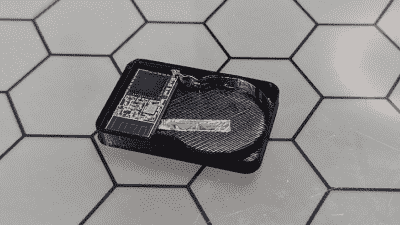

# 使用 AirTag 基础设施检查您的邮箱

> 原文：<https://hackaday.com/2022/05/30/check-your-mailbox-using-the-airtag-infrastructure/>

当一家公司创建了一个设备基础设施时，我们有时会颠覆这个基础设施，并用它来解决棘手的问题。例如，这里有一个许多黑客都思考过的问题——当有人将邮件放入您的邮箱时，您如何检测？根据电源和无线/有线连接选项的可用性，该问题可能从“非常容易”到“无法解决”不等。[dakhnod]只是让这个问题对绝大多数黑客来说变得微不足道，FakeTag 项目——借用了苹果的 AirTag 基础设施。

该项目使用廉价的通用 CR2032 供电的 NRF51822 板，通过苹果为 AirTag 设备构建的 FindMy 系统发送邮箱状态。对于收到的邮件检测，他使用一个简单的振动传感器，粘在翻盖上——我们想象，对于无翻盖的邮箱，可以使用光学传感器或不同类型的机械传感器。每当有人拿着支持 FindMy 的 iPhone 路过[dakhnod]的邮箱时，他就会收到一条状态更新，并显示传感器被触发的次数。[dakhnod]估计该设备可以在一块电池上运行长达一年。

标题图中显示的具体的 NRF51822 板，网上好像卖 7 美元左右，但是有很多不同的 NRF51822 板可供选择，你应该可以使用其中任何一种。例如，[dakhnod]给我们发了一张他设计的不同传感器的照片，放在 3D 打印的盒子里，用铜带连接到 CR2032 电池。到目前为止，一个友好的黑客空间在某个地方的抽屉里有几块合适的板是有可能的！

这个项目建立在 OpenHaystack 项目的基础上，这是一个我们之前告诉过你的研究项目。我们以前甚至见过[ESP32 微控制器被](https://hackaday.com/2022/02/22/no-privacy-cloning-the-airtag/)用于构建克隆，但 NRF51822 的低功耗特性在实际应用中无与伦比。