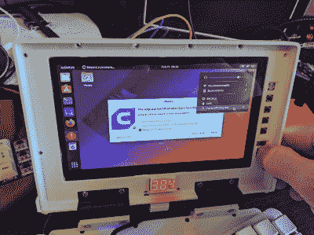

# Chonky 掌上电脑将滑入你的心脏

> 原文：<https://hackaday.com/2022/04/29/chonky-palmtop-will-slide-into-your-heart/>

你现在可能知道什么是网络甲板，但是你会发现人们的定义不同。有些人使用这个词相当宽松，把它用在最容易被拖走的东西上。但是我们认为你会同意由[丹尼尔·诺里斯]又名[a8ksh4] 创造的[“Chonky 掌上电脑”毫无疑问是非常赛博德克式的。](https://gitlab.com/norris.daniel/chonky-palmtop)

cyberdeck 的一个标志是它可以折叠，通常就像一台笔记本电脑，屏幕在键盘上。不仅 chonky palmtop 做到了这一点，而且分离键盘(稍后将详细介绍)也有令人印象深刻的枢轴几何结构和真正令人满意的滑块机制。整个东西折叠成一个小砖块，[丹尼尔]说它大约有一台旧的华硕 EEE 笔记本电脑那么大。(还记得那些坏男孩吗？那些日子。)

 砖块里面是一些你可能会想到的东西，比如树莓派 4 和 7 英寸触摸屏。【a8ksh4】还装了一个 AmpRipper 3000 LiPo 充电器，特别适合高压项目。说到这里，有一个电压按钮来检查电池电量，然后显示在三个 7 段显示器上，就在屏幕下方的中间。

现在关于分离键盘——这是一个角，是一种介于太多键和太少键之间的中间选择，42 个键对大多数人来说可能已经足够了。考虑到整体大小，我们认为这是一个很大的数量的关键。

不是说你可以从那些 Chocs 上的键帽看出来，但是[a8ksh4]正在撼动 Miryoku 的布局和固件。滑过休息时间，观看 chonky palmtop 展开，启动到 Ubuntu，并在一个简短的演示视频中关闭。

 [https://www.youtube.com/embed/5uxr-FFjzCg?version=3&rel=1&showsearch=0&showinfo=1&iv_load_policy=1&fs=1&hl=en-US&autohide=2&wmode=transparent](https://www.youtube.com/embed/5uxr-FFjzCg?version=3&rel=1&showsearch=0&showinfo=1&iv_load_policy=1&fs=1&hl=en-US&autohide=2&wmode=transparent)

