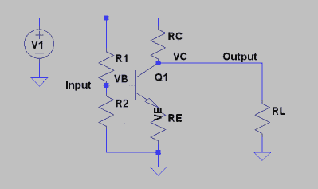
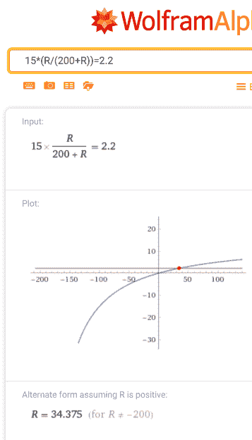
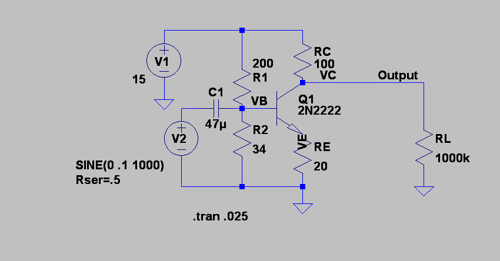
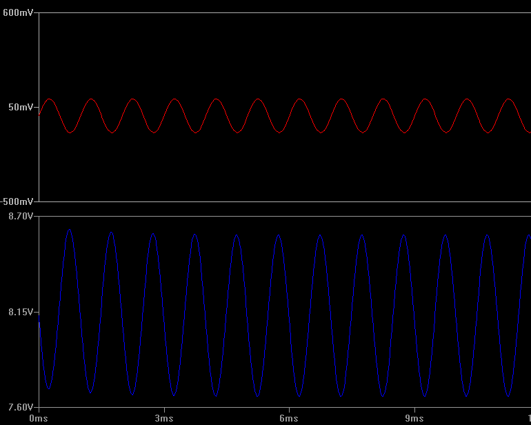
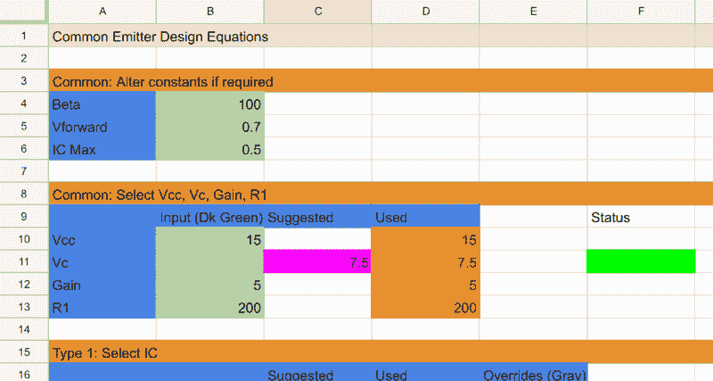
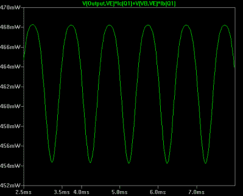
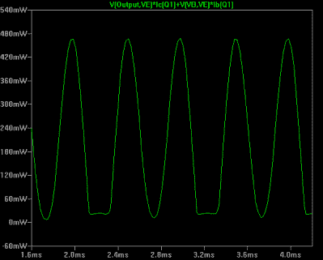

# 电路虚拟现实:开始放大器设计

> 原文：<https://hackaday.com/2018/08/10/circuit-vr-starting-an-amplifier-design/>

有时我希望场效应晶体管在双极晶体管之前就已经变得实用了。场效应晶体管更像是一个电子管，可以放大电压。双极晶体管放大电流，这使得它们有点难以使用。最近【Jenny List】做了一个关于晶体管放大器的系列包括这个电路 VR 的话题，[共发射极放大器](https://hackaday.com/2018/05/04/biasing-that-transistor-part-1-the-common-emitter-amplifier/)。[Jenny]谈到了偏见。我也将从偏置开始，但在下一篇文章中，我想谈谈如何在该设计中使用电容，如何将两个放大器融合在一起，以及为什么要这样做。

但在深入研究电容和级联之前，我们需要对如何开始偏置晶体管有一个良好的感觉。一如既往，有好消息也有坏消息。坏消息是不同设备的晶体管差别很大。好消息是，我们将使用一些设计技巧来避免这一问题，这也将使我们对元件值有相当大的容忍度。最终的放大器不一定精确，但对大多数用途来说是不错的。像往常一样，你可以在 [GitHub](https://github.com/wd5gnr/circuitvr/tree/master/common-emitter) 上找到所有的设计文件，我们将使用 [LT Spice 模拟器](https://hackaday.com/2016/02/26/adding-spice-to-your-workbench/)。

## 今日巡回赛

 这是一个基本的共发射极放大器，还没有电容。晶体管会将基极电流放大β倍，从而产生集电极电流。为了简化设计过程，我们将做许多假设，其中之一是基极电流要足够小，使发射极电流与集电极电流相同。这意味着我们可以认为集电极和发射极电流只是基极电流的β倍。

不过，还是有一些问题。首先，beta 是一个很糟糕的设计参数。它变化很大，原因很多。所以我们想改变我们的设计，使它不那么依赖测试版。此外，晶体管必须处于激活模式才能工作。出于我们的目的，这意味着基极上的电压必须能够比发射极上的电压高大约 0.7 V。由于发射极在这里接地，因此不能将 0.3 V 电压加在基极上，然后期望发射极以某种方式补偿另一个 0.4 V 电压，但是，如果将 3 V 电压加在基极上，那么发射极将有 2.3 V 左右的电压，具体数字取决于温度和电流水平，但我们假设 0.7 V 电压足够接近。

R1 和 R2 背后的想法是设置基极电压，使晶体管进入有源区。该输入将导致它在该数字附近摆动，从而产生发射极电压的变化。如果我们正确设置所有组件，这些摆动会在集电极侧产生相应的负摆动，幅度会大得多。有时，输出来自收集器。有时，集电极电阻就是负载。对我们来说，这并不重要。

## 足够近通常就足够好了

尝试精确模拟压降和所需电阻值是很有诱惑力的。但事实是，晶体管差别很大。您的电阻有一个可能的值范围。你不太可能得到(或需要)完全完美的东西。如果你需要极其精确的电路，这本身就是一门完整的设计学科。

偏置这样的放大器至少有两个出发点。显然，输出信号只能低至 0 V，高至电源电压(Vcc)。晶体管不能产生更多的电压，将会限制任何超出这些限制的电压。因此，为了在不失真的情况下获得最大可能的输出范围，我们应该将集电极电压设置为电源电压的一半。

然而，有时我们希望一级的输出阻抗与下一级的输入阻抗相匹配。在这种情况下，您需要选择一个固定的 RC 值，因为这是放大器的输出阻抗。我们将回到这个话题，但现在，让我们假设我们设置 Vc 为电源电压的 1/2。你可能想快速浏览主题“总结”来了解我们将要采取的步骤，然后再回到这里了解细节。

## 细节

接下来你需要选择的是实际的集电极电流和目标增益。请记住，最大信号乘以增益必须在 1/2 Vcc 限值以内。因此，+/- 1V 的输入信号会将增益限制在 7 左右。集电极电流将影响你能传送到下一级的功率。对于一个简单的放大器，你可以选择一个比晶体管最大值稍低的数字。例如，如果您认为器件最高可达 100 mA，您可能会选择 75 mA。

假设我们的电源电压为 15 V，Ic=75 mA，我们需要 5 倍的适度增益。我们知道，我们希望 Vc 为 7.5 V，这意味着 RC 必须降低剩余的 7.5 V，利用欧姆定律，我们可以看到 RC 必须等于(15-7.5)/0.075 = 100 欧姆。放大器的增益主要由 RC/RE 的比值决定。因此，如果 RC 为 100，增益为 5，则我们解出 5=100/RE，可以看出 RE 必须为 20ω。

我们知道通过 RE 需要 75 mA 电流，如果它是 20ω，那么我们得到 Ve = 1.5 V，因为基极必须比 Vb = 2.2 V 高 0.7 V，现在我们必须选择 R1 并计算 R2。为了让我们的一些假设成立，特别是β(B)不会影响增益，R1 和 R2 的并联组合需要比 RE*(B+1)小得多。如果我们假设 B 为 100，我们得到的电阻组合必须远远小于 2020 欧姆。

 让我们从 200 欧姆的 R1 低值开始。分压器看起来很简单，但你必须考虑到这样一个事实，即 R2 将与(大约)RE 乘以β并联。然而，由于我们正试图得到比这少得多的东西，你可以忽略这种影响。让我们两方面都试试。

顺便说一下，Wolfram Alpha 非常适合解决这些方程，如果你懒得做的话。我们需要一个分压器将 15 V 电压降至 2.2 V，我们知道 R1 是 200 欧姆。[求解](https://www.wolframalpha.com/input/?i=15*(R%2F(200%2BR))%3D2.2)你得到大约 34 欧姆。

不过，你可以走远路。为了简单起见，我们假设 RX = R2 * B * RE/(R2+B * RE)—R2 和 RE 的并联组合。现在我们可以用 RX 代替 R2 求解分压器，得到相同的答案，34。现在的问题是“R2 与 2000 欧姆并联得出 34 欧姆的值是多少？”[求解](https://www.wolframalpha.com/input/?i=34%3D2000*R%2F(2000%2BR))得到大约 34.6 欧姆。所以 34 欧姆可能没问题。如我所说，当你考虑到我们在容差、温度变化等方面有多么草率时，足够接近通常就足够好了。

就是这样！你现在知道所有电阻的值。您必须设置电源电压、集电极电流、增益，并任意选择一个电阻值。

这是具有选定值的模拟电路。注意，输入端有一个电容。我们会在下一个电路 VR 中讨论为什么那个电容会在那里。

注意，垂直刻度并不相同，但它们确实代表相同的电压增量(1.1 V)。对于 0.2 V 峰峰值输入，输出接近 1 V，因此增益为 5 是正确的，但显然存在 DC 偏移。另外，请注意放大器反相。顶部轨迹上的峰对应于底部轨迹中的谷。这是共发射极设计所期望的。

## 概括起来

以下是供参考的步骤:

1.  选择约为电源电压(Vcc)1/2 的 Vc
2.  选择在设备范围内的 Ic(参见下面的更新了解更多信息)
3.  选择您的实际目标增益(G)(输入信号乘以 G 必须小于 Vc)
4.  计算 RC=(Vcc-Vc)/Ic
5.  计算 RE=RC/G
6.  计算 Ve=RE*Ic(假设 Ic=Ie)
7.  计算 Vb=0.7+Ve
8.  选择 R1(注意，与 R2 并联的 R1 需要比 RE*(Beta+1)小得多)
9.  为 R2 求解 Vb=Vcc*(R2/(R2+R1))
10.  如果需要更高的精度，求解 R2 = R2 ' *贝塔*RE/(R2 '+贝塔* RE)得到 R2 '，用 R2 '作为 R2
11.  验证与 R2 并联的 R1 远小于 RE *(β+1)

为了确保晶体管的β不会变得显著，您可以应用经验法则，即 RE *(β+1)应远大于 R1 和 R2 之间的并联电阻。例如，R1=100，R2=300，并联值为 75 欧姆(100*300/(100+300))。但是对于 20 欧姆环和 100 的β值，剩下的是 75<2020，这是一个合理的说法。

为了让事情变得更简单，我在[中加入了一个谷歌电子表格](https://docs.google.com/spreadsheets/d/1aqnElnE4TMKD-cQmnPr0d9aq_zXHk4yU2nl2ZL_R9Mk/edit?usp=sharing)来捕捉所有这些信息。这些数字可能会有一点变化，因为当我在桌子上涂鸦时(像 34 欧姆 R2)，我会四舍五入中间结果，电子表格不会。电子表格中有使用说明。

## 电容呢？

我答应过我们要讨论电容器，但今天已经够了。您已经看到，输入端有一个电容。这可以防止输入扰乱我们创建的 DC 偏置安排。出于同样的原因，我们通常会在输出中添加另一个。此外，我们还可以增加第三个电容，在不牺牲 DC 稳定性的情况下提高增益。

当然，就像电阻一样，诀窍是找到这些电容的值，并了解它们如何改变电路。同时，很容易在模拟器中对电路进行实验。改变 RL 对事情有什么影响？通过观察来自 V2 的电压和电流，你能算出放大器的输入阻抗吗？改变 V2 的振幅或频率如何改变输出？你能确定什么样的 RL 值能从放大器获得最大功率吗？给你个提示。如果 Q1 完全关闭，RL 需要什么值才能获得最大功率？我们将在下次讨论这些话题。

## 更新

一般来说，Hackaday 和在线出版的一大好处是我们可以参与对话，这篇文章当然引起了一些评论。

一些评论者抱怨 Ic 的高价值。当然，这里的 Ic 值(75 mA)高于该放大器所需的值。然而，尽管我喜欢四舍五入和估算，但至少有一条评论高估了功耗。

正如我上面提到的，Ic 的选择可能会考虑几个因素，这就是为什么它是算法的一个输入。一切都是一种权衡，取决于你想优化什么，在这种情况下，我只是拿出一个例子，没有特别的设计优化。然而，让我们来看看 Q1 的力量。

### 在 Q1 计算权力

晶体管中的功率就像大多数与电路有关的东西一样。确切的数字取决于许多贡献不大的小事(如基极电流)和一两个往往占主导地位的大事。因此，最接近的近似值是集电极和发射极之间的电压(Vce 或 Vc-Ve)乘以集电极电流(Ic)。根据您阅读的数据手册以及外壳是金属还是塑料，您会发现不同的 Pd 值，即器件能够处理的最大功率(通常指定为 25C)。一个金属设备的数据表说它可以处理 500 mW，如果你将外壳散热到 25C，它可以处理超过一瓦。根据 ON Semiconductor 和 Fairchild 的说法，更常见的 2N2222A 塑料 TO92 封装在室温下可以达到 625 mW，尽管 ST 的报价为 500 mW。

一条评论提到，通过晶体管的功率为 560 mW，这对于没有散热器的数据手册中的最低额定值来说太高了。然而，由于评论者过于简单化，这个数字并不正确。

### 模拟功率

在我进一步解释之前，我们先来看看 LTSpice 是怎么说的。这是 Q1 的电力图。您可以通过在探测晶体管时按 Alt 键(光标变为温度计符号)来获得此信息。

峰值远低于 500 mW，略低于 470 mW。的确，这比需要的要高，但即使在这些设备的最低额定功率下也能工作。您还会注意到，所用的表达式 LTSpice 确实考虑了基极电流等因素。然而，这是在特定输入电压下，因此最大值可能会更大，对吗？

### 输入的影响

不过，请记住，放大器的增益为 5，起始电压为 7.5V。因此，15V 电源下的最大输入为 7.5 除以 5，即+/-1.5V。这会导致 Vc 发生 7.5V 的偏移，从而产生 0V 或 15V 输出。实际上，您可能无法不失真地达到这些限值，但出于我们的目的，假设输入在该范围内(如果不是更小的话)是合理的。

如果您在模拟器上输入 1.5V 信号，您将在 Q1 看到以下功率，您可以看到低端失真。你还会注意到通过晶体管的功率并没有高多少。事实上，正如你将看到的，最大功率无论如何都不是最大输入。

### 为什么是 560 vs 450？

那么为什么会有差异呢？560 兆瓦的数字是通过简化得出的。我通常都是做一个简化，但是这个有点太简单了。评论者似乎将 Vce(从集电极到发射极的电压)视为 7.5V，将 IC 视为 75mA。问题是，没有信号输入时，Vce 不是 7.5V，而是 Vc，即集电极相对于地的电压。

根据设计，Ve 为 1.5V，因此无信号时 Vce 为 6V，此时的功耗为 0.75 的 6 倍，即 450 mW。然而，你可能认为，通过正确的信号输入，Vce 最终将达到 7.5V，因此该评论仍然有效。

但是想想 Vc 崛起会怎么样。会发生两件事。首先，Ic 下降，因为 Rc (15-Vc)两端的电压变小。其次，输入电压必须下降约 1/5 的变化量(该级以 5 倍的增益反相)。

如果 Ic 下降，Vce 稍微上升，就会改变功耗。如果 Vc 下降，Ic 就会增加。但这也意味着基极电压上升，这增加了 Ve，从而降低了 Vce。

所以 Vce 增加，Ic 下降，反之亦然。结果，最大功率在中性点，我们看到是 450 mW。这与 LTSpice 不太一致，因为它也从基极电流、输入信号和流过负载电阻的电流来考察功率。如果从仿真中移除负载和输入，则得到的功率略低于 464 mW，与我们的估计相当接近。

### 从中吸取的教训

模拟并不总是完美的，如果你不小心，很容易通过模拟 LED 泵 100 安培，即使在实践中不会很好地工作。然而，尽管我提倡使用小捷径来简化数学，但这是一个很好的例子，说明它走得太远了。当然，在实际设计中，您可能希望选择较低的 Ic 值。但即使是普通的 2N2222，这种设计在常温下也是有限度的。

那么怎么挑 Ic 呢？这取决于你想优化什么。如果您阅读数据手册，会发现不同的晶体管对β、增益和噪声之间的关系有不同的敏感度，具体取决于集电极电流。如果你试图在低功率下运行，这可能会压倒一切。

其他评论指出了低输入阻抗。这是我在下一篇文章中讨论的内容，我们还将讨论电容和输出阻抗等其他细节。不过，最好的方法是匹配前一级的阻抗，因为这个仿真没有前一级，所以我不想花太多时间来进行特定的匹配。