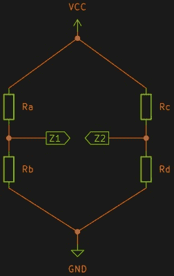
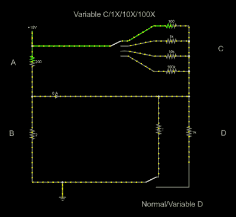
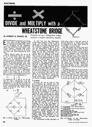

# 电路 VR:惠斯通电桥模拟计算机

> 原文：<https://hackaday.com/2022/03/31/circuit-vr-the-wheatstone-bridge-analog-computer/>

我们总是对如此简单的事情实际上可能如此复杂印象深刻。例如，你认为模拟计算机中会有什么？当然,“真正的”模拟计算机有运算放大器，可以做对数、平方根、乘法和除法。但是，您会惊讶吗，您可以使用惠斯通电桥制作类似计算尺的模拟器件，实际上是两个分压器。你甚至根本不需要任何主动设备。这是一个古老的想法，过去经常出现在电子杂志上。我将向您展示它们是如何工作的，并模拟该设备，这样您就不必构建它，除非您只是想构建它。

[](https://hackaday.com/wp-content/uploads/2022/03/voltage_divider_had.jpg) 分压器是世界上最容易分析的电路之一。考虑两个串联电阻 Ra 和 Rb。电压从 Ra 的顶部进入，Rb 的底部接地。连接 Ra 和 Rb 的节点——我们称之为 Z——就是我们要考虑的输出。

假设我们有一个为 A 供电的 10 V 电池和一个不加载连接到 z 的电路的理想电压表。根据[基尔霍夫](https://hackaday.com/2017/05/25/ohm-dont-forget-kirchhoff/)电流定律，我们知道流经 Ra 和 Rb 的电流必须相同。毕竟，它无处可去。我们还知道 Ra 上的电压降加上 Rb 上的电压降，必须等于 10 V，Kirchoff，能量守恒，不管你怎么称呼它。我们把这些量叫做 I，Va，Vb。

从这里有许多方法，但让我们接受这样一个事实，即通过两个串联电阻的电流是相同的，就好像它是一个等值电阻一样。也就是说，串联的 1kω和 2kω电阻消耗的电流与 3kω电阻相当。这意味着欧姆定律告诉我们:

```
I = 10/(Ra+Rb)
```

现在，您可以求解每个压降:

```
Va = I Ra

Vb = I Rb
```

事实上，我们在 Z 处的电压表将测量 Vb，因为它是接地的。

## 大麻烦

[](https://hackaday.com/wp-content/uploads/2022/03/wheatstone_had.jpg) 当然，你大概知道分压器。但是我们要讨论惠斯通电桥。事实是，这只是两个并联的分压器，您可以测量两个输出之间的电压(称为 Z1 和 Z2)。你经常会看到这个电路被画成菱形，但不要被它骗了。它仍然只是两个分压器。

不使用任何数学，你可以看到，如果分压器是相同的，那么 Z1 和 Z2 将是相同的，因此，没有电流流动，因为两点之间的电压为零。分割线不一样会怎么样？一个 Z 点上的电压会比另一个高。

历史上，这是用来衡量阻力。你可以在电桥的一部分中使用两个匹配的电阻，在剩余的一个脚中有一个未知的电阻，一个可变电阻带有一个校准到欧姆的刻度盘。你转动刻度盘直到仪表读数为零，然后从刻度盘上读出电阻值。如果电源是交流的，你也可以用类似的电路测量电抗。

## 但是计算尺呢？

那么如何从一件古董测试设备到一把计算尺呢？让我们改变电桥，使左边的分压器有电阻 Ra 和 Rb，而另一个有 Rc 和 Rd。我们可以看看代数:

```
Z1=V (Rb/(Ra + Rb))

Z2=V (Rd/(Rc + Rd))
```

我们希望 Z1 等于 Z2，所以:

```
V (Rb/(Ra + Rb)) = V (Rd/(Rc + Rd))
```

我们可以把两边除以 V，去掉那个项:

```
(Rb/(Ra + Rb)) = (Rd/(Rc + Rd))
```

因此，为了平衡桥梁，我们需要:

```
(Ra + Rb)/Rb  = (Rc + Rd)/Rd    *reciprocal both sides*

(Ra Rd + Rb Rd) = (Rc Rb + Rb Rd)    *multiply both sides by Rb Rd*

Ra Rd = Rc Rb      *subtract Rb Rd from both sides*

Ra = (Rb Rc)/Rd    *Solve for Ra*
```

作为一个简单的思维实验，想象 Rd=1。如果你设置了 Rb 和 Rc，那么你可以调整 Ra 来平衡，Ra 的值就是答案。或者可以将 Rb 设置为 1，在 Rc 和 Rd 中输入数字。一旦你平衡了 Ra，你就会知道除法的结果。

但是，在实践中，您可能希望缩放结果，尤其是对于除法。例如，如果 Rb=1，Rc=2，Rd=1000，则需要将 A 设置为 0.002 欧姆，这很难做到。不过，在这种情况下，您可以将 Rb 设置为一个比例因子。如果是 10K，那么 Ra 可以设置为 20 欧姆。

## 模拟

你可以拿出几个电位计来试一试。我们建议您使用线性刻度，除非您非常擅长制作对数刻度表盘。但既然这是 Circuit VR，我们宁愿做一个模拟。法尔斯塔德符合要求，但任何模拟器都能胜任这项任务。

[](https://tinyurl.com/yclw4ahe)

[Analog slide rule simulation](https://tinyurl.com/yclw4ahe)

模拟中有两个开关。顶部的“C”开关可让您为 C 切换顶部电阻或 10X、100X 或 1000X 范围电阻。底部的“D”开关可让您为 D 选择 1 欧姆电阻或可变电阻。中间的安培计显示电桥平衡，当您处于平衡状态时读数为 0A。

说到可变电阻，我确实在模拟器的右边栏放了每个电阻的滑块。然而，使用它们通常会将值放入像 10.002K 这样的值中，这在屏幕上读取 10K，并且是错误的来源。当然，你在真的锅里也会遇到同样的问题，所以这可能是一个很好的模拟。但是，最好双击要更改的电阻，直接输入其值。显然，你不应该改变三个固定的 C 电阻或固定的 D 电阻。

## 后续步骤

[](https://worldradiohistory.com/Archive-Radio-Electronics/60s/1960/Radio-Electronics-1960-06.pdf)

A similar device in a [1960 Radio Electronics](https://worldradiohistory.com/Archive-Radio-Electronics/60s/1960/Radio-Electronics-1960-06.pdf)

如果你想亲眼看看这个电路是什么样子，可以看看 1960 年 6 月的《无线电电子学》第 48 和 49 页。甚至可能正是这篇文章催生了[【比尔·赫德】的第一个计算机](https://hackaday.com/2014/07/25/bil-herd-computing-with-analog/)套件。Edmund Scientific 的类似套件使用三个电位计以普通配置形成电桥。我们甚至看到了来自 GE 的[版本，它使用了](https://oldcomputermuseum.com/ge_ef140.html)[音频振荡器](https://archive.org/details/bitsavers_geEF140EF1ject1961_3820351)，所以你可以使用耳机听到零点。你可以在 1961 年 12 月的《大众电子学》第 65 页开始的文章中看到这两点。或者在 Hackaday.io 上查看[的新版本](https://hackaday.io/project/177346-simple-analog-computer-electronic-slide-rule)。

这将是一个足够容易的雨天项目。如果你有一个老式万用表的老式镜像表，它在这个应用中会大放异彩。用 CAD 程序制作表盘并打印出来也毫不费力。

如果你想要挑战，为什么不使用交流电源以及可变电容和电感来制作一个复数计算器呢？那将是一件了不起的事情，如果你成功了，[我们会报道它](https://hackaday.com/submit-a-tip/)。

同时，我们想指出真正的模拟计算机并没有这么简单。另一方面，根据定义，这是一台模拟计算机，就像[一个真正的计算尺](https://hackaday.com/2015/11/05/slide-rules-were-the-original-personal-computers/)。如果你读了无线电电子学的文章，你会发现它甚至能把一个答案链接到下一个问题中，就像你在一根滑棒上做的那样。