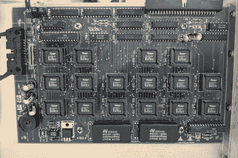
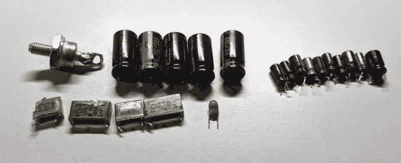

# 思科路由器维修回顾互联网历史

> 原文：<https://hackaday.com/2021/09/13/cisco-router-repair-revives-piece-of-internet-history/>

公平地说，我们所知道的互联网运行在思科的硬件上。虽然你可能永远不会直接看到这些设备，但很有可能每一个离开你的电脑或智能手机的网络数据包都会在它的生命周期中至少花费几毫秒的时间通过这家总部位于加利福尼亚州圣何塞的公司制造的硬件。但是，当然，即使是像思科这样的电信巨头也必须从某个地方开始。

思科的第一个商用路由器，高级网关服务器(AGS)，于 1986 年发布，并帮助该公司(和互联网)走向深不可测的成功。[【Andreas Semmelmann】很久以前就想在自己的收藏中加入一台这种微波炉大小的机器](https://designated-router.com/ciscos-first-router-revisiting-the-venerable-ags-in-2021/)，所以当一台 AGS+出现在当地分类广告上时，他毫不犹豫地开了一个小时的车去取它。但就像许多老式计算机设备一样，它需要一点帮助才能重新站立起来。

What 4 MB of flash looked like in the late 1980s.

因为他无论如何都要拆开路由器来诊断故障所在，[Andreas]决定沿途拍照，记录这段互联网历史。他带领读者通过巨大的处理器、以太网和串行卡，这些都装在单元的机架状外壳中。我们很欣赏他走风景优美的路线，因为它让我们很好地了解了这个版本的 AGS 在 1989 年上市时最先进的电信设备的内部。

该演示充满了有趣的细节，让我们体会到过去 32 年来事情取得了多大的进展。想象一下，每次你需要更新路由器的固件时，把 EPROMs 从电路板上拔下来，启动 UV 橡皮擦。或者需要一个特殊的适配器将背板上的 AUI-15 连接器转换成现在无处不在的 RJ45 插孔。

在回忆中漫步之后，[Andreas]开始了实际的修复工作。普通黑客读者可能不会惊讶地发现，电源没有按照规格运行，一些老化的电容器和短路的整流二极管需要更换，以使其恢复平稳。但是即使 PSU 修好了，路由器还是无法启动。控制台输出表明软件正在崩溃，但硬件诊断显示没有明显的故障。

Replacing these failed PSU components was just the beginning.

通过一些零件交换、固件更新，甚至来自[Cisco luminary【Phillip Remaker】](https://blogs.cisco.com/wearecisco/25-years-later-why-im-still-a-ccie)的一点帮助，问题最终被确定为安装在 AGS+中的有故障的环境监测(ENVM)卡。幸运的是，启动路由器并不需要 ENVM 功能，所以[Andreas]能够断开网卡，继续他对硬件的探索，正如我们所知，这有助于建立互联网。

考虑到它的年龄，这个 20 世纪 80 年代的思科设备最终处于相对较好的状态。但事实并非总是如此。这些年来，我们发现自己对修复这些经典机器所需的大量时间、努力和技能感到敬畏。我们非常尊重那些愿意接受挑战的[奉献者，他们让这些历史片段延续下去，让后代惊叹不已。](https://hackaday.com/2018/06/22/vcf-east-xiii-another-day-in-retro-paradise/)

谢谢鲍勃的提示。]