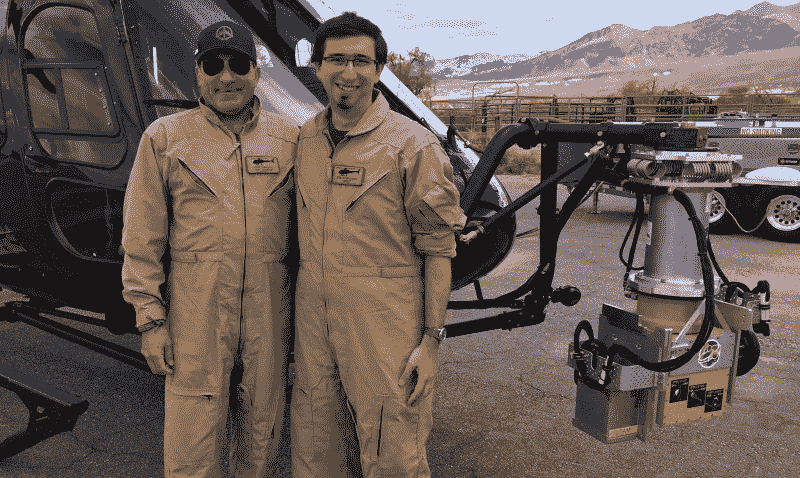

# 经典聊天:Arko 带我们走进 NASA 传奇的 JPL

> 原文：<https://hackaday.com/2022/02/25/classic-chat-arko-takes-us-inside-nasas-legendary-jpl/>

喷气推进实验室(JPL)由加州理工学院的研究生于 20 世纪 30 年代末创建，在美国早期火箭技术的发展中发挥了重要作用。在 1943 年被陆军指派分析德国 V2 后，JPL 团队从单纯关注推进系统扩展到研究和改进航天所需的无数技术。自 1958 年 12 月正式成为美国国家航空航天局的一部分以来，JPL 的尖端研究仍然是人类和机器人探索太空不可或缺的一部分。

对于哈卡代·阿拉“阿科”·库尔奇人的老朋友来说，在 JPL 找到一份机器人电气工程师的工作是梦想成真。这可能解释了为什么他申请了十几次才最终接到电话加入这个团队。[他在 2019 年 8 月的 Hack Chat 上停下来谈了谈作为这样一个标志性组织的一部分是什么感觉，回忆了一些他最喜欢的项目，并反思了他在这一路上学到的经验教训。](https://hackaday.io/event/166178-life-at-jpl-hack-chat)

鉴于 JPL 令人难以置信的声誉，许多问题都是关于如何在那里找到工作，这也许并不奇怪。需要学位吗？必须是名牌大学的吗？你需要获得安全许可吗？黑客怎么做才能引起注意？

至于具体细节，Arko 将人们引向实验室的人力资源部门，但根据他自己的观察，他说似乎没有人过分担心你在哪里上学，黑客是非常受欢迎的修补者。更重要的是展示你拥有他们所需要的知识和热情，这就是为什么他带了一些自己的机器人和定制的印刷电路板去面试。

正如您可能从我们的社区中所期待的，许多用户对实验室如何在内部构建东西有技术问题。他解释说，对于硬件，他们维护着一个可信任的组件和电路设计库，这样工程师就不必每次需要可靠的电压调节器时都要重新发明轮子。同样重要的是，JPL 图书馆的组件都有库存。

在软件方面，虽然 Arko 承认自己是一个 Rust 粉丝，但大多数项目使用的“官方”语言是 C/C++。这至少部分是由于已经从这些语言中积累的知识，过去任务的代码经常被合并到他们的后继者中。代码被仔细审查，必须遵循 JPL 的开发安全关键代码 的 10 条规则，Arko 说每条规则都可以追溯到任务失败。

继续他最喜欢的一些项目，Arko 谈到了最近完成的火星 2020 漫游车着陆器视觉系统的测试。为了验证最终将引导我们今天所知的*毅力*着陆器到达火星表面的系统，[他们在直升机](https://www.youtube.com/watch?v=NdNuyznPpbs)上安装了其视觉系统的工程模型，并让它飞过死谷国家公园。通过将系统的相机和惯性测量单元(IMU)安装在飞机前面的万向节上，他们能够模拟火星进入、下降和着陆(EDL)的一些独特动力学，如降落伞的展开和移动。他解释说，JPL 有一个“边飞行边测试”的哲学。“边测试边飞行”，这种精心设计的装置使他们能够在地球上最接近实际任务条件的地方实地测试整个系统。

Arko 在结束聊天时谈到了他在第二版美洲驼上的工作，这是一个由 JPL 内部设计和制造的四足机器人。他说这项任务特别令人兴奋，因为他和团队有机会真正对设计做出重大改变。虽然这只是一个研究项目，并不是为了去红色星球旅行，但美国宇航局和 JPL 认为，这种腿式机器人可以应用于轮式或履带式车辆无法轻易探索的岩石世界。与此同时，该技术还可用于地面目的，如灾难情况下的救援行动。

Arko (right), with the gimbal used to test the Mars 2020 Lander Vision System.

我们一直认为，黑客聊天是像 Arko 这样的个人与更广泛的黑客社区分享他们迷人的第一手知识和经验的宝贵机会。但是像这样的聊天既有启发性又有知识性。它们证明了只要有奉献精神，你就可以从业余时间对机器人进行编程，到为火星建造硬件。

* * *

Hack Chat 是一个每周一次的在线聊天会议，由来自硬件黑客世界各个角落的顶尖专家主持。对于黑客来说，这是一种有趣和非正式的联系方式，但如果你不能现场直播，这些概述帖子以及发布到 Hackaday.io 的[文字记录确保你不会错过。](https://hackaday.io/event/166178-life-at-jpl-hack-chat)