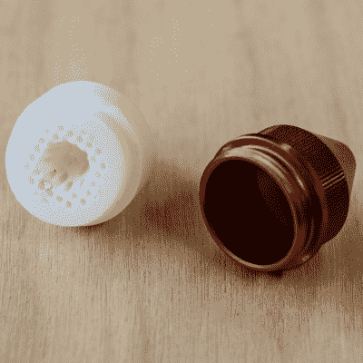

# 使用 3D 打印喷嘴进行更清洁的激光切割

> 原文：<https://hackaday.com/2020/11/25/cleaner-laser-cutting-with-a-3d-printed-nozzle/>

[神经系统]做了很多激光切割，[杰西] [分享了他们对激光切割机的一项有趣的实验改进，其中包括一个 3D 打印的喷嘴，用于更清洁的切割](https://n-e-r-v-o-u-s.com/blog/?p=8722)。你可以在上面看到你自己的结果，两次切割的差别是惊人的。

【杰西】的修改并不影响激光束本身；这是对空气辅助的改进，空气辅助是在激光燃烧和蒸发材料时吹走烟雾和碎片的恒定气流的名称。有效的空气辅助是获得漂亮干净的激光切割的关键之一，但是[Jesse]指出，高质量的空气辅助不仅仅是关于空气吹起来有多用力*和多平稳。湍流空气辅助会使焦痕变得更糟，而不是更好。*

3D-printed nozzle to promote laminar air flow on the left, stock nozzle on the right.

作为一项改善从激光喷嘴流出的空气质量的实验，[Jesse]研究了通过创造层流来避免湍流的方法。层流是液体的一种性质，液体中的各层相互流过，很少或没有混合。做到这一点的一种方法是，当液体向一个明显限定的出口喷嘴前进时，迫使液体通过单独的平行通道。虽然[Jesse]没有发现用于空气辅助的层流喷嘴的参考设计，但肯定有制造用于水的层流喷嘴的资源。事实证明，对这种喷嘴的兴趣主要是作为一种改进朗尼·约翰逊的杰出发明“超级浸泡器”的手段而存在的。

根据这样的设计，[杰西]创造了一个定制的喷嘴，以帮助促进层流。可悲的是，激光切割头带有设计限制，使得一些妥协不可避免；一个是空间有限，另一个是需要保持激光的路径通畅。尽管如此，在用刚性耐热树脂 3D 打印后，[杰西]发现空气从喷嘴喷出的感觉有了显著改善。一些测试切割证实了性能上的差异，这导致明显更干净的切口，而边缘周围没有烧焦。

[神经系统]做的事情之一是制作他们自己的定制拼图，因此激光切割的任何改进都有助于可靠性和质量。当涉及到生产时，几乎所有事情都很重要；当他们讨论如何制作制作拼图的最佳胶合板时,[神经系统]分享了这一课。