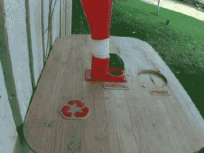

# 用人工智能打扫院子——鸟类智能

> 原文：<https://hackaday.com/2020/10/04/cleaning-up-the-yard-with-ai-avian-intelligence/>

尽管有“鸟脑”这样的绰号，我们长着羽毛的朋友实际上相当聪明。能在三维空间高速机动肯定有关系，鸟类的认知能力有据可查，还在研究中。因此，利用鸟类智能来保持庭院清洁自然是有意义的，对吗？

 根据记录，[汉斯]正在训练的喜鹊非常聪明，非常漂亮，它们喜欢俯冲下来骚扰人，它们会很乐意从其他鸟那里偷食物，然后在上面拉屎，然后飞走。所以他们是混蛋，但这并不意味着他们不能成为有用的混蛋。他的鸟箱系统的目标是使用经典的操作性条件反射，在那里一个想要的自愿行为被奖励加强。在这种情况下，当鸟儿从院子里收集一个瓶盖并将其放入合适的槽中时，奖励是由 3D 打印的振动分配器分配的一份零食。下面的视频显示了鸟儿们正在做它们应该做的事情。

[汉斯]告诉我们，诀窍是让鸟接受鸟箱，并让它们把它融入到它们领地的“巡逻示意图”中。一旦这样做了，让他们把瓶盖和奖励联系起来就简单多了。另一个挑战是让一切都防弹，或者在这种情况下，防喜鹊。我们提到喜鹊是混蛋了吗？

用花生换院子工作的可能性是无穷无尽的；[Hans]提到了他清理掉落水果的计划，并提到了一个持续的花园蛞蝓问题，这些鸟可能会被用来补救。如果你想试试这个，重温一下[【b . f .斯金纳】和他的《战鸽》](https://hackaday.com/2018/04/11/hacking-when-it-counts-pigeon-guided-missiles/)的作品可能是个好主意。

 [https://www.youtube.com/embed/LJG3282QU4g?version=3&rel=1&showsearch=0&showinfo=1&iv_load_policy=1&fs=1&hl=en-US&autohide=2&wmode=transparent](https://www.youtube.com/embed/LJG3282QU4g?version=3&rel=1&showsearch=0&showinfo=1&iv_load_policy=1&fs=1&hl=en-US&autohide=2&wmode=transparent)

