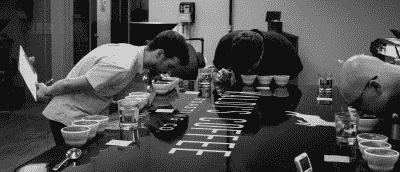

# 咖啡拔罐是一项苦差事——光谱学可以煮出更好的咖啡豆

> 原文：<https://hackaday.com/2021/05/01/coffee-cupping-is-a-grind-spectroscopy-could-brew-better-beans/>

如果你曾经买过整粒咖啡豆，那么很有可能袋子上有各种各样的信息让你做出决定，比如产地、烘焙类型和味道。传统上，咖啡分级——即判断干咖啡和湿咖啡的香气，并在舌头上均匀地啜饮咖啡，以确定风味特征——是由人类在一个叫做拔罐的过程中完成的。称之为一个过程太过客观——它真的更像是一个以咖啡应得的严肃真诚进行的仪式。

A traditional cupping ceremony. Image via [Kaldi’s Coffee](https://kaldiscoffee.com/pages/cupping)

有一个行业标准的咖啡风味转盘，所以为什么不利用它来制造一个机器人，可以消除人类的偏见和以传统方式做事可能出现的错误？这正是哥伦比亚-以色列公司 [Demetria](https://demetria.ag/technology/) 正在做的事情。

他们开发了一个人工智能平台，可以通过 Kickstarter 上诞生的手持扫描仪来判断咖啡豆的质量。扫描仪使用近红外线来寻找咖啡豆中的生化标记，它使用这些标记来匹配由[无所不知的咖啡风味轮](https://www.redrockroasters.com/blog/coffee-2/coffee-tasters-flavor-wheel)支持的轮廓。

Demetria 正在使用 SCiO 扫描仪和一个定制应用程序来判断咖啡豆，甚至在它们被烘焙之前，这大大加快了过程，但让我们想知道绿豆光谱如何与人类判断的烘焙咖啡豆相比较。你可能还记得 SCiO，这是一个口袋大小的连接光谱仪，由 Consumer Physics 制造，在融资几年后终于开始交付。如果你有 SCiO，你可能会想知道有一个公开的项目可以破解它们。Sparkfun 做了一个[漂亮，彻底的拆卸](https://hackaday.com/2017/07/20/scio-pocket-molecular-scanner-teardown/)，它似乎是一个精心设计的硬件。

一方面，[拔罐](http://www.coffeeresearch.org/coffee/cupping.htm)是*的传统*，因此人们可能会觉得剥夺了咖啡的这一传统就等于剥夺了咖啡的灵魂。另一方面，拔火罐是一种浪费，因为在仪式开始之前，咖啡必须立即烘焙和研磨，并且需要受过咖啡分级培训的品级员。

想了解更多关于咖啡生产的知识？[不妨学学复古的方式](https://hackaday.com/2014/09/03/retrotechtacular-time-for-coffee/)。

[通过 [Demetria](https://demetria.ag/technology/) 的主图像和缩略图]