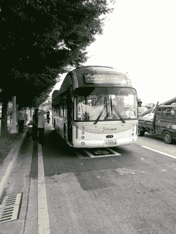
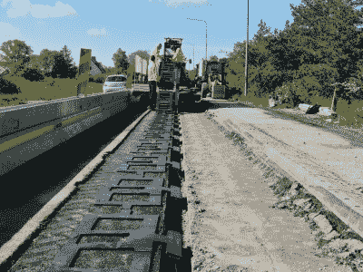

# 道路上的线圈可以在行驶时给电动汽车充电

> 原文：<https://hackaday.com/2022/08/17/coils-in-the-road-could-charge-evs-while-driving/>

电动汽车的一个主要问题是你需要靠边停车充电。如果没有高速 DC 充电器可用，这可能意味着等待几个小时，而你的电池充满。

自从电动汽车开始大量上路以来，这一直是电动汽车的主要问题。然而，一种新的无线充电设置可以让你在旅途中充电。

## 电动高速公路

多年来，已经提出了许多在电动车辆行驶时给它们供电或充电的提议。许多类似于我们目前常用的手机充电方式，通过磁线圈使用感应电能传输。理论很简单。电力被输送到道路上的线圈，然后通过移动车辆上的线圈感应获得。

然而，将这些想法从概念变为现实是困难的。当给电动汽车充电时，需要几十到几百千瓦的巨大功率。此外，虽然手机可以整齐地放在充电板上，但电动汽车通常需要相当大的离地间隙才能安全地在路上行驶。此外，由于汽车移动速度相当快，感应充电系统可以处理这种动态条件，需要大量的线圈反复埋在路基中。

## 公共汽车是开始

The OLEV system buries a “power track” in the road, which powers the buses wirelessly via receivers mounted underneath. The receiver operates with a nominal airgap of just 17 cm above the coil. Credit: [KAIST, press release](https://www.kaist.ac.kr/newsen/html/news/?mode=V&mng_no=4014&skey=department&sval=Cho+Dong+Ho&list_s_date=&list_e_date=&GotoPage=1)

尽管有这些挑战，这个想法已经在现实世界中得到有限的验证。在线电动汽车，或称 OLEV，是由韩国高级技术学院(KAIST)开发的，于 2009 年用于为一辆穿梭巴士提供动力。到 2016 年，该系统慢慢扩展到四条线路，由于感应电力发射器埋在公交车沿线的道路上，公交车可以无线充电。

公交车上使用的第二代系统以 85%的功率效率通过 17 厘米的空气间隙无线传输 100 千瓦的功率。这通过使用安装在单个车辆上的多个功率拾取线圈来实现。许多研究致力于寻找最佳的线圈几何形状和电气参数，以使系统能够在这一水平上运行。由于电力来自路面，公交车可以依靠更小的电池来行驶，从而减轻重量并提高效率。该系统被埋在公交车路线上 5-15%的道路中，车辆检测系统在不使用时会关闭感应线圈。虽然一些路线已经关闭，但 KAIST 仍然使用该技术运营班车服务。

其他公司也在这个领域工作。初创公司 Magment 以“磁性水泥”的组合命名，正在与印第安纳州交通部合作进行一项特殊的感应道路演示。细节很少，但该公司正在开拓一种特殊的方法，将铁磁材料与水泥混合，以生产更具成本效益和效率的无线充电道路系统。该公司打算将该系统用于非道路应用，如叉车和电动滑板车。

Workers installing inductive charging coils in the road surface at Smartroad Gotland. Much research goes into coil geometry to ensure the maximum power transfer and efficiency while still working at a reasonable air gap distance. Credit: [Smartroad Gotland, News Blog](https://www.smartroadgotland.com/post/successful-upgrade-of-the-first-50-meters)

另一个突出的例子是总部位于以色列的 Electreon 公司，该公司在瑞典哥特兰岛开展了一个试点项目。该项目于 2020 年 12 月首次部署，已成功在 1.65 公里长的测试路段上运行 40 吨卡车。再次使用埋在路面的铜线圈，它能够为时速高达 80 公里的移动车辆提供约 70 千瓦的电力。该公司还在世界各地开展其他试点项目，包括与福特汽车公司合作的一个设施[将安装在底特律密歇根中央码头附近。](https://www.forbes.com/sites/greggardner/2022/02/01/electreon-to-develop-in-road-charging-system-near-fords-mobility-tech-hub/?sh=216ee693fb4d)

## 还没到

这种系统的问题仍然是成本。首先，在路面上埋输电线和花式线圈本身就要花费很多。对于新的道路来说，这已经够贵了，更糟糕的是，当你需要挖掘一条现有的道路来放置硬件时。[对一个瑞典项目的估算](https://web.archive.org/web/20210203031443/http://www.diva-portal.org/smash/get/diva2:1524344/FULLTEXT01.pdf)表明，像 Electreon 这样的无线系统在新建项目中的成本大约为每公里 200 万美元。与简单的轨道或架空电线等更传统的电力传输方法相比，这种安装成本大约是前者的两倍，而提供的电力却少得多。后者已经在世界各地[的卡车运输测试中证明了它们的价值。](https://hackaday.com/2022/07/18/trucks-could-soon-run-on-electrified-highways/)

维护也是一个主要问题。在道路上掩埋任何东西意味着如果出了问题，修复它是一项巨大的工作。至少，这将需要关闭道路，在最坏的情况下，这将意味着挖掘它。升级到更高性能的技术同样需要拆除旧硬件并重新安装新硬件的侵入性工作。

最后，还有标准化的问题。通过道路上的感应线圈为车辆供电是很棒的，但汽车和卡车需要安装特殊的皮卡来接收这种能量。感应式拾音器必须仔细调整以适应道路上的线圈，因此几乎没有机会改装一种可以穿越多个电动道路系统的通用拾音器。因此，为了使这样的系统实用化，一个公司的系统将不得不在宽阔的路段上铺开，以至于个人和商业用户考虑为他们的车辆安装皮卡硬件在经济上变得有价值。

看来我们不太可能在短期内挖掘道路来安装充电线圈。毕竟，我们几乎没有给我们的城镇配备常规的电动汽车充电器，而这已经是一项成熟的技术了。然而，在一些应用中，如专业公共汽车或卡车运输路线，该技术可能会流行起来。从那以后，它可能会进一步扩散，但前提是巨额投资有意义。