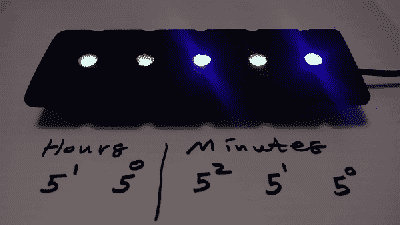

# 彩色五进制时钟充分利用五个新像素

> 原文：<https://hackaday.com/2020/11/19/colorful-quinary-clock-makes-the-most-out-of-five-neopixels/>

如果二进制数是位，五进制数是“对等”的吗？也许吧，但不管你怎么称呼它们，你都必须用你的头脑去思考一些新概念，以便理解这个五进制显示时钟。

The transition between 15:42 and 15:43.

为什么是五进制？[斯派克·斯内尔]想要尽量减少发光二极管的数量，5 个 ^(2 个)就足以覆盖所有 24 小时。二进制时钟可能很时髦，但显示 1 和 0 的方式只有这么多。

[Spike]的时钟是独一无二的，因为它使用单个 WS2812 Neopixel 显示每个退出。值 0 到 4 分别用不同的颜色表示，这意味着用户需要记住哪个颜色对应哪个值，我们怀疑这是学习这个时钟最难的部分。时钟的软件相当简单，在 ESP8266 上运行，并使用 NTP 来保持跟踪。这个时钟可以根据夏令时进行自我调整，它有一个很好的功能，可以在晚上调暗显示屏，让生活变得更加轻松。

即使对那些不擅长五进制算术的人来说，[Spike]的时钟仍然是一个不错的、慢慢演变的抽象艺术品。对于那些寻找五进制时钟的人来说，也许在另一个未来，一个双五进制中继计算机开始流行的职业在等着你。