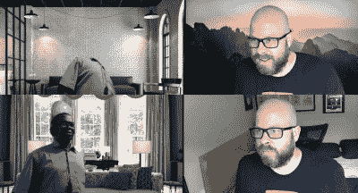
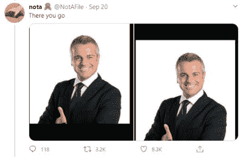
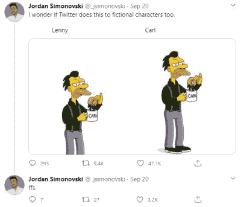
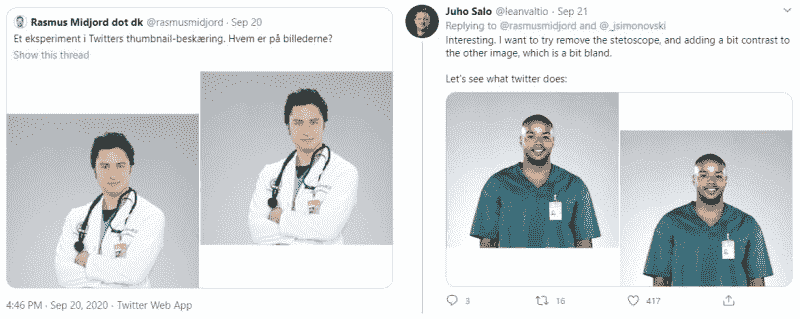

# 社区测试表明 Twitter 的裁剪算法存在偏见

> 原文：<https://hackaday.com/2020/09/23/community-testing-suggests-bias-in-twitters-cropping-algorithm/>

随着社交媒体和在线服务成为日常生活的重要组成部分，我们的整个世界正在被算法塑造。他们的工作方式很神秘，他们负责我们看到的内容和我们看到的广告。同样重要的是，他们也决定了什么是隐藏的。

重要提示:这篇文章的大部分内容都在讨论一个实时网站算法的性能。如果以后查看，这篇文章中的一些链接可能不会像报告的那样执行。

The initial Zoom problem that brought Twitter’s issues to light.

最近，[Colin Madland]在 Twitter 上发布了一些 Zoom 会议的截图，指出 Zoom 的背景检测算法如何不恰当地删除了一位肤色较黑的同事的头部。在这样做的时候，[科林]注意到了一个奇怪的效果——虽然他提交的截图显示了他们两个人的脸，但 Twitter 总是会裁剪图像，只显示他的浅色皮肤的脸，不管图像的方向如何。Twitter 社区竞相探索这个问题，结果很快就出来了。

## 意图！=结果

An example pair of source images posted to Twitter, featuring two faces in alternate orientations.

Twitter 用户开始迭代这个问题，用不同的图片反复测试。使用了库存照片模型，以及新闻广播员和《辛普森一家》中莱尼和卡尔的图像，在大多数情况下，Twitter 的算法裁剪图像，以聚焦照片中肤色较浅的脸。在可能是最荒谬的例子中，[算法在同一喜剧演员的正常图像上裁剪出一个黑人喜剧演员*假装*是白人](https://twitter.com/aftertheboop/status/1308091057863888896)。

The result – Twitter’s algorithm crops on the white face, regardless of orientation.

进行了许多实验，控制不同的背景、服装或图像清晰度等因素。不管怎样，这种影响持续存在，导致推特在这个问题上发表官方言论。该公司的一名发言人表示,“我们的团队在发货之前确实进行了偏见测试，在我们的测试中没有发现种族或性别偏见的证据。但是从这些例子中可以明显看出，我们还需要做更多的分析。我们将继续分享我们学到的东西，我们采取的行动，并将开源我们的分析，以便其他人可以审查和复制。”

几乎没有证据表明这种偏见被有意地编码到了裁剪算法中；当然，Twitter 在 2018 年关于这项技术的博客文章中没有公开提到任何这样的意图。不管这个事实如何，问题确实存在，对受影响的人有负面影响。虽然一个简单的图像裁剪听起来可能没什么，但它具有降低受影响人群的可见性并将其排除在在线空间之外的效果。这个问题以前也被强调过。在这组来自 2019 年 1 月的一组人工智能评论员的图像中，[Twitter 图像裁剪集中在男性的面部和女性的胸部。](https://twitter.com/AnimaAnandkumar/status/1307465594304974848?s=20)双重标准在职业环境中尤其有害，女性和有色人种可能会发现自己似乎被客体化了，或者完全被排除在外，这要归功于一种神秘算法的阴谋诡计。

The problem remained consistent in many community tests, involving [newsreaders](https://twitter.com/BradRubenstein/status/1307450052189630465), [cartoons](https://twitter.com/_jsimonovski/status/1307542747197239296), and [even golden and black labradors.](https://twitter.com/MarkEMarkAU/status/1307616892551487488)

像[Ferenc Huszár]这样的前员工也谈到了这个问题，特别是关于产品在发布前所经历的测试过程。这表明测试是为了探索这个问题，关于种族和性别的偏见。同样，目前担任 Twitter 工程主管的【汪则翰】表示，这些问题[早在 2017 年就已经调查过，没有发现任何重大偏见。](https://twitter.com/ZehanWang/status/1307461285811032066)

这是一个很难解析的问题，因为算法实际上是一个黑箱。Twitter 用户显然无法观察到控制算法行为的源代码，因此，对于公司外部的任何人来说，在现场测试是研究这一问题的唯一可行方式。这大部分是临时完成的，选择偏见可能发挥了作用。那些寻找问题的人肯定会找到一个，而且更有可能忽略反驳这一假设的证据。

人们正在努力更科学地调查这个问题，使用许多工作室拍摄的样本图像试图找到偏见。然而，即使这些努力也受到了批评——即使用为机器学习设计的源图像集，并在白色背景[的完美工作室灯光下拍摄，并不能真实地代表用户发布到 Twitter 的真实图像。](https://twitter.com/IDoTheThinking/status/1308087143156207618)

Some users attempted to put the cause down to issues of contrast, saturation, or similar reasons. Whether or not this is a potential cause is inconclusive. Regardless, if your algorithm will only recognise people of color if they’re digitally retouched, you have a problem.

Twitter 的算法并不是第一个被指责种族偏见的技术；从[皂液机](https://metro.co.uk/2017/07/13/racist-soap-dispensers-dont-work-for-black-people-6775909/)到[医疗保健](https://www.nature.com/articles/d41586-019-03228-6)，这些问题以前就有过。不过，从根本上说，如果 Twitter 要让所有人都满意地解决问题，还需要做更多的工作。需要进行更广泛的测试，以真实世界图像的广泛取样为特征，并与公众分享方法和结果。如果做不到这一点，Twitter 就不太可能让更广泛的用户群相信它的软件没有让少数族裔失望。鉴于在理解机器学习系统方面有所收获，我们预计研究将继续快速解决这一问题。