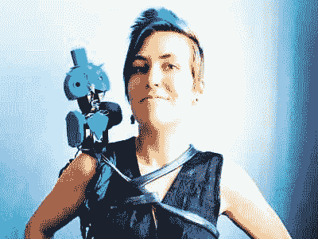

# 同伴机器人绝对是你要找的机器人

> 原文：<https://hackaday.com/2020/01/31/companion-bots-definitely-are-the-droids-youre-looking-for/>

迄今为止，陪伴机器人是我们主要在电影中看到的一种。摆脱了现实世界技术的限制，他们设法变得有魅力、可爱、能干，从而受到全世界观众的喜爱。Jorvon Moss 和 Alex Glow 决定这项迷人的技术不应该只存在于银幕上，并一直在开发自己的同伴机器人来探索这一领域。幸运的是，他们来到 hack aday super conventi on 告诉我们这一切！

两人使用各种技术来构建他们的“机器人”，一路上给它们注入大量的个性。Jorvon 喜欢将 Arduino 作为他构建的基础，而 Alex 则尝试了谷歌 AIY 视觉套件、BBC Micro:bit 以及其他平台。通过巧妙的设计和精心的规划，这两种常见的制作技术创造出它们独特的造型。使用标准的伺服系统、3D 打印的身体部位和大量的发光二极管，这些都是家庭游戏玩家容易获得的东西。

【Alex】的伴侣机器人阿基米德(Archimedes)已经通过多次升级来改善功能。另外，他有一顶可爱的帽子！

制造了许多机器人后，不同的同伴在他们互动的方式上有各种各样的能力。亚历克斯的机器猫头鹰阿基米德利用机器视觉寻找人，并试图判断他们是快乐还是悲伤。如果他们足够兴奋，会给这个人一份小礼物。阿基米德骑在亚历克斯用金属线制成的特殊挽具上，让这只鸟在外出时可以栖息在她的肩膀上。同样，Jorvon 的 Dexter 潜伏在他的背上，模仿一只猴子。Dexter 的 3D 打印底盘采用了 LED 矩阵，用于表情丰富的面部表情，以及用于击掌的触摸传感器。

Alex 和 Jorvon 还谈到了他们在开发各自的伙伴机器人时遇到的一些陷阱和挑战。Jorvon 将伙伴机器人定义为“任何你可以随身携带，进行任何类型冒险的机器人”。在现实世界中，被撞来撞去意味着损坏是常见的，两人有时会捡起一把把粉碎的塑料和一捆捆电线。幸运的是，随着 3D 打印成为行业工具，很容易反复设计新的组件，以更好地承受日常生活中的粗糙和翻滚。这也融入到设计过程的其余部分，Jorvon 给出了 Dexter 在 Supercon 建造和安装的最后一分钟 LED 升级的例子。

同伴机器人的开发永远不会真正完成。未来的工作包括集成 [Chirp.io 数据-声音通信](https://chirp.io/solutions/)以允许机器人说话。在软件方面有一些令人头痛的问题，但我们期待看到这些机器人用他们自己的 droid 语言聊天。虽然人工智能还没有与电影中看到的俏皮机器人相匹配的自制伴侣机器人，但为我们的数字创作设计栩栩如生的身体是朝着这个方向迈出的一大步。有了像亚历克斯和乔里恩这样的人参与这个案子，我们确信，用不了多久，我们就可以和数字朋友一起四处走动了——而且这肯定会很有趣！

 [https://www.youtube.com/embed/DSQ0cRYMrfQ?version=3&rel=1&showsearch=0&showinfo=1&iv_load_policy=1&fs=1&hl=en-US&autohide=2&wmode=transparent](https://www.youtube.com/embed/DSQ0cRYMrfQ?version=3&rel=1&showsearch=0&showinfo=1&iv_load_policy=1&fs=1&hl=en-US&autohide=2&wmode=transparent)

