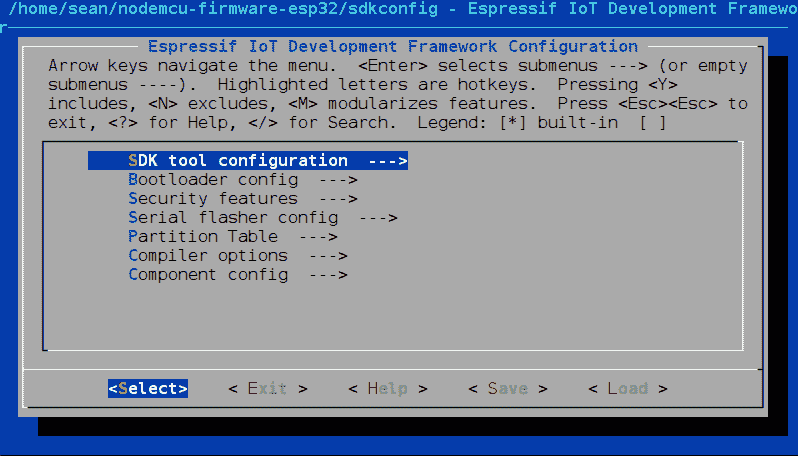
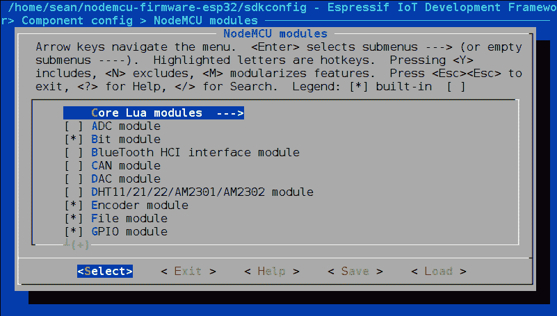

# 为支持公钥-私钥加密的 ESP32 编译 NodeMCU

> 原文：<https://hackaday.com/2019/01/03/compiling-nodemcu-for-the-esp32-with-support-for-public-private-key-encryption/>

当我在 2003 年开始编写微控制器程序时，我已经学会了 Atmel STK-500 和 ATtiny 和 ATmega 系列的汇编程序。当时我认为这很棒——仿真器和开发板很好，我可以花一美元在一个项目中永久添加一个微控制器。然后 ESP8266 就出来了。

除了对时间敏感的应用程序之外，它的功能、可切换的平台都让我大吃一惊，几年来它一直是我选择的芯片。不久前，一位朋友给了我一台 [ESP32](http://en.wikipedia.org/wiki/ESP32) ，它是速度更快的双核版本的 ESP8266。由于我很少使用 ESP8266 的计算能力，因此没有一个功能看起来像是游戏规则的改变者，它在一段时间内仍然是一个“桌面装饰品”。

大约七周前，增加了对`libSodium`椭圆曲线加密库的支持。加密并不是物联网设备最强的功能，而且[我在 ESP8266 上使用的一些方法](http://hackaday.com/2017/06/20/practical-iot-cryptography-on-the-espressif-esp8266/)并不理想。能够更容易地执行公钥-私钥加密，这足以让我考虑为一些项目更换硬件。

然而，我的首选自动化构建工具 NodeMCU 在 ESP32 上还不可用。需要编译固件——这是一个令人惊讶的用户友好的体验，所以我想我应该和你分享一下。如果我知道它会这么快，这个芯片就不会放在我的桌子上这么久了！

## 配置和编译

最简单的开始方式是让 Linux 作为您的主要操作系统运行，或者在安装了 Git 和 Make 的虚拟机中运行，如 [VirtualBox](http://itsfoss.com/install-linux-in-virtualbox/) 。我们的工作流程将是克隆 NodeMCU ESP32 开发分支、配置所需的编译选项、保存配置、编译和刷新。

首先，我们用`git clone --branch dev-esp32 --recurse-submodules [https://github.com/nodemcu/nodemcu-firmware.git](https://github.com/nodemcu/nodemcu-firmware.git) nodemcu-firmware-esp32`克隆 ESP32 git 存储库。这将复制构建 NodeMCU 固件和所有模块所需的源代码。然后`make menuconfig`将启动一个简单的菜单驱动界面，您可以在其中选择编译选项和包含的模块。为了节省空间和内存，不建议选择超过特定项目所需的模块。



The main menu. Overall it’s well organized and exceeded expectations.

菜单包含熟悉的选项，如默认串行端口、波特率、闪存详情等。值得注意的是，你可以在这里设置 CPU 速度，配置外部 RAM，并定义 WiFi 和蓝牙将如何工作。虽然大多数选项可以保留默认值，但菜单中有许多有趣的功能值得探索。您几乎肯定想要进入“组件配置→节点 MCU 模块”并启用项目所需的高级功能:



This is the menu interface to select which modules you need to compile support for, for example the DHT11 temperature / humidity sensor.

如果在那里启用了`libSodium`模块，您可能还想进入“组件配置”下的`mbedTLS`和`libSodium`菜单项，并确保它按照您期望的方式设置。

一旦我们完成了，我建议将配置保存为描述性的；我经常发现自己在使用相同的功能组，手边有一些常用的配置可以让我在有想法或想做快速演示时更快地工作。更好的是，把它和你的代码一起放在版本控制中，这样你就知道它依赖于什么。

注意，这意味着在编译之前，您需要运行一个命令来将您感兴趣的配置复制到一个名为`sdkconfig`的文件中。然后运行' make '进行编译。 `cp yourfilename sdkconfig && make`

完成后，插入您的 ESP32 并在终端中运行“make flash”。如果您的 ESP32 连接到`ttyUSB0`，它将检测您的设备并加载编译的固件，否则在 makefile 中设置它。我发现这最后一个功能是一个真正的时间节省器——我希望它返回一个文件，而我将不得不使用另一个工具加载到 ESP32。

为了测试，我更喜欢用 [ESPlorer](http://esp8266.ru/esplorer/) 。运行它，打开串行端口，点击设备上或 GUI 中的 reset 按钮——运气好的话，您会看到终端输出成功引导的结果。

## 步入钠

这就是内置`libSodium`的固件刷新。让我们用一个原始的工作证明算法对加密库进行基准测试，从而对它进行一点试验。还有更简单的基准测试，但它们有点无聊，我不需要确切的数字:

```

-- Set difficulty (number of leading zeroes) and start WiFi (needed for cryptography), then generate a public and private key and print it
difficulty = 2
wifi.start()
public_key, secret_key = sodium.crypto_box.keypair()
print (&quot;Public key for this session: &quot; .. encoder.toHex(public_key))

function pause()
    -- Take a short break for the ESP32 to handle other processes
    tmr.create():alarm(500, tmr.ALARM_SINGLE, mine)
end

function mine()
    i=0
    while i &lt; 60 do
        -- Generate a large nonce by concatenating 3 numbers from the PRNG. Not sure how fast it generates entropy, check this another day.
        i = i+1
        x = sodium.random.random()
        y = sodium.random.random()
        z = sodium.random.random()
        n = x .. y .. z
        -- encrypt the nonce using the public key defined in setup
        a = sodium.crypto_box.seal(n, public_key)
        b = encoder.toHex(a)

        -- If there are a number of leading zeroes equal or greater to difficulty, decrypt and print the nonce
        if tonumber(string.sub(b,1,difficulty)) == 0 then
            print (&quot;Valid nonce found! &quot; .. sodium.crypto_box.seal_open(a, public_key, secret_key))
        end
    end
pause()
end

mine()

```

该算法打开 WiFi(ESP32 上的加密应用需要**)，并生成密钥对。然后，它生成一个一次性随机数，一个 nonce，大约有 8 x 10 ^(28) 种可能性，用公钥加密，并检查它是否以两个前导零开始。如果是，它用私钥解密并返回原始随机数。在 60 次尝试之后，它会暂停 500 毫秒，以便让其他后台功能完成，否则就会崩溃。在 ESP8266 上，我可能会定期重置看门狗定时器，让它不间断地运行，但这对于现在来说已经足够了。**

 **结果以接近每分钟三次的速度出现，这表明我们可以每秒钟尝试大约十三次随机数:


Don’t worry, I’m not going to create yet another cryptocurrency with this.

它偶尔会掉电和复位，但在 ESP8266 上运行类似算法时，我从未遇到过这种情况。它也变得相当温暖，所以如果我要在 ESP32 上运行这么多计算，我似乎需要一个更好的电源！然而，它对于我心目中的应用程序来说肯定足够快，所以虽然我可能会在大多数项目中使用廉价的 ESP8266，但 ESP32 已经在我的工作台上赢得了一席之地，因为我知道如何为它编译定制的 NodeMCU 固件。**