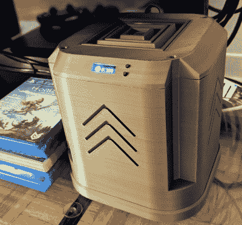

# 带定制载板的计算模块 4 NAS

> 原文：<https://hackaday.com/2021/04/08/compute-module-4-nas-with-custom-carrier-board/>

此时，我们看到的 Raspberry Pi 网络连接存储(NAS)构建数量已经超出了我们的想象。该平台从来不是这项任务的特别理想的选择，因为它只能通过 USB 连接到驱动器，但它便宜且易于使用，所以人们充分利用了它。但是，一旦计算模块 4 将 PCIe 支持引入 Raspberry Pi 生态系统，这一切都变了。

如果这个由[mebs]构建的令人印象深刻的 NAS 代表了未来的发展方向，我们会非常兴奋。从外面看，它有 3D 打印的外壳和集成的有机发光二极管显示器来显示系统状态，可能看起来像它之前的许多版本。但是打开这个赛博朋克风格的服务器的顶部，你就会意识到投入了多少工作。

 这个 NAS 的核心是一个专门构建的载板，[mebs]基于 Raspberry Pi Foundation 为[他们的官方 CM4 IO 板](https://hackaday.com/2020/10/19/new-raspberry-pi-4-compute-module-so-long-so-dimm-hello-pcie/)发布的 KiCad 文件而设计。虽然不比 CM4 本身大多少，但 NAS 板将板的 PCIe、以太网、HDMI 和 USB 分开。还有一个 I2C 头，主要用于有机发光二极管显示器，但自然可以扩展到其他传感器或设备，以及 9 个 GPIO 引脚。

当然，这本身并不能构成 NAS。进入 PCIe 端口的是一个四通道 SATA 控制器卡，它依次连接到硬盘驱动器，这些驱动器分别位于印刷机箱的各个节点中。一个中央风扇吹过核心的电子设备，[由于巧妙的设计和一些纸板密封](https://www.reddit.com/r/raspberry_pi/comments/mkbxss/cm4_custom_nas_complete/)，通过印在侧面的进气口将空气吹过驱动器。

尽管这个版本令人印象深刻，但并不是每个人都需要这种级别的性能。如果你不介意受到 USB 速度的限制，你可以 3D 打印标准 Raspberry Pi 的 NAS 外壳。或者，如果你想要更实惠一点的东西，你也可以[重新利用一个旧的电脑机箱](https://hackaday.com/2019/11/01/raspberry-pi-nas-makes-itself-at-home-in-donor-pc/)。