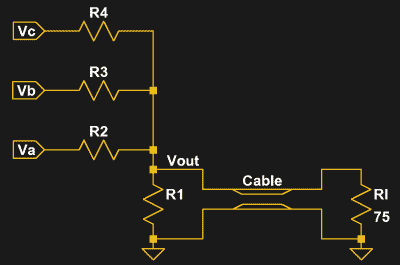
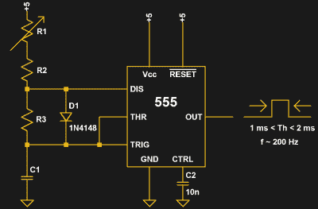
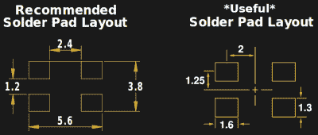

# 电子设计用计算机代数

> 原文：<https://hackaday.com/2019/02/28/computer-algebra-for-electronic-design/>

不要误解我。像大多数人一样，没有什么比用手解决一个又长又复杂的数学问题更让我享受的了。但是，有时候，纸上几页代数划痕只是达到目的的一种手段。我发现在电子设计课上尤其如此，无论是电路设计还是 PCB 布局；我只是需要答案，任何花在寻找答案上的时间都会分散我对手头更大任务的注意力。至少对我来说，这似乎每周至少发生一次，大约五年前我决定对此做点什么。当然，我听说过计算机代数软件包，但是当我上学的时候，它们不是作为本科工程课程的一部分来教授的。因此，我开始学习一种方法:让计算机来做数学运算！

我选择的软件包是 [wxMaxima](https://wxmaxima-developers.github.io/wxmaxima/) ，它是 [Maxima](http://maxima.sourceforge.net/) 计算机代数系统的基于文档的前端。它起源于 20 世纪 60 年代末编写的代码，是一个支持代数和微积分符号计算的通用软件包。下面是坚实、成熟的代码，上面是现代的用户界面。另外，它是 FOSS。

随着我的进步，我发现一些额外的功能使得 Maxima 环境对于电路设计特别方便。有几个非常简单，我通常只需要根据需要重新创建它们，所以我从来没有真正组织过——我的“库”有几个版本在不同的机器上浮动。我终于整理好了自己的行为，清理了最常用的函数，并将它们放入一个 [GitHub repo](https://github.com/tedyapo/maxima-circuits) 中。

让我们看看如何使用它们来解决一些设计问题的数学烦琐。

## 预赛

关于 Maxima 语法，我们需要了解一些东西，它不同于您可能更熟悉的常见语言:

1.  行以分号(显示结果输出)或美元符号(取消输出)结束。
2.  变量赋值使用冒号。为了将变量“x”设置为值“3”，我们说“x:3；。
3.  等号建立了一个象征性的相等关系:“y = 2 * x；定义一个可以象征性操作的方程。
4.  如果你混淆了#2 和#3，你会非常困惑。

考虑到这些，我们准备看看 GitHub 代码中的一些函数。三个简单的函数非常有用。第一个函数 par()计算并联电阻、电感或串联电容的等值。例如:

第二个函数 vdiv(r_top，r_bot)计算给定电阻的分压比。在第一个示例中，5 V 电源由 400 和 100 欧姆电阻分压，产生 1 V 输出，而第二个示例为 r1 和 r2 形成的分压器创建了一个符号表达式。

最后，pref(x，E)函数从选定的首选值的[EIA“E 系列”中找到最接近 x 的值。您可以从{E3、E6、E12、E24、E48、E96、E192}以及组合系列{E48_E24、E96_E24、E192_E24}中选择任何系列。例如，我们可以找到值约为 piω的最接近的 5%和 1%电阻。](https://en.wikipedia.org/wiki/E_series_of_preferred_numbers)

有了这三个功能以及 Maxima 的内置功能，我们就可以解决一些问题了。

## VGA 输出:新的闪烁 LED

 由于 2019 年注定是黑客们全面拥抱 FPGA 威力的一年，因此将这些技术应用到一个常见的 FPGA 例子中似乎再合适不过了。虽然介绍性微控制器项目传统上是闪烁的 LED，但简单的 VGA 输出是许多人的第一个“真正的”FPGA 项目。为了产生模拟信号，每个颜色通道通常有几条数字输出线馈入一个简单的基于电阻的 DAC，同步线由另外两条输出处理。

这里显示的电路代表一个颜色通道(比如红色)，允许从三位输入获得八个不同的输出电平，因此 RGB 显示器能够显示 512 种颜色。这种情况下，Vc 是 MSB，Va 是 LSB。这种拓扑结构是一个简单的加权电阻 DAC，我们选择它而不是更常见的 R-2R，因为后者(双关语)需要 7 个电阻，而不是 4 个。有几件事我们马上就知道了，即我们的电源电压为 3.3 V，而当监控器内加载 75 欧姆终结器(Rl)时，DAC 的满量程输出(Vmax)应为 0.7 V(我们从 VGA 规格中得知)。

我们需要找到四个电阻(R1-R4)的值，所以我们需要提出四个方程来求解。其中一个应将输出阻抗设置为 75 欧姆，以避免电缆上的反射和由此导致的显示器模糊。从原理图中我们可以看到，输出阻抗就是所有并联的电阻(假设 Va、Vb 和 Vc 都接地)。因此，我们使用 par()函数定义了一个变量 Zout。稍后，我们将创建一个等式，将其赋值为 75 欧姆。我们得到的结果显示了一个格式良好的公式版本:

我们还需要三个方程。有多种设置可供选择，但最简单的方法可能是考虑只有一条输入线处于高电平状态时的输出电压。例如，当只有 MSB 为高电平时，即状态{Vc=1，Vb=0，Va=0}或“100”时，电阻从 Vcc 形成一个分压器，R4 作为顶部电阻，所有其他并联电阻作为底部电阻。我们使用 vdiv()和 par()函数为这个状态定义一个变量 V100，我们还将为它创建一个后续方程。输出对我们来说是一种混乱的表达，但是 Maxima 并不介意。

同样，当只有 Vb 为高电平(“010”状态)时，我们可以用一个类似的分压器来定义 V010，这次 r3 作为顶部电阻，所有其他电阻并联在底部。

最后，将相同的逻辑应用于“001”状态，得到 V001 的表达式。

现在，我们可以形成四个方程，并让 maxima 求解()它们。第一个等式将输出阻抗设置为 75 欧姆，其余三个等式为我们选择的状态设置电压输出。对于 3 位 DAC，MSB 的权重为满量程电压的 4/7，中间位的权重为 2/7，LSB 的权重为 1/7。将这三个电压态与 Vmax 的这些分数相等，就给出了另外三个方程。除了方程之外，我们还传递了一个要求解的变量列表:电阻值。

输出显示了两件事:我们想要的解决方案，以及计算机代数软件包的输出可能很混乱的事实。在这种情况下，解决问题的方式引入了很多我们并不是特别在意的“解”族。然而，列表中的最后一个显然是我们要找的。

由于我们不太可能购买 130.26316 欧姆的电阻器，我们可以从 E24 (5%)系列中选择最接近的值，并将结果赋给变量“vals”

当然，选择这些值会改变 DAC 的性能，因此最好检查这些电阻实际产生的结果。ev()函数使用第二个参数的上下文来计算第一个参数，所以在这种情况下，我们将替换首选电阻值。(fpprintprec 变量控制浮点打印精度；这里它被设置为四个有效数字。)

理想情况下，输出应为[75，0.4，0.2，0.1]。我可能对这些值满意，可能是因为我有大量的 5%电阻，但如果我们想要更接近的结果，我们可以简单地从 E96 (1%)系列中找到首选值。

这一分析有几个脚注。首先，我们忽略了 DAC 驱动器的任何输出阻抗。如果我们知道它们的输出阻抗(或者可以测量、猜测或从数据手册的图表中推断出来)，我们可以从每个输入电阻中减去它进行补偿。我们还方便地省略了伽马校正，不幸的是，仅用电阻网络无法做到这一点。最后，这只是计算电阻值的一种方法。你可以用 R1、R2 和 R3 应该以 2 为因子相关的知识来简化计算，尽管重点可能是你不需要这么聪明。

## 555 定时器伺服控制器

 作为第二个例子，考虑使用普遍存在的 555 定时器 IC 的伺服控制器的设计。假设我们有一个 10 k 电位计(R1)，我们想用它来控制伺服位置。我们需要 555 定时器输出 1 ms 到 2 ms 之间的脉冲，对应于当电位计在其范围内移动时伺服的全行程。我们还决定脉冲重复率应该为 200 Hz 或更低。查阅[维基百科页面](https://en.wikipedia.org/wiki/555_timer_IC)，我们发现在典型的 555 非稳态电路中增加一个二极管让我们的占空比小于 50%，这是我们产生脉冲所需要的。该页还给出了增加二极管后高电平时间(Th)和低电平时间(Tl)的公式。

为了开始设计，我们将所有已知的东西都放入变量中。我们为 Vcc 选择 5 V 电源，并假设二极管的正向电压为 0.7 V(稍后我们将再次讨论)。高时间(Th)和低时间(Tl)的表达式是维基百科页面上给出的等式的直接翻译，而频率(F)只是周期的倒数。

给定这些定义，我们现在可以写出三个方程来约束三个未知数 r2、r3 和 c1 的解。我们使用 ev()函数，它根据给定的关系列表计算表达式。例如，第一个等式“ev( Th = 1e-3，r1 = 0)”表示，当 r1 设置为零(一直向左旋转)时，脉冲宽度应为 1 ms。同样，我们将脉冲宽度设置为 2 ms，R1 设置为其最大电阻(10k)。最后，最后一个等式表明，当 R1 为零时，频率应为 200 Hz。这三个方程足以解出三个未知数。

同样，结果并不都是我们可能在垃圾箱中找到的值，所以我们可以选择最接近的 5%的值。

因此，我们可以检查我们的器件库存，看是否有 10k 和 56k 电阻以及 100n 电容。如果我们想要谨慎，我们也可以通过在两个极端用 R1 评估脉冲宽度和频率来检查这些替换没有实质上改变解决方案。

结果看起来不错:在 170 Hz 和 205 Hz 之间有 1 ms 到 2 ms 的脉冲。但是，当然，这只是验证所选的元件与我们选择的电路模型一起工作。该模型假设二极管正向电压是一个已知的常数 0.7 V，实际上，该正向电压随通过二极管的电流而变化:快速浏览一下 1N4148 数据手册可以发现，在该电路所涉及的电流下，该电压可能约为 0.5 V。因此，在构建电路之前，我们可能需要使用该值重新运行计算。无论哪种方式，结果都让我们大致了解了情况，并为下一步做好了准备，无论是仿真还是原型制作。

## PCB 尺寸转换

What the datasheet gives (left) vs what I want (right).

这是最后一个简单的例子，我经常用它来创建 PCB 尺寸。在 Eagle 中，通过在指定的中心点放置指定大小的焊盘来创建足迹。一些数据手册以这种格式给出尺寸，而另一些数据手册则要求您做一些数学运算来转换尺寸。我过去常常在脑子里做这些，但在由于一个愚蠢的错误收到三个紫色杯垫 PCB 后，我现在让我的电脑做这些工作。通过检查可以找到两个快速方程，maxima 完成剩下的工作。在这种情况下，我将数据手册给出的尺寸表示为我想要的尺寸:焊盘的尺寸(h，w)和位置(x，y)。

输入方程只需要几秒钟，相对于手动计算，大大降低了愚蠢错误的概率。

## 更进一步

如果你对 Maxima 感兴趣，并且想自己开始，在 github.io 页面上有很多教程链接。网上也有许多电路设计的例子:[振荡器阻尼分析](https://wxmaxima-developers.github.io/wxmaxima/Example.html)，一些[电路分析入门](http://denethor.wlu.ca/maxima/maxima_kirchhoff.shtml)，[将微分方程应用于 RC 电路](https://arachnoid.com/maxima/differential_equations.html)，以及[晶体管放大器设计](http://www.guitarscience.net/papers/maxima.pdf) (PDF 警告)。

当然，计算机代数并不是解决电路问题的唯一方法。你也可以使用一个古老的电子表格。