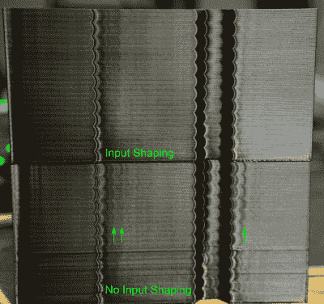

# 控制理论施法驱逐 3D 打印幽灵

> 原文：<https://hackaday.com/2020/12/24/control-theory-spellcasting-banishes-the-3d-printing-ghosts/>

似乎我们仍然无法为 3D 打印机找到更好的控制方案。输入整形是我们雷达上的最新技术，是一种共振补偿形式，几乎消除了我们在打印零件壁上看到的重影(又名:垂直振铃)伪影。虽然这项技术已经存在了几十年，但直到最近[Dmitry Butyugin]才将其应用于 3D 打印机控制，并将他们的辛勤工作融入开源固件包[Klipper](https://hackaday.com/2017/12/26/fast-3d-printing-with-raspberry-pi-but-not-how-you-think/)。一旦调整，结果是惊人的-特别是因为这个方案可以提高打印质量，即使是最便宜的打印机。

[@ lukes laboratory]

【T4]提供的有无 Klipper 输入整形功能的分割 A/B 测试假设你的 3D 打印机不是无限僵硬的，当你的喷嘴从一点移动到另一点或改变方向时，它会因速度改变而振动。结果是喷嘴沿着它试图跟踪的理想路径摆动。结果是*重影*，这是一种美学瑕疵，看起来像打印部件侧面的垂直波浪。

输入整形是一种*前馈*控制技术，用于消除产生重影的机械振动。这个想法是，如果我们想把机器从一点移动到另一点，我们给它两个脉冲。第一个脉冲推动机器运动，第二个脉冲在精确的时间跟进，抵消机器停止时我们会看到的振动。尽管如此，通过向任何机器发送两个脉冲来移动它都是相当粗糙的，所以我们采用这些脉冲，调整它们的幅度，使它们的总和为 1，并将其与我们实际上想要发送的控制输入信号进行卷积。结果是，信号的共振抵消部分无缝地“混合”到控制输入信号中，并且机器从一个点移动到另一个点，在移动结束时振动明显减小。关于这个过程背后的数学原理的更多信息，请看来自[辛格和辛格霍兹]的[这篇论文](http://code.eng.buffalo.edu/tdf/papers/acc_tut.pdf)的前四页。

唯一的问题是，在利用这项技术之前，您需要对运行 Klipper 的 3D 打印机进行一些预先的系统表征。幸运的是，Klipper 升级版附带了一套逐步说明，用于预先描述您的机器。在几次测试打印来测量振铃的周期性之后，您可以简单地将测量结果应用到您的配置文件中，这样就设置好了。

输入整形是一个典型的例子"[只要用一台计算机把它包起来就行了！](https://www.bunniestudios.com/blog/?p=5215)“–通过软件描述和消除不必要的行为来修复硬件。如果你渴望更聪明、更有特色的硬件控制方案，看看这个为 BLDC 汽车设计的[反齿槽算法就知道了。关于 Klipper 实现的视频演示，请在休息之后看一下[eddiesteengineer]的分析。](https://hackaday.com/2016/02/23/anti-cogging-algorithm-brings-out-the-best-in-your-hobby-brushless-motors/)

你的 3D 打印机运行 Klipper 吗？我们很想在评论中看到你的一些意见。

 [https://www.youtube.com/embed/pH-1RWdC75E?version=3&rel=1&showsearch=0&showinfo=1&iv_load_policy=1&fs=1&hl=en-US&autohide=2&wmode=transparent](https://www.youtube.com/embed/pH-1RWdC75E?version=3&rel=1&showsearch=0&showinfo=1&iv_load_policy=1&fs=1&hl=en-US&autohide=2&wmode=transparent)

