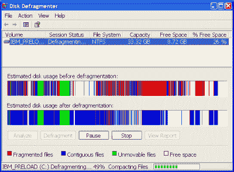
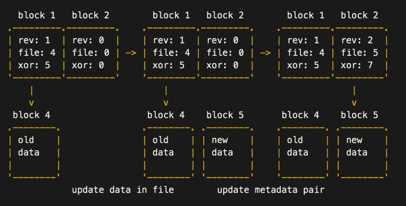

# 酷工具:一个小文件系统，让您的位保持锁定

> 原文：<https://hackaday.com/2019/01/24/cool-tools-a-little-filesystem-that-keeps-your-bits-on-lock/>

计算机的文件系统并不是嵌入式系统的最佳选择。即使那些知道这个真相片段的人仍然落入陷阱，并在以后为它付出代价，而被曾经是一个功能项目的瓦砾所包围。事情是这样的。

该项目开始规模较小，存储需求适中。这只是一个温度记录器，你想存储数据，所以你坚持一个小 EEPROM。那工作得相当好！但是你需要存储更多的数据，这样 EEPROM 就可以和一小块 NOR flash 配对，后者要大得多，但是仍然很容易操作。器件设置进入 EEPROM，数据记录进入 NOR。这在一段时间内有效，但随后你会记得互联网上的人都是关于物联网的，所以是时候添加 WiFi 了。您开始使用令人惊讶的强大处理器提供一些静态页面，然后再次遇到存储问题，因此 NOR 闪存被替换为 SD 卡，现在日志也放在那里。突然，你要处理多个文件，并想在一台计算机上访问，所以一个真正的文件系统是有序的。FAT 很简单，所以卡增加了一个 FAT 文件系统。一切都很好，但是您开始注意到日志中缺少补丁。然后 SD 卡就完全损坏了。这是怎么回事？让我们来看看问题，以及如何达到嵌入式文件涅槃。

Hello darkness my old friend

## 文件系统如何组织文件

你有了一个惊喜的学习机会(也就是你搞砸了什么)。在寒冷的花园小屋中，你的小设备的电源并不像你想象的那样可靠，它往往会突然关闭。事实证明，FAT(和许多其他文件系统)并不特别容忍您在这些环境中发现的错误。你知道是什么吗？littleFS ，ARM 的 BSD 授权开源文件系统，专为小型设备设计。

我们暂且迂腐一下；什么是文件系统？它只不过是数据在存储介质上的组织方式。对于一个具有简单存储需求的非常简单的系统，比如我们最初的 EEPROM 温度记录器，可能实际上并不存在“系统”本身。EEPROMs 通常擅长字节分辨率寻址，因此存储温度数据的最直接方式可能简单到“每个字节就是一个样本”。再加上对采样间隔和首次引导时间的了解，这对于简单的应用程序来说就足够了。在这样的系统中，你可以说 EEPROM 包含一个“文件”——温度记录的单一列表。

在更复杂的系统中，发现需要更多的组织是不足为奇的。高级温度记录器有一个小型静态网站、一个配置设置文件和数据日志。您当然可以将所有这些保存在一个“文件”中，并对每个区域的地址偏移量进行硬编码，但当存储区域需要改变大小或 SD 卡被另一个设备读取时，这将变得很脆弱。另一种方法是将每个区域开始和结束的信息存储在磁盘上某个预先指定的结构中。一旦有了这样的结构，就不难想象添加其他元数据，如磁盘的哪些区域已经被擦除或正在使用、时间戳、大小、权限等。你看这是怎么回事。甚至可以通过添加元数据的层次级别来创建目录。现在，事情开始看起来更像桌面文件系统。对于相对简单的嵌入式系统，可能不需要它们，但是一旦复杂性增加，添加文件系统可以使存储更容易处理。

## SD 卡上的数据损坏

回到我们有问题的温度记录器。为什么数据会损坏？想象一下 SD 卡中那些关键的元数据扇区。如果一个被损坏了会发生什么？有时它们可能是可恢复的，但是如果没有这些重要的元数据，磁盘就会变成巨大的熵。它坏掉了。

你如何确保东西永远不会被损坏？[日志](https://en.wikipedia.org/wiki/Journaling_file_system)是一个流行的选项，其中要写入磁盘的更改首先存储在挂起操作的“日志”中。如果磁盘损坏，理想情况下可以重放该日志进行恢复。元数据可以写入磁盘上的多个位置并进行比较，或者以特定的顺序写入，CRC 和其他一致性检查*本身*以特定的顺序写入。数据可以保留在 RAM 中，直到它被明确、绝对、肯定地写入磁盘。一个详尽的选项列表比这篇文章更适合博士。

很明显，这些选择中的一些会比其他的更好。由此可见，提高台式计算机、服务器或电话耐用性的方案可能不太适合电源不稳定的嵌入式设备所固有的风险。稍作思考就足以意识到，如果在写操作过程中切断电源，上述许多想法都会灾难性地失败。在设计文件系统时，有可能考虑到功率损耗，但这是一个需要特别注意的特性。

## littlest 喜欢微控制器设计

回到 littleFS，事实证明它符合我们对可靠的小型嵌入式文件系统的许多标准。它对意外断电很耐用(他们认为这是文档中项目的主要焦点)。它可以磨损水平，这在小型闪存设备上尤其重要，这些设备不适合像老式转盘那样多次循环，与 FAT 形成鲜明对比。当你的 CPU 有 16k 的内存时，它支持所有你想要的静态分配、最大内存和 ROM 保证。另外，整个事情是一个单一的来源/头对，与第二对可选的工具！

littleFS 最好的部分不是它的一致性保证或它的许可(好吧，我们真的*喜欢一个好的许可方案，尽管如此)当然是文档！打开那个头文件，看看它都是些什么，迎接你的是一个*伟大的*级别的文档。源文件？甚至更好！恰到好处的评论冗长程度；解释大部分高级逻辑，但不是每一行。老实说，它可能偏向于过多的文档。*

但是这还不是全部！就在你认为文档不能再好了的时候，你找到了 [SPEC.md](https://github.com/ARMmbed/littlefs/blob/master/SPEC.md) 和 [DESIGN。md](https://github.com/ARMmbed/littlefs/blob/master/DESIGN.md) 。规范涵盖了技术细节。如果您已经知道文件系统是如何工作的，SPEC 可以帮助您编写额外的工具和调试原始磁盘。设计就是一切。设计是对一切的一个 *1200 线*描述。为最终实现所做的选择。要比较的现有设计。操作的理论，ASCII 图非常好，我们用它们来装饰这篇文章。

无论如何，如果这不是显而易见的，我喜欢这个项目，并肯定会在下次我有存储来组织小型嵌入式系统时使用它。即使你不打算这样做，如果你已经读到这里，浏览一下 DESIGN，作为关于如何编写优秀文档的入门读物~~可能是值得的~~在组装文件系统时应该考虑什么。和往常一样，如果你试用过 littleFS 或者有另一个喜欢的 uC 文件系统，请在评论中告诉我们！我们很想知道结果如何。