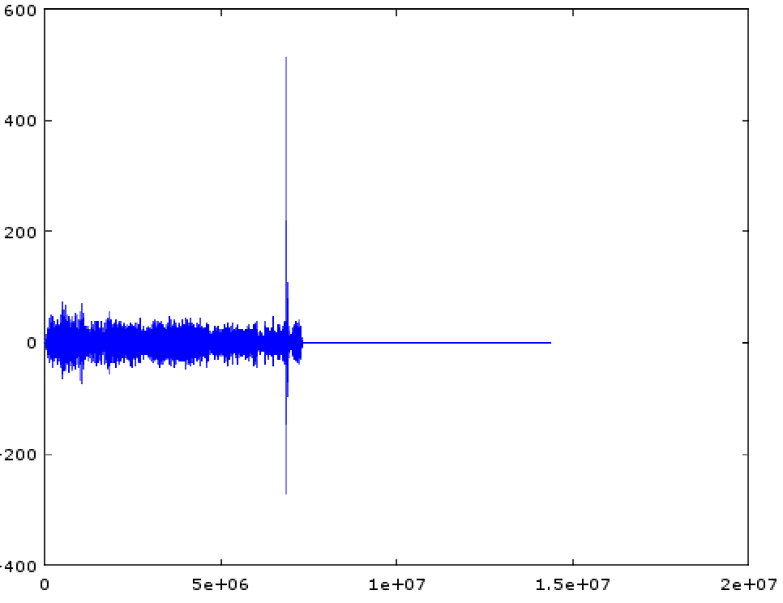

# 交叉关联使广告工作迅速

> 原文：<https://hackaday.com/2018/08/22/cross-correlation-makes-quick-work-of-ads/>

广告拦截曾经一度属于众所周知的热爱 Linux 的 Firefox 用户，但随着人们对隐私和互联网广告机制的日益关注，它已经进入了公众的视野。在一年一度的家庭聚会上，当那位亲戚询问如何安装他们的新笔记本电脑时，我们费力地完成了一篇关于广告拦截器价值的论文，并说服他们安装一台。但是除了互联网之外还有什么媒介呢？几十年前，Tivo 给了我们一个按钮来跳过录制的电视节目。收音机怎么样？如果可以的话，卫星广播可能没有讨厌的广告。但是地面广播和在线流媒体呢？[tomek]并不满足于收听波兰广播 3 台的美妙体验，决定[开发一个桌面工具](https://blog.rekawek.eu/2016/02/24/radio-adblock/)来检测和删除直播音频流中的广告。

[tomek]知道这个被称为数字信号处理的时髦知识领域，但自己并没有做过任何事情。像许多算法问题一样，第一步是找出最快的方法来拼凑一个原型，以证明给定的技术是可行的。我们和[托梅克]一样惊讶于这竟然如此简单。从根本上说，它需要一个函数——互相关——来测量两个数据样本(本例中为音频文件)的相似性。事实证明，八度音阶是由 T2 提供的。在从一个样本文件中截取广告开头的广告歌，并将其与一个广播节目进行比较后，[tomek]得到了左边的图表。明显的尖峰是音频文件中叮当声的位置。

在这一点上，剩下的就是把它打包成一个单击工具，不用加载整个分析包就可以收听广播。Octave 是一个开源软件，所以[tomek]能够挖掘它的源代码，直到找到关键的 xcorr()函数。[tomek]修改了他们的代码，将音频倒入一个循环缓冲区，以便使用现有的 Java FFT 库，神奇的事情发生了。当检测到给定的广告顺口溜样本时，将流从 ffmpeg 输送到广告检测器会产生事件。

[tomek]将该工具打包成一个独立的可执行文件，但这里的精华是后续文章。在删除在线流中的广告后，他们改编了 RaspberryPi 来收听 FM 接收器，并通过网络远程控制他们的雅马哈调谐器。因此，当调谐器播放第三电台时，Pi 会注意到并适当地避开音频，以避免那些讨厌的广告。休息后的视频。

 [https://www.youtube.com/embed/hmdEd4WlKE8?version=3&rel=1&showsearch=0&showinfo=1&iv_load_policy=1&fs=1&hl=en-US&autohide=2&wmode=transparent](https://www.youtube.com/embed/hmdEd4WlKE8?version=3&rel=1&showsearch=0&showinfo=1&iv_load_policy=1&fs=1&hl=en-US&autohide=2&wmode=transparent)

