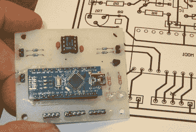

# 定制控制器让涡轮分子泵吸

> 原文：<https://hackaday.com/2021/01/06/custom-controller-makes-turbomolecular-pump-suck/>

[Mark Aren]购买了一对不带控制器的涡轮分子泵(TMP ),然后为涡轮分子泵构建了[基于 FPGA 的 BLDC 控制器。TMP 类似于喷气涡轮机，由几级交替运动的涡轮叶片和静止的定子叶片组成，涡轮转速范围为 10，000 rpm 至 90，000 rpm。TMP 不能直接排放到大气中，必须与前级(或粗抽)泵结合，首先产生较低等级的真空。它们在许多领域都有应用，如电子显微镜、分析科学、半导体和灯具制造。随着灯具行业迅速接受 led，许多传统的灯具生产线正在退役，如果你幸运的话，你可以以较低的成本获得 TMP 但无论如何也不会便宜。](https://hackaday.io/project/176132-turbomolecular-pump-controller)

[Mark]购买的两台 [BOC-Edwards EXT255H 复合分子泵](https://www.idealvac.com/files/manualsII/Edwards_EXT255H_Manual.pdf) (PDF)没有随附的 [EXC100E 涡轮分子泵控制器](https://shop.edwardsvacuum.com/Viewers/Document.ashx?id=1098&lcid=2057) (PDF)，考虑到疫情的相关限制，他决定使用自己零件箱中的组件和模块构建自己的控制器。泵和控制器用户手册仅提供了泵中使用的带传感器的 BLDC 电机的粗略细节。低相间电阻意味着低驱动电压，因此[Mark]决定先在 24 V 下运行。他已经有了使用三菱 PS21245-E IGBT 逆变桥的经验，尽管它的额定电压要高得多，但他知道它在 24 V 也能正常工作。

在计算出一个利用基于 PWM 的可调电流控制的电机换向状态机后，他将其实现在一个 128 单元 FPGA 板上。考虑到 TMP 有多贵，他明智地决定首先在一台更小的“一次性”BLDC 发动机上测试他的驱动程序。这整个过程是不平凡的，因为他可用的 IGBT 模块未经测试和记录，需要几个调整，然后才能在所需的 12 kHz PWM 信号下运行。他的测试马达也没有记录，第一次连接时无法正确运行。解决这个问题意味着必须拆卸电机来检查其内部线路。最终，他的努力得到了回报，他能够安全地运行 TMP 电机，以证实他的设计是可行的。

解决了 FPGA 代码、IGBT 布线和电源问题后，下一步是使用 Arduino Nano 添加监控微控制器。它的功能包括作为用户界面与触摸屏 LCD 连接，与 FPGA 模块通信，以及控制几个继电器将电源切换到电机电源、低真空泵、TMP 冷却风扇和真空排气口的螺线管。主轴电流通过测量 IGBT 低端分流电阻上的压降来计算。电机速度通过一个电机霍尔传感器测量，热敏电阻提供电机温度检测。[Mark]的 PCB 制造技术似乎也有点不同。他使用 Excellon 钻孔锉，用激光切割机在一块塑料上钻孔，形成一个裸板，然后手工焊接铜轨道。

他在大气压力下的初始测试(尽管不推荐，除非你监控泵的温度)，结果是每分钟 7300 转，消耗大约 7 安培，然后他不得不关闭它。在进一步的测试中，在测试设置中添加低真空泵后，他能够将 TMP 旋转到 20，000 rpm，同时消耗 0.6 A。显然，泵的额定工作电压更高，根据 TMP 控制器手册中提到的值，可能为 48 V。该项目仍在“进行中”，因为[Mark]希望最终将泵驱动到其指定的 60，000 rpm 的运行速度。不清楚的是，他最终打算用这台奇特的机器做什么。他只提到“他最近对高真空系统产生了兴趣，并对探索电子枪的高真空世界感兴趣。”

也许[Mark]可以与我们不久前推出的[开源涡轮分子泵控制器](https://hackaday.com/2018/04/28/an-open-source-turbomolecular-pump-controller/)交换意见。如果你想更冒险一点，建立自己的 TMP，我们让你拥有这个 DIY [普通人的涡轮分子泵](https://hackaday.com/2016/04/09/everymans-turbomolecular-pump/)。