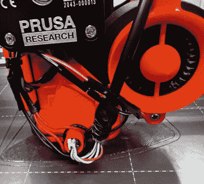

# 定制 Prusa MK3 风扇导管给相机完美的视野

> 原文：<https://hackaday.com/2022/11/25/custom-prusa-mk3-fan-duct-gives-camera-perfect-view/>

越来越多的趋势是在 3D 打印机的喷嘴附近安装管道镜“检查相机”，以提供独特的近距离观察活动。一些人认为，如果你试图微调你的机器，这种视角可以提供有价值的见解，但不管这些喷嘴凸轮是否有实际应用，当然每个人都同意这是一个非常酷的视频。

【Caelestis Cosplay】最近决定给他的 Prusa i3 MK3S+配备这样一台相机，并好心地[在一篇报道中分享了这个过程](https://www.instructables.com/A-New-Perspective-on-3d-Printing/)。第一步是找到一个社区开发的风扇导管，然后他对其进行了修改，以容纳 7 毫米相机模块。由于管道正好吹在打印机的喷嘴上，这提供了一个理想的有利位置。

相机模块在镜头周围包括一些微小的 SMD LEDs，但[Caelestis Cosplay]在风扇导管上增加了孔，以安装一对 3 毫米的白色 led，真正照亮东西。虽然修改打印部分需要一些努力，但他表示，整个构建过程中最困难的部分是从手持放大镜中抢救出一个 5X 镜头，并将其锉平，以便它能整齐地适合相机。但是从他提供的清晰明亮的演示视频来看，我们会说额外的努力肯定是值得的。

在讲述了摄像机是如何组装的之后，[Caelestis Cosplay]接着讲述了它是如何被整合到 OctoPrint 中的，包括[外部 led 是如何被打开和关闭的](https://hackaday.com/2018/09/15/adding-3d-printer-power-and-light-control-to-octoprint/)。他在树莓派上运行 OctoPrint，尽管正如我们最近报道的那样，一台[小型台式电脑](https://hackaday.com/2022/11/04/thin-client-and-smartphone-step-in-for-3d-printers-raspberry-pi-and-touchscreen/)也可以轻松运行这场秀。

 [https://www.youtube.com/embed/J96qmJQXhAw?version=3&rel=1&showsearch=0&showinfo=1&iv_load_policy=1&fs=1&hl=en-US&autohide=2&wmode=transparent](https://www.youtube.com/embed/J96qmJQXhAw?version=3&rel=1&showsearch=0&showinfo=1&iv_load_policy=1&fs=1&hl=en-US&autohide=2&wmode=transparent)

