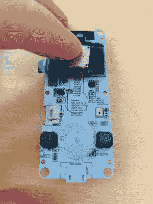

# 处理丢失的 Pin 分配

> 原文：<https://hackaday.com/2019/10/12/dealing-with-missing-pin-allocations/>

因缺少 pin 分配而措手不及？也许你正在开发一个硬件，你发现文档是完全错误的。你如何让你的设备工作？

[Dani Eichhorn]的麻烦开始于使用相机模块经营一个[物联网车间](https://thingpulse.com/reverse-engineering-pin-allocations/)。在这项工作开始之前，没有人检查过为参与者订购的所有相机模块是否都是相同的。事实证明，TTGO T-CAM 模块进行了多次修改，有些甚至在普通电路板上安装了温度/压力传感器。

虽然这些板看起来可能一样，但它们的引脚分配却完全不同。如果只是编号不同，更改 pin 号并不困难，但是因为配置不同，错误开始大量出现:*无法初始化相机*

事实证明，即使是 LillyGo 的工程师(电路板的制造商)在处理引脚分配时也可能有点迷路，因为[Eichhorn]能够找到一些正好印在 PCB 上的引脚，藏在摄像头组件后面。

要找到没有印在黑板上的信息，需要做更多的挖掘。要找到连接到 I2C 总线的设备的地址，运行一个程序来找到监听总线的外围设备就成功了。这能够打印出 SSD1306 有机发光二极管显示驱动器和麦克风的地址。

为了找到未印刷在 PCB 上或隐藏在丝网印刷上的外设引脚，GPIO 扫描仪做到了这一点。这尤其适用于寻找 PIR(被动红外)运动传感器。

我们从这一努力中得到了一些提示和技巧，但也了解到逆向工程是很难的，并且当文档丢失时，没有任何一种方法可以找到引脚分配。