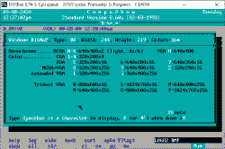

# 解码网飞公告:解释 4K 优化的基于镜头的编码

> 原文：<https://hackaday.com/2020/09/16/decoding-the-netflix-announcement-explaining-optimized-shot-based-encoding-for-4k/>

网飞最近宣布，他们现在[为 4K 优化基于镜头的编码内容。当我读到这个新闻标题时，我心想:“太好了！听起来不错，但是…那到底是什么意思？到底什么是基于镜头的编码？”](https://netflixtechblog.com/optimized-shot-based-encodes-for-4k-now-streaming-47b516b10bbb)

这些问题基本上是我如何在永久编码优化历史的兔子洞结束的，以努力彻底解剖以上句子并正确理解它，所以我可以与你分享。在我开始之前，让我们回顾一下过去。

## 90 年代

CSHOW on DOSBox

在 90 年代初，如果你想在电脑上显示一个图像文件，比如 GIF 或新 JPG 格式，你需要使用一个程序。我想我当时用的是 CSHOW。对于“视频”,我和我的朋友们交换 FLIC 文件，这是一系列静止的帧，可以在一个我再也想不起的软件中快速翻转，以实现运动的幻觉。尽管在 90 年代早期已经开发了一些视频压缩标准，但是视频文件并不常见。数据存储是稀缺和昂贵的，甚至我的 486 DX 33Mhz，8 MB 内存和 120 MB 硬盘台式机可能无法以任何方式(速度，内存或磁盘)处理现代视频文件的解码。

我甚至不敢想象用我 28.8 kb/s 的调制解调器传输任何有意义的视频需要多长时间。

JPEG 压缩改变了图像的游戏规则。我们现在可以在更小的空间里存储质量几乎相同的巨大图像。当它出现时，对我来说几乎是不可思议的。我们一直在寻找最好的压缩算法和技巧，以便在软盘上花更少的钱。有 ARC，ARJ，LHA，PAK，RAR，ZIP，仅举几个我在 MS-DOS 中用过的例子。这些都是采用无损压缩的归档器，大多数都达不到高清图像的要求。但是 JPEG 使用[有损压缩](https://en.wikipedia.org/wiki/Lossy_compression)，因此它可以以牺牲图像质量为代价获得更小的图像。

对于作为图像序列的视频，合乎逻辑的下一步是运动 JPEG。M-JPEG 是一种视频压缩格式，其中每个视频帧都作为 JPEG 图像单独压缩，这意味着您可以将 JPEG 压缩的好处应用到每个帧。像 FLIC，但是针对 JPEGs。

由于压缩仅取决于每个单独的帧，这被称为帧内压缩。作为纯粹的帧内压缩方案，M-JPEG 的图像质量直接是每个视频帧的静态空间复杂度的函数。但是一个视频包含的信息比每一帧的总和还要多。进化，从一个帧到另一个帧的转换也是信息，新算法很快就利用了这一点。

## 从静态到动态

MPEG-1 是探索视频压缩新方法的编码器之一。MPEG-1 不是压缩每个单独的帧，而是将视频分成不同的帧类型。为简单起见，假设 MPEG-1 中有两种主要的帧类型，关键帧(I 帧)和预测帧(P 帧，B 帧)。MPEG-1 存储一个关键帧，这是一个压缩格式的常规全帧，然后是一系列预测帧，可能是十帧或十五帧。预测帧不是图像，而是帧和最后一个关键帧之间的差异，因此节省了大量空间。至于存储音频，MPEG-1 音频(MPEG-1/2 音频层 3)使用心理声学来显著降低音频流所需的数据速率，因为它删除了人耳听不到的音频部分。我们大多数人只通过 MP3 知道这种音频格式。

听起来很酷，也很有创意，甚至在 MPEG-1 标准的第一稿完成之前，MPEG-2 的工作就已经开始了。MPEG-2 伴随着隔行视频和声音改进而来，隔行视频是一种在不消耗额外带宽的情况下将视频显示的感知帧速率加倍的技术。MPEG-2 标准可以将视频流压缩到原始视频大小的 1/30，同时仍然保持良好的图像质量。

当发现 MPEG-3 是多余的时，它被整合到 MPEG-2 中。但是后来出现了更现代的 MPEG-4。MPEG-4 为更高级的压缩算法提供了一个框架，与 MPEG-2 相比，它以更高的计算要求为代价，潜在地产生了更高的压缩比。在发布之后，曾经有一段时间，许多不同的编解码器共存，对于普通用户来说，试图播放一个视频文件有时会令人沮丧。我记得没有 DivX 编解码器，或 Xvid，或 3ivx，或不得不安装`libavcodec`和`ffmpeg`，或可能试图在 Quicktime player 中播放它，或只是含泪放弃…

但有一点是肯定的，我们现在的个人电脑、游戏机和数码相机质量非常好。

## 流动

实际的视频流只有在数据压缩的这些和其他进步下才成为可能，因为以未压缩的方式传送所需数量的数据仍然是不实际的。流媒体起源于流媒体音乐、分享音乐以及最终开发 P2P 网络，有很多有趣的故事可以讲述。尽管如此，我在本文中还是将重点放在视频流上，因为整个目标是理解什么是“优化的基于镜头的编码”。

我们目前生活在一场流媒体战争中，视频流媒体服务之间的竞争非常激烈，如网飞、亚马逊 Prime Video、迪士尼 Plus、Hulu、HBO Max、Apple TV+、Youtube Premium、CBS All Access 等。

所有这些服务都试图提供新的独家内容，并且提供得很好。交付好涉及许多方面，从内容新鲜度到用户体验，但有一点我认为我们可以达成一致:当视频质量糟糕时，没有营销或 UX 团队可以扭转局面。考虑到这一点，使用了几种现代视频编码算法，包括 H.264(也称为 MPEG-4 第 10 部分)、HEVC、VP8 或 VP9。除此之外，每个服务试图提高他们自己的视频质量。

## Nexflix 技术博客

网飞有一个不错的科技博客，在那里你可以读到一些严肃的极客视频内容。他们在网络和压缩算法中引入了许多不同的优化，有时他们会在博客中分享。2015 年底，他们宣布了一项名为[按标题编码优化](https://netflixtechblog.com/per-title-encode-optimization-7e99442b62a2)的技术。

> 当我们在 2010 年末首次部署 H.264/AVC 编码时，我们的视频工程师开发了在我们的视频目录中效果最佳的编码方案(当时)。他们测试了各种编解码器配置，并进行了并行视觉测试，以确定能够在不同类型的内容之间产生最佳质量平衡的编解码器参数。选择一组比特率-分辨率对(称为*比特率阶梯* ) …使得比特率足以以该分辨率编码流，而没有明显的编码伪像。

当时，网飞使用以分贝为单位的 PSNR(峰值信噪比)来衡量图像质量。他们发现这个固定的*比特率阶梯*对于大多数内容来说更像是一个平均值或经验法则，但在一些情况下并不适用。具有高相机噪声或胶片颗粒噪声的场景，5800 kbps 的流在噪声区域中仍然会表现出块效应。另一方面，对于像卡通这样的简单内容，5800 kbps 对于制作 1080p 的视频来说是一种大材小用。所以他们为每个标题尝试了不同的参数:

这里的每一行代表一个标题、一部电影或一集。更高的 PSNR 意味着更好的整体图像质量:45 dB 是非常好的质量，35 dB 将显示编码伪像。很明显，许多标题实际上并没有从超过某一点的比特率增加中获得很多。一般来说，每标题编码通常会为您提供更好的视频质量，或者是相同比特率下的更高分辨率，或者是相同比特率下的更低分辨率。

标题内容在本质上可以非常不同。但是，即使在同一个标题中，也可以有高的动作场面，然后是静止的风景。这就是为什么当网飞[决定对他们的电影](https://netflixtechblog.com/high-quality-video-encoding-at-scale-d159db052746)进行块编码以利用云时，通过将电影分成块以便可以并行编码，他们在 2016 年开始测试和实施每块编码优化。这和每个标题的逻辑是一样的，但是对于标题中的每个块。就像多加了一层优化。

最后，在 2018 年，网飞开始实施[优化的基于镜头的编码](https://netflixtechblog.com/dynamic-optimizer-a-perceptual-video-encoding-optimization-framework-e19f1e3a277f)，它现在也可以从 8 月份开始在 4K 的游戏中使用。所以回到最初的问题。如果我们可以为每个标题选择正确和最佳的关键帧，而不是以某种方式随机块来编码我们的视频，这导致随机关键帧的生成(其中一些可能非常相似，因为它们占用了大量空间，所以不是最佳的)，会怎么样？

> 在一个理想的世界中，人们希望将一个视频分块，并对每个分块施加不同的参数集，以优化最终组合的视频。实现这种完美的位分配的第一步是将视频分割成其自然原子，这些原子由彼此非常相似的帧组成，因此对编码参数的改变表现相似——这些是组成长视频序列的“镜头”。(…)镜头的自然边界是通过相对简单的算法建立的，这种算法称为镜头变化检测算法，它检查属于连续帧的像素之间的差异量以及其他统计数据。

除了优化用于编码的关键帧之外，基于镜头的编码还具有一些其他优点，例如在视频序列中寻找自然的兴趣点(由镜头边界表示),并且不同镜头中的编码参数变化对于用户来说是不明显的，因为关键帧非常不同。所有这些变化都是对编码器的调整，实际上可以是 H.264 或 HEVC 或 VP8，没有什么区别。

这一切麻烦值得吗？要回答这个问题，让我们看看 Nexflix 使用的最新视频质量评级:视频多方法评估融合(VMAF)。传统上，编解码器比较使用相同的方法:计算多个视频序列的 PSNR 值，每个视频序列根据一组测试条件以预定义的分辨率和固定的量化设置进行编码。这适用于编解码器中的微小差异，或者适用于同一编解码器中的评估工具。根据网飞的说法，对于视频流来说，使用 PSNR 是不合适的，因为它与感知质量关系不大。VMAF 可以捕捉编解码器之间的较大差异，以及缩放伪像，以更好地与人类的感知质量相关联的方式。行业中的其他参与者认识到并采用 VMAF 作为质量评级工具。

使用 VMAF 网飞开始运行测试他们的 4K 标题。结果令人印象深刻。

Example of a thriller-drama episode showing new highest bitrate of 11.8 Mbps VS 16 Mbps

Example of a 4K animation episode showing new highest bitrate of **1.8 Mbps** VS 11.5 Mbps

以上只是两个例子，但平均来说，他们需要降低 50%的比特率才能达到优化阶梯的相同质量。最高 4K 比特率的标题平均为 8 Mbps，与固定比特率阶梯的 16 Mbps 相比也减少了 50%。总的来说，用户以较低的比特率获得了更高的质量，这是一个相当大的成就。

由于一张图片胜过千言万语，我将以此结束(注意区别和比特率):

#### 放弃

作者并不是想挑起一场编解码器大战，有许多编解码器和标准，MPEG 似乎更适合用于演示目的。大量的编码、规范和它们的别名肯定会在文本中出现错误，请在评论中随意修改。

作者也不认可任何流媒体服务。我们提到网飞只是因为它与公众分享它的编码技巧。我们确信其他服务也有聪明的东西在进行，只是他们没有说。