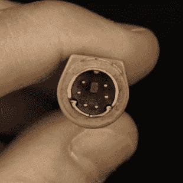

# 使用老式硬件解码 PS/2 键盘协议

> 原文：<https://hackaday.com/2021/03/11/decoding-the-ps-2-keyboard-protocol-using-good-old-fashioned-hardware/>

1987 年是辉煌的一年。它给我们带来了 PS/2 键盘标准，这一标准至今仍存在于许多主板背板上。(这也标志着《塞尔达传说》的北美/欧洲发行，但那是另一篇文章了。)到目前为止，外围设备一直使用 DIN-5 和 DE-9(通常被误称为 DB9，当时常用于鼠标)连接器，或者——gasp——非标准专有连接器。那么这种新的性感是怎么回事呢？【食本者】[通过逆向工程协议](https://www.youtube.com/watch?v=7aXbh9VUB3U)带我们走过 PS/2 名人堂。

The PS/2 connector in all its glory

这是一种时钟数据协议，因此每按一次键，data 引脚上就会产生一个波形，该波形可以与 clock 引脚进行比较，以确定每个脉冲的时序。每一个键都发送一组独特的编码脉冲，瞧，用户的奇思妙想可以很快很容易地被机器解码。

这是[本]跳水真正出彩的地方，我们知道[他是一个面包忍者](https://hackaday.com/2021/01/05/ben-eaters-breadboarding-tips/)，所以他伸手去拿一些蘸酱薯条。移位寄存器是构建并行 PS/2 接口的一种简单方法，用于分解每个数据包。这个过程中有一些奇怪的地方，比如需要反转时钟信号，以便移位寄存器在正确的边沿触发。他还利用几个反相器门的传播延迟来稍微延迟触发 595 移位寄存器的 latch 引脚，以避免竞争情况。第二个 595 存储由一组发光二极管显示的输出。

除了简单地解码信号，[Ben]还深入研究了数据包是如何格式化的。你不只是得到关键代码，而是得到正常的串行接口错误检测；开始/停止位以及奇偶校验位。他甚至深入到发送多个数据包的扩展键，以及由这个特定键盘发送的按键动作数据包。

这是该协议如何工作的完美的底层演示。在实用性方面，当监控两条信号线并利用微控制器对其进行解码非常容易时，将串行分解为并行会让人感觉有点奇怪。你可能想把它调大一点，坚持使用时钟和数据引脚，但是[只用几个无源元件](https://hackaday.com/2016/03/02/hack-a-ps2-keyboard-onto-your-pi-zero/)把它们连接到一个 Raspberry Pi。

 [https://www.youtube.com/embed/7aXbh9VUB3U?version=3&rel=1&showsearch=0&showinfo=1&iv_load_policy=1&fs=1&hl=en-US&autohide=2&wmode=transparent](https://www.youtube.com/embed/7aXbh9VUB3U?version=3&rel=1&showsearch=0&showinfo=1&iv_load_policy=1&fs=1&hl=en-US&autohide=2&wmode=transparent)

