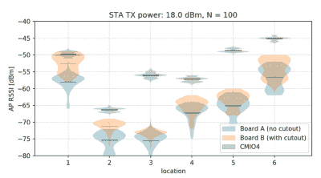

# 设计您的 CM4 运营商时考虑到 WiFi 性能

> 原文：<https://hackaday.com/2022/06/27/design-your-cm4-carrier-with-wifi-performance-in-mind/>

Raspberry Pi Compute Module 4 有一个内置的 WiFi 天线，但这并不意味着它会很好地为您工作-载板的物理属性也会影响您的信号质量。[Avian]决定[做一个简单的测试](https://www.tablix.org/~avian/blog/archives/2022/03/effect_of_ground_cutout_on_the_cm4_antenna/)——用几种不同的载板测量 WiFi RSSI 变化和吞吐量。他使用的载体似乎是专有的，但[Avian]提供了 CM4 如何在这些载体上定位的草图。

有两个建议可以让 WiFi 在 CM4 上很好地工作——将模块的 WiFi 天线放在运营商 PCB 的边缘，并在天线下添加指定大小的接地切口。[Avian]总共对三种配置进行了测试 CMIO4 官方载板符合这两种规则，载板 A 不符合这两种规则，载板 B 似乎是板 A 的副本，但增加了接地切口。

在设置了一些测试地点并编写了几个便于测试的脚本后，【Avian】记录了实验数据。有了这些数据，看起来虽然天线下的开口有所帮助，但它对 RSSI 的影响不如模块放置的影响大。当然，对于您自己的设计来说，还有更多的变量会影响 RSSI 结果——幸运的是，用于记录的脚本是可用的，因此如果需要，您可以测试自己的设置。

如果你幸运地能够在设计中考虑 CM4，并且外部天线不是你的选择，这可能有助于从你的 WiFi 天线中挤出更多的空间。[Avian]一直在测试类似的东西——一个月前，[他的 ESP8266 GPIO 5V 兼容性研究](https://hackaday.com/2022/05/12/is-esp8266-5-v-tolerant-this-curve-tracer-says-yes/)让我们再次就这个话题展开了热烈的讨论。如果 WiFi 对你来说至关重要，那么坚持设计准则是有意义的——毕竟，即使是树莓派[上的 HDMI 接口也可能使自己的 WiFi 无线电失灵。](https://hackaday.com/2019/11/28/raspberry-pi-4-hdmi-is-jamming-its-own-wifi/)