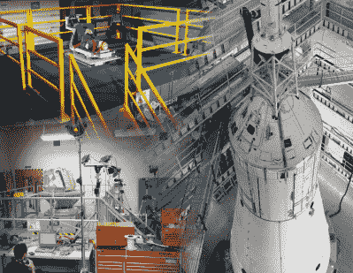

# 设计空间级 PCB

> 原文：<https://hackaday.com/2018/11/26/designing-space-rated-pcbs/>

我们将印刷电路板设计简化到如此多的实践中，以至于我们几乎不再考虑细节。很容易就能完成一个设计，把它送到一个 fab house，然后马上就有十块电路板在你手中。所有的设计复杂性对我们来说很大程度上是隐藏的，抽象成供应商网站上的几个复选框。

毫无疑问，为业余爱好者提供专业的 PCB 设计工具是一个好处，但也有坏处。并非所有 PCB 设计都可以归结为“一个来自 A 列，一个来自 B 列”的方法。在许多应用中，原材料和制造技术都不能满足要求。设计在太空中运行的 PCB 就是这样一种应用，虽然我们很少有人会幸运地拥有一个被炸到无限远的小部件，但了解太空级 PCB 背后的东西是非常有趣的。

## 到达那里

太空中使用的多氯联苯的设计主要由航天飞行的两个主要阶段驱动:到达那里和到达那里。当然，有些任务最终会温和地返回地球，有些会降落在另一个世界的表面，但在大多数情况下，我们会将它们炸毁，它们会在那里度过余生。

 在短暂的太空之旅中，对航天器中任何 PCB 的首要挑战就是振动。印刷电路板将非常接近一个几乎无法控制的连续爆炸，该爆炸由一台尽可能轻的机器控制，即使在车辆和有效载荷之间安装了减震装置，振动也可能很大。[美国宇航局的振动测试设施](https://www.nasa.gov/centers/johnson/pdf/639713main_Vibration_Testing_FTI.pdf)可以在 5 赫兹到 3 千赫兹的范围内向巨大的负载施加巨大的力，并用高达 167 分贝的声能爆破测试样本，以模拟有效载荷在发射过程中会经历什么。

这意味着 PCB 的材料必须能够承受比接地设备承受的最大压力环境更强的动态环境。有点令人惊讶的是， [NASA 自己的 PCB 工作组指南](https://nepp.nasa.gov/index.cfm/27505)列出了许多常见的基板材料，如玻璃纤维和酚醛树脂。它确实列出了一些更奇特的材料，如凯夫拉尔、特氟隆和各种树脂。对于大多数应用，NASA 似乎更喜欢聚酰亚胺基板，这对于订购了柔性 PCB 的任何人来说都是熟悉的。构建这些的 Kapton 薄膜是一种聚酰亚胺，美国宇航局经常使用这种材料制成的柔性和半刚性 PCB。当设计需要刚性 PCB 时，有时也会使用玻璃纤维增强的聚酰亚胺。

不管使用什么材料，设计师们通常用最简单的方法来处理 launch 的物理滥用:使 PCB 更厚。不过，这只能在一定程度上起作用，因为有效载荷重量直接转化为发射成本。当发射价格超过每公斤 20，000 美元时，增加几克的重量就必须仔细考虑了。

## 在那里

尽管其规模巨大，但发射期间产生的应力持续时间很短，如果有效载荷在短暂的太空飞行中幸存下来，它将在使用寿命期间面临一系列挑战，而地面上的多氯联苯很少考虑这些挑战。其中最主要的是除气作用，或者说材料在真空环境中释放气体的趋势。PCB 基板中使用的树脂在大气条件下非常稳定，一旦进入太空，可能会很快从电路板中起泡，从而污染其他表面并削弱基板。在需要控制除气的地方，通常使用在严格条件下制造的带有玻璃纤维增强物的 PTFE 树脂基底。

很少有地球上的设备会经历轨道上的东西会经历的热状态，这些热负荷是空间级 PCB 的主要设计考虑因素。如果没有大气层来缓和温度波动，轨道卫星的一面可能会在阳光下炙热无比，而另一面则会陷入寒冷的温度。必须处理热膨胀引入的物理应力；同样，这主要归结为选择正确的基底材料，并使其膨胀系数与电镀所用金属的膨胀系数紧密匹配。这使得走线和通孔上的物理应力最小化。

考虑温度如何影响 PCB 的电气特性也很重要。电路板材料的介电常数随温度而变化，设计人员需要考虑这一点，尤其是在固有阻抗至关重要的 RF 电路中。由于太阳活动，空间中的多氯联苯经常会遇到高压电场，因此介电考虑也很重要。董事会需要在不崩溃的情况下处理这些指控。

考虑到所有的事情，用于太空应用的印刷电路板和它们在地球上的同类非常相似。我们在应对太空的额外挑战方面学到了很多，NASA 等太空机构以及众多商业利益集团开发了必要的工具，以确保一个简单的错误不会在数十亿美元的资产开始获得投资回报之前将其毁掉。