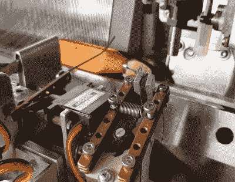

# 台式全自动织机是一种机电漫威

> 原文：<https://hackaday.com/2022/11/28/desktop-sized-fully-automatic-loom-is-an-electromechanical-marvel/>

编织是世界上最古老的工艺之一，也是最早实现自动化的工艺之一:工业革命在很大程度上是由织布机技术的发展推动的。[罗杰·德·梅斯特]决定通过建造他自己的桌面大小的全自动织布机，在某种程度上重现这个行业的那段历史。在纺织行业工作了很长时间后，他成为了纺织方面的专家，正如你将看到的，他也是机器制造专家。

[Roger]的织机是一种特殊类型的织机，称为*多臂织机*，这意味着垂直线(*经纱*)可以以各种方式上下移动，以在织物上创造不同的图案。水平线(*纬线*)是由一个左右移动的梭子产生的，梭子携带着一个线轴，在它移动时会松开。然后一个梳状板*钢筘*将新鲜纬纱固定在其位置上。[Roger]的视频(嵌入在下面)清楚地展示了这种机制的作用，以及织机的整体设计。

A clamp hold the end of the weft as the shuttle starts its run

3D 打印的梭子通过一个皮带驱动系统在经线中来回移动，该系统抓住梭子的磁性末端。机器两侧的旋转储纱筒可在每次穿梭运行中使用不同的纱线颜色。航天飞机由机械臂交换，机械臂将它们拾起并放到轨道上；当梭子开始运行时，有一个夹子夹住线的末端，当梭子准备更换时，有一个钢丝钳将它分离。

这种复杂的机械舞蹈由一组 Arduino Megas 和 Nanos 控制。它们驱动所有的伺服系统、DC 马达和步进器，同时读出一系列传感器和开关。该系统甚至可以检测到几个故障:每次循环后都会检查纬纱的张力是否合适，空筒的梭子会被自动丢弃，同时激光会密切关注经纱，以确保没有纱线断裂。

整个机器是[罗杰]自己设计的；除了 3D 打印和 CNC 加工的零件，他还重复使用各种废弃机器的部件。他的最终目的是利用这种机器制造医用或工业用的专门织物:例如，它可以利用导电线制造内置传感器的织物。

虽然这不是我们展示的第一台 DIY 自动织布机，但它绝对是最先进的。以前的例子，像这个 [3D 打印的微型版本](https://hackaday.com/2022/06/07/3d-printed-power-loom-shows-how-complex-weaving-really-is/)或[这个整洁的电脑控制的](https://hackaday.com/2019/06/18/open-source-computer-controlled-loom-knits-pikachu-for-you/)真的无法与【罗杰】的 26 厘米簧片宽度和广泛的可定制性相比。如果你喜欢让事情简单一点，你也可以使用 3D 打印机[直接打印某些面料](https://hackaday.com/2022/05/24/3d-printing-fabrics-is-easier-than-you-think/)。

 [https://www.youtube.com/embed/nBUR466rVQs?version=3&rel=1&showsearch=0&showinfo=1&iv_load_policy=1&fs=1&hl=en-US&autohide=2&wmode=transparent](https://www.youtube.com/embed/nBUR466rVQs?version=3&rel=1&showsearch=0&showinfo=1&iv_load_policy=1&fs=1&hl=en-US&autohide=2&wmode=transparent)

 [https://www.youtube.com/embed/Mng_hX7eGe0?version=3&rel=1&showsearch=0&showinfo=1&iv_load_policy=1&fs=1&hl=en-US&autohide=2&wmode=transparent](https://www.youtube.com/embed/Mng_hX7eGe0?version=3&rel=1&showsearch=0&showinfo=1&iv_load_policy=1&fs=1&hl=en-US&autohide=2&wmode=transparent)

