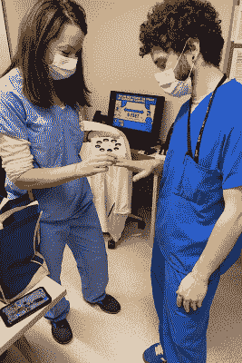

# 使用可穿戴设备和人工智能检测新冠肺炎症状

> 原文：<https://hackaday.com/2020/07/11/detect-covid-19-symptoms-using-wearable-device-and-ai/>

西弗吉尼亚大学(WVU)洛克斐勒神经科学研究所(RNI)的一项新研究使用可穿戴设备和人工智能(AI) [在症状出现前 3 天预测新冠肺炎](https://wvutoday.wvu.edu/stories/2020/04/08/wvu-rockefeller-neuroscience-institute-and-oura-health-unveil-study-to-predict-the-outbreak-of-covid-19-in-healthcare-professionals)。这项研究是一项令人印象深刻的事业，涉及纽约、费城、纳什维尔和其他新冠肺炎重要热点地区医院的 1000 多名医护人员和一线工作人员。

数字健康平台的实施使用一个定制的智能手机应用程序和一个 ura 智能戒指来监控呼吸和温度等生物信号。该平台还通过智能手机应用程序管理的调查来评估心理、认知和行为数据。

我们知道可穿戴设备[往往缺乏精确性](https://hackaday.com/2020/04/07/reliability-check-consumer-and-research-grade-wrist-worn-heart-rate-monitors/)，尤其是在活动期间。然而，[ura 环似乎在用户非常安静时进行测量，尤其是在睡眠期间](https://ouraring.com/faq)。这是一个优势，因为当用户不移动时，可穿戴设备的准确性会大大提高。RNI 指出,“苏拉环”是他们测试过的最精确的设备。

鉴于新冠肺炎的一些早期预警信号是发烧和呼吸窘迫，一种能够测量呼吸和温度的设备可以用作新冠肺炎的早期探测器是有意义的。事实上，[我们已经看到一些可穿戴设备公司尝试了很多 RNI 正在做的事情](https://www.avawomen.com/ava-bracelet-for-covid-19/)以及[一些 DIY 的尝试](https://hackaday.com/2020/06/26/smart-thermometer-can-tell-flu-from-cold/)。RNI 的研究可能是迄今为止发表的最彻底的作品，但我们确信更多的作品即将问世。

该研究的初始阶段部署在医疗保健和一线工作人员中[，但现在向公众开放](https://wvumedicine.org/rni/covid19/general-public-sign-up/)。与此同时[美国国家篮球协会(NBA)正在利用修罗的技术协调其重新开放的努力](https://www.engadget.com/oura-smart-rings-nba-disney-world-022230528.html)。

我们希望看到 RNI 非常重要的工作取得更多成果。在那之前，保持安全。