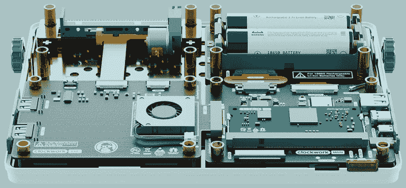

# devteam 抢先了一步

> 原文：<https://hackaday.com/2020/12/08/devterm-beats-cyberdeck-builders-to-the-punch/>

什么是虚拟甲板？看起来好像它来自 20 世纪 80 年代的另一个现实版本是一个好的开始，但肯定不是必需的。如果你真的试图坚持赛博朋克的精神，任何好的甲板都应该足够模块化，以便随着时间的推移可以很容易地修复和升级。事实上，如果它不是处于不断发展变化的状态，你可能做错了什么。如果你能实现这些目标*和*，让它看起来同时具有复古未来感，那就更好了。

这就是为什么[发条装置这个术语如此有趣的原因](https://www.clockworkpi.com/devterm)。它几乎囊括了我们在过去几年中讨论过的自定义 cyberdeck 构建的每一个盒子，同时对于更主流的受众来说也足够平易近人。您不需要 3D 打印机、烙铁或热胶枪来构建自己的 DevTerm。当然，如果你*真的*拥有这些工具和技能来将它们投入工作，那么这可能是一个理想的平台。

凭借 65%的 QWERTY 键盘和宽屏显示器，DevTerm 看起来很像早期的便携式计算机，如 TRS-80 Model 100。但与它从中获得灵感的机器不同，显示器是 6.8 英寸 1280 x 480 IPS 面板，内部没有小巧的英特尔 8085 芯片。220 美元的基本型号由 Raspberry Pi 计算模块 3 提供支持，如果您需要更多功能，还有一些价格更高的选项，可以插入更强大的定制模块。[就像我们最近看到的 Waveshare Pi CM 笔记本电脑一样](https://hackaday.com/2020/12/03/waveshares-pi-cm3-laptop-arrives-a-bit-too-late/)，遗憾的是不支持更新的 CM4 但至少 DevTerm 是足够模块化的，它似乎不是不可能的，发条可以发布一个新的主板。或者社区中的某个人甚至会为他们做这件事。

说到这里，DevTerm 中的板被设计成两部分，以便“EXT Module”侧可以与定制硬件交换，而不会损害系统的核心功能。stock board 配有额外的 USB 端口、一个用于调试的微型 USB UART 端口、一个 CSI 摄像头连接器以及一个用于内置热敏打印机的接口，该打印机可插入电脑背面的一个托架中。发条说，他们希望社区真的用他们自己的 EXT 板运行，特别是因为整个系统的原理图和相关设计文件都将放在 GitHub 上，并在 GPL v3 下发布。

他们说，任何听起来好得不真实的事情都可能是真的，如果我们诚实的话，我们从 DevTerm 那里得到了一点。安(CPU BLOBs 暂且不说！)具有这种模块化的开放硬件便携式 Linux 计算机基本上是黑客的梦想成真，到目前为止，获得这种计算机的唯一途径是自己动手制作。很难相信“发条装置”能够以低于廉价笔记本电脑的成本推出这样的东西，而不在某些地方偷工减料，但我们绝对希望明年它发布时被证明是错误的。