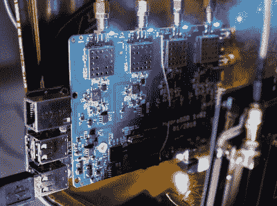

# RTL-SDR 测向和无源雷达

> 原文：<https://hackaday.com/2018/09/10/direction-finding-and-passive-radar-with-rtl-sdr/>

如果说 RTL-SDR 项目彻底改变了黑客在射频频谱方面的能力，那也是轻描淡写。过去，在知识和硬件方面的门槛都很高，只有那些真正专注的人才能探索无线电频谱。但是今天，任何一个有 20 美元的人都可以拿起一个 RTL-SDR 设备，将它与各种开源软件结合起来，进入一个以前看不见的世界。

 话虽如此，RTL-SDR 通常被认为是通往射频世界的“经济门票”。这是你的敲门砖，但经验丰富的射频黑客会很快指出，如果你想开始做更复杂的实验，你需要更高端的硬件。[但是 KerberosSDR 可能很快会改变人们对 RTL-SDR 衍生硬件的看法](https://www.rtl-sdr.com/hydrasdr-preview-a-4x-coherent-rtl-sdr-for-direction-finding-passive-radar-and-more/)。它将四个 R820T2 SDRs 集成在一个定制设计的板上，允许以低成本使用高概念技术，如无线电测向、无源雷达和波束形成。如果你对此感到厌倦，你可以像使用四个独立的 RTL-SDR 加密狗一样使用它，非常适合需要监控多个频率的应用，如接收集群无线电。

KerberosSDR(以前称为 HydraSDR)是 Othernet 工程团队和 RTL-SDR.com 团队的合作成果，他们在今年早些时候呼吁有经验的开发人员加入这个项目。布达佩斯技术和经济大学的博士生 Tamás Peto 响应了这一号召，并设计了一个系统，该团队计划将其作为开源软件发布，以便整个社区都能从中受益。在休息后的视频中，您可以看到使用 KerberosSDR 开发版本的测向和被动雷达功能的演示。

至于硬件，它结合了 RTL-SDR 无线电和用于校准的板载 GPIO 控制的宽带噪声源，以及集成的 USB 集线器，因此它只占用一个端口。所有东西都被包裹在一个屏蔽的金属外壳中，该团队目前正在试验 KerberosSDR PCB 上的一个接头，它可以让你直接将其插入 Raspberry Pi 或 Tinkerboard。

该团队希望在未来几个月内开始最终的硬件生产，同时建立了一个邮件列表，以便感兴趣的各方可以留在循环中，并在预订开始时得到通知。

如果你不能等到那个时候，我们有一个关于使用 RTL-SDR 硬件的被动雷达 DIY 实验的详细报道[，如果你想得到你的无线电测向定位](https://hackaday.com/2015/06/05/building-your-own-sdr-based-passive-radar-on-a-shoestring/)，你可以随时[使用你的浏览器。](https://hackaday.com/2018/07/16/global-radio-direction-finding-in-your-browser/)

 [https://www.youtube.com/embed/HE1BFeteBo0?version=3&rel=1&showsearch=0&showinfo=1&iv_load_policy=1&fs=1&hl=en-US&autohide=2&wmode=transparent](https://www.youtube.com/embed/HE1BFeteBo0?version=3&rel=1&showsearch=0&showinfo=1&iv_load_policy=1&fs=1&hl=en-US&autohide=2&wmode=transparent)

 [https://www.youtube.com/embed/lnFWNJP91pQ?version=3&rel=1&showsearch=0&showinfo=1&iv_load_policy=1&fs=1&hl=en-US&autohide=2&wmode=transparent](https://www.youtube.com/embed/lnFWNJP91pQ?version=3&rel=1&showsearch=0&showinfo=1&iv_load_policy=1&fs=1&hl=en-US&autohide=2&wmode=transparent)

