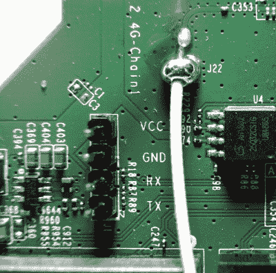

# 剖析 TL-WR841N 以获得乐趣和利润

> 原文：<https://hackaday.com/2019/09/12/dissecting-the-tl-wr841n-for-fun-and-profit/>

TP-Link TL-WR841N 并不是一款特别令人印象深刻的硬件，但由于它工作得相当好，售价不到 20 美元，所以它是亚马逊上最受欢迎的消费者路由器之一。现在，由于零日倡议的[TrendyTofu],我们现在有了一个简明的分步指南，指导如何侵入硬件的新版本并完全控制这个廉价的 WiFi 设备。这项工作最初是为了帮助测试路由器固件中报告的漏洞，但我们相信 Hackaday 的读者可以为这些信息提供各种潜在的用途。

TP-Link helpfully labeled the UART pins

和之前的许多故事一样，这个故事是从串口开始的。找到 PCB 上的 UART 焊盘并连接电平转换器没有问题，但[TrendyTofu]发现它只能单向工作。经过故障排除和使用示波器后，发现罪魁祸首是连接到 RX 线路的一个 1kω下拉电阻，该电阻阻止电压峰值高到足以被识别。

一旦建立了双向通信，就可以开始对路由器的 Linux 操作系统进行适当的探查了。发现内核是古老的(2010 年的版本 2.6.36 ),系统实用程序被精简到最低限度以节省空间，这并不奇怪。完全替换固件当然是理想的，但不幸的是 OpenWRT 已经放弃了对 TL-WR841N 新硬件版本的支持。

为了教会这个 Linux 的准系统一些新技巧，[TrendyTofu]使用了`mount`命令在系统上找到一个具有写访问权限的分区，并使用它来存放一个用于 MIPS 的 BusyBox 预编译版本。有了一套更完整的工具，真正的乐趣就可以开始了:使用 GDB 调试 TP-Link 的二进制文件，并寻找盔甲上的裂缝。但是你可以在这里随意插入你自己的伤害。

你可能会认为在 Raspberry Pi 时代，滥用廉价路由器将它们变成通用的 Linux 机器有点过时了。坦白说，你是对的。但是，虽然将 Linksys WRT54Gs 捆绑到遥控汽车上的日子可能已经一去不复返了，但仍然有一些路由器足够有趣，足以让[重温这一由来已久的硬件黑客传统](https://hackaday.com/2019/02/01/this-tiny-router-could-be-the-next-big-thing/)。