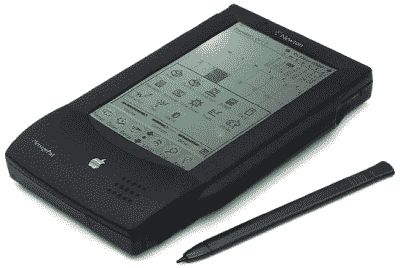
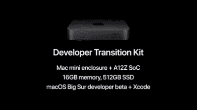

# 抛弃 X86，苹果开始军备竞赛

> 原文：<https://hackaday.com/2020/06/25/ditching-x86-apple-starts-an-arm-race/>

在一年一度的全球开发者大会上，苹果公司宣布他们的 Mac 系列将在今年年底前淘汰英特尔处理器，这让很多人大吃一惊。英特尔的 x86 架构是继 PowerPC 和摩托罗拉 68000 系列之后，第三个为苹果台式电脑产品增色的架构。

取而代之的将是苹果自己的定制芯片，基于 64 位 ARM 架构。苹果绝不是第一个尝试将 ARM 芯片用于通用计算的公司，但是他们能在别人失败的地方成功吗？

## 手臂——通往巅峰的漫漫长路

Apple’s Newton PDA was one of the first applications of the ARM processor outside Acorn’s failed computer business.

ARM 处理器是由 Acorn Computers 在遥远的 1983 年创造的，最初的名字代表 Acorn RISC Machine。使用精简指令集计算(RISC)技术，最终的芯片比经典的 CISC 设计使用更少的晶体管，因此使用更少的功率。为 Acorn 的计算机产品线开发的后来的芯片也在苹果的牛顿 PDA 找到了家，远在 1992 年。然而，随着 Acorn 的计算机业务摇摇欲坠，这项技术在很大程度上被主流遗忘了。

尽管如此，底层技术是健全的。在接下来的 20 年中，ARM 架构在默默无闻中度过了大部分时间，当智能手机出现时，它实现了飞跃。设备需要大量的处理能力，同时保持较长的电池寿命；手臂只是这项工作的工具。快进到今天，[和 ARM 芯片驱动着世界上 95%的智能手机。](https://www.arm.com/solutions/mobile-computing/smartphones#:~:text=Arm%20remains%20at%20the%20center,smartphones%20built%20on%20our%20IP.)

The iPad featured Apple’s first system-on-chip (SoC) designed in-house.

当苹果的 iPhone 彻底改变了我们对手机的看法时，它搭载了来自三星的 32 位 ARM 处理器。随着苹果继续发布新的移动硬件，他们正在收购公司和人才，以扩大公司的芯片设计能力。2010 年，苹果凭借 A4 向前迈进了一大步。这是苹果内部设计的第一个片上系统，是三星为 iPad 和 iPhone 4 制造的 ARM Cortex-A8。这仅仅是一个开始，苹果将继续在这一成功的基础上开发下一代平板电脑和智能手机。

在多年依赖外部公司提供 CPU 后，苹果终于掌握了自己的命运——至少在移动平台上。2006 年，其台式机和笔记本电脑从英特尔 x86 芯片的转换中受益。然而，与外部合作伙伴合作必然会有缺点，拥有十多年设计自己芯片的经验，苹果不再认为这是值得的。该公告明确表示，正式过渡[将在两年内进行，](https://www.apple.com/newsroom/2020/06/apple-announces-mac-transition-to-apple-silicon/)基于英特尔的机器将在一段时间后得到支持。但是现在苹果的墙上写着——x86 已死，ARM 万岁。

## 开关

改变处理器架构是一项重大决策，会影响平台的整体生存能力。通过将 ARM 引入桌面，苹果将在其他公司失败的地方寻求成功。然而，如果过去的表现可以预测未来的结果，那么他们完全有能力关掉开关。

从历史上看，ARM 一直在努力争取在电脑领域的立足点——笔记本电脑、台式机等等。一个简单的观点可能暗示这不是一个好兆头，但是深入挖掘，很明显事实并非如此。Acorn 一开始的失败更大程度上是因为一条小鱼试图在 IBM 的统治下推出一个新平台。在现代，阻碍 ARM 发展的是操作系统和软件，但这种情况正在开始改变。

最近，微软在搭载 ARM 芯片的轻型笔记本电脑上推出了 Windows。通过这样做，他们试图创建第二个为 ARM 而不是 x86 编译的 Windows 生态系统。这些版本的 Windows 不能运行为 x86 编译的应用程序，需要开发人员改变他们的软件以适应 ARM 架构。由于安装基数较低，很少有开发者愿意为该平台开发应用。与此同时，由于缺乏应用程序，增加安装基数非常困难。鸡和蛋。

苹果不应该面临同样的问题，原因很简单，他们在短短两年内就转变了整个生态系统。在可预见的未来，开发人员不会被迫为每个应用程序创建两个版本，并希望创建 ARM 版本的工作有所回报。相反，他们可以选择转向 ARM，面带微笑地前进，或者被苹果未来的桌面产品拒之门外。普通用户几乎不会注意到，只需下载他们已经使用的任何软件的最新版本，苹果的 Rosetta 2 仿真器填补了这里和那里的遗留空白。

The Developer Transition Kit packs Apple’s new ARM chip into a Mac mini enclosure to help developers transition to the new platform.

受这一声明打击最大的将是 Mac 软件的开发者。x86 OS X 平台的现有软件将需要修改，以在 ARM 上运行，或者同时使用苹果的仿真工具。为了简化这一过程，苹果公司为感兴趣的各方提前提供了开发硬件，类似于他们之前转向 x86 所采取的方式。长期以来，苹果一直牢牢控制着他们的平台，在过去的二十年里，他们在开发工具和他们自己的编程语言上投入了大量的资金。这使得他们能够为尽可能无痛的转换打下基础。虽然转换不太可能像[点击复选框和点击编译按钮](https://mondaynote.com/arm-ed-mac-a-mere-matter-of-software-1fbfc9bb1042?gi=3d09b21d603a)那么简单，但是必要的工具已经准备就绪。

或许这一转变最有趣的部分是，Mac 系列现在将运行与 iPad 和 iPhone 相同的架构。这意味着应用程序将能够在所有设备上运行，为开发者开辟了新的可能性。以前的移动应用程序将在 Mac 上运行，不需要重新编译。显然，开发人员会对界面和其他类似的变化进行调整，以适应桌面环境。然而，在苹果的世界里，为桌面和移动领域创建独立的应用程序这一更广泛的问题将在很大程度上成为过去。

## 结论

虽然如此重大的变化看起来令人担忧，但从各方面来看，苹果公司是进行这一转变的最佳选择。鉴于已经有大量用户安装了苹果芯片，而 ARM 电脑仅在几个月后推出，我们认为这种转变应该相当简单。高级用户和那些有复杂边缘情况的用户会感到一些摩擦，但对于绝大多数 Mac 用户来说，进入 ARM 的旅程可能会一帆风顺。