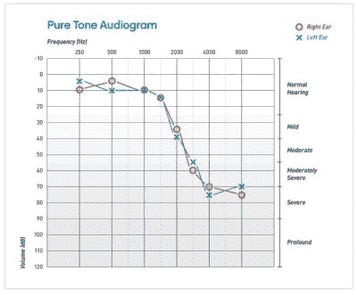

# DIY Arduino 听力测试装置

> 原文：<https://hackaday.com/2022/10/23/diy-arduino-hearing-test-device/>

听力损失是许多人的共同问题——尤其是那些年轻时可能参加过太多喧闹音乐会的人。[mircemk]最近参加了一次听力测试，并注意到测试过程实际上非常简单。有了这些知识，他决定建立自己的测试系统并记录下来供他人使用。

Resultant audiogram from the device showing each ear in a different color

通过使用 Arduino 产生各种步进频率的音调，并逐渐增加音量，直到测试对象可以检测到音调，就可以绘制出听觉阈值敏感度的听力图。单独测试每只耳朵可以比较一侧和另一侧。

[mircemk]建造了一个漂亮的微型机柜，可容纳 8×8 矩阵的 WS2812 可寻址 RGB LEDs。128×64 像素的有机发光二极管显示器提供用户指令，带有按钮的旋转编码器作为用户输入。

当然，这不是一个经过校准的专业测试设备，很大程度上取决于所用耳机的质量。然而，作为一种检查听力问题的方法，作为一个有趣的实验，它有很大的前景。

甚至还有一个扩展，包括一个 D 类音频放大器，允许使用骨传导耳机来进一步缩小听力损失的原因。

这里有更多关于骨传导的信息，我们也报道了一个有趣的[光刺激耳蜗植入](https://hackaday.com/2018/07/26/shining-a-light-on-hearing-loss/)。

 [https://www.youtube.com/embed/H_ecWkNRzCI?version=3&rel=1&showsearch=0&showinfo=1&iv_load_policy=1&fs=1&hl=en-US&autohide=2&wmode=transparent](https://www.youtube.com/embed/H_ecWkNRzCI?version=3&rel=1&showsearch=0&showinfo=1&iv_load_policy=1&fs=1&hl=en-US&autohide=2&wmode=transparent)

