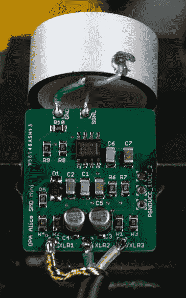

# 廉价的 DIY 水听器监听深海

> 原文：<https://hackaday.com/2022/02/19/diy-hydrophone-listens-in-on-the-deep-for-cheap/>

麦克风是一项我们都很熟悉的无处不在的技术，但如果你不想在空中录制音频，而是想听听水下发生的事情，该怎么办？那是水听器的工作！不幸的是，水听器并不是那种你能在大盒子电子商店里找到的东西。对我们来说幸运的是，[Jules Ryckebusch]在他 20 年的海军潜艇艇员生涯中学会了一些技巧，并记录了他在不需要军事预算的情况下制造灵敏水听器的过程。

 他过去常常在声纳室周围听到各种令人难以置信的声音，对此他非常着迷，[朱尔斯]仔细研究了来自海军和国家海洋和大气管理局(NOAA)的与水听器设计相关的文件，直到他将所有这些提炼出来，建立了一个令人惊讶的简单结构。整个建筑的关键是一个商业上可获得的圆柱形压电换能器，它是为水下通信而设计的，令人难以置信的是，成本不到 20 美元一个。

传感器连接到他自己设计的运算放大器板上，该板改编自他以前对电容麦克风的研究。[Jules]设计了 29 x 26 mm 的电路板，正好适合传感器本身的直径。整个麦克风和前置放大器组件可以铸造在一个树脂圆柱体内。具体来说，他从 Smooth-On 公司找到了一种负担得起的两部分树脂，其比重几乎与海水相同。这使得他能够以一种防水且几乎透声的方式封装所有的电子设备。几个 3D 打印的模具之后，水听器就可以铸造了。

有趣的是，这个[并不是我们见过的第一个自制水听器](https://hackaday.com/2008/06/04/hydrophone/)。但与早期的参赛作品相比，它基本上只是对标准麦克风拾音器进行了防水处理，我们认为这种更周到的方法可能会有更好的性能。

 [https://www.youtube.com/embed/KQ_KqJDaOM4?version=3&rel=1&showsearch=0&showinfo=1&iv_load_policy=1&fs=1&hl=en-US&autohide=2&wmode=transparent](https://www.youtube.com/embed/KQ_KqJDaOM4?version=3&rel=1&showsearch=0&showinfo=1&iv_load_policy=1&fs=1&hl=en-US&autohide=2&wmode=transparent)

