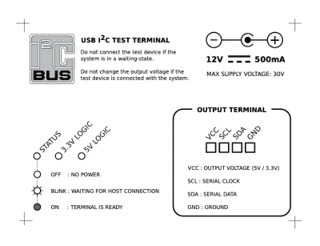

# DIY I2C 测试仪

> 原文：<https://hackaday.com/2021/03/23/diy-i2c-tester/>

[Dilshan]构建了一个[专用 I2C 测试器](https://hackaday.io/project/178271-i2c-master-mode-emulator)，它允许使用简单的命令如`init`、`read`、`write`等对 USB 进行 I2C 总线控制。几十年来，Linux 内核一直支持 I2C 驱动程序，但你很难找到一台带有 I2C 连接器的电脑或笔记本电脑(当然，不包括 Bunnie Huang 的 [Novena hacker 的笔记本电脑](https://en.wikipedia.org/wiki/Novena_(computing_platform)))。这个测试人员确实需要一个 Linux 主机，他的程序在电脑端使用 [`libusb`](https://libusb.info/) ，在嵌入式端使用 [`V-USB`](https://github.com/obdev/v-usb) 。

[Dilshan]在构建这个项目上投入了大量时间，这体现在构建质量和全面的文档中。凭借其单面 PCB 和全通孔结构，对于刚刚开始这项爱好的人来说，它是一个很好的初学者项目。测试仪的核心是一个 40 针 PDIP 封装的 ATmega16A(尽管[微芯片概述页面](https://www.microchip.com/wwwproducts/en/ATmega16A)称其为 44 针芯片)，由一些电阻和晶体管支持。原理图是用 KiCad 编写的，代码是用`gcc`和`avr-gcc`编译的，他提供了外壳顶部的标签。唯一缺少的是关于附件本身的信息，但我们怀疑你可以通过一点侦查(或询问[Dilshan]本人)找到它。

如果你经常使用 I2C，看看这个项目。易于构建，在实验室中很有用，而且看起来也不错。我们已经介绍了[Dilshan]多年来的工作，包括这个[逻辑模式发生器](https://hackaday.com/2012/02/27/cheap-and-easy-logic-signal-generator/)和他的[电路板上的两个晶体管超外差接收器](https://hackaday.com/2015/03/08/simple-superheterodyne-sw-receiver-harks-back-almost-100-years/)。