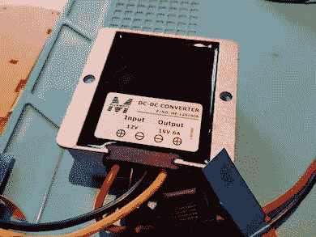

# DIY Magsafe 充电器采用 12 V 太阳能电池供电

> 原文：<https://hackaday.com/2020/04/19/diy-magsafe-charger-feeds-off-12-v-solar-battery/>

(史蒂夫·钱伯林)有一块漂亮的太阳能充电的 12 V 电池，他很想用它来为他的笔记本电脑供电，但遇到了小故障。他的 MacBook Pro 使用苹果的 MagSafe 2 连接器供电，但通过 110 VAC 逆变器将交流适配器插入电池似乎效率非常低。将它直接插入电池会好得多，但这也是一个问题。虽然苹果公司有许多用于汽车的 DC 电源适配器，但没有一个用于 MagSafe 2 连接器[Steve]的 2014 年年中 MacBook Pro。他的解决方案是[用 12 VDC 输入](https://www.bigmessowires.com/2020/04/16/building-a-12v-dc-magsafe-charger/)滚动他自己的 MagSafe 充电器。

 由于 MagSafe 的连接器是专有的，他的首要任务是从一个破墙充电器中抢救出一个。在清理电线和修复任何磨损的部分后，是时候选择 DC-DC 转换器来连接 MagSafe 连接器和电池了。电池标称电压为 12 伏，因此 DC-DC 转换器的输入很容易选择，但输出有点不确定。弄清楚 MagSafe 连接器期望的是什么需要一些有经验的猜测。

充电器附带的原始交流适配器声称输出 20 伏，另一个苹果适配器声称输出 14.85 伏，第三方适配器说 16.5 伏。[Steve]认为 MagSafe 连接器适用于 15 至 20 V 范围内的任何电压，因此使用他现有的 12 V 至 19 V DC-DC 升压转换器是可以接受的。结果很好，而且[史蒂夫]进行了测量，以验证它实际上比他用逆变器的简单方法更有效。

如今，MagSafe 已经被 USB-C 取代，但仍有许多 MagSafe 设备在使用。在紧要关头，记住[一点点锉或磨是把 MagSafe 1 变成 MagSafe 2](https://hackaday.com/2017/03/24/magsafe-1-to-magsafe-2-the-cheap-way/) 所需要的全部。