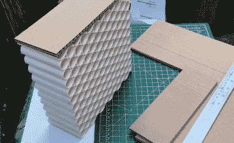

# DIY 风洞旨在教育年轻人

> 原文：<https://hackaday.com/2022/10/01/diy-wind-tunnel-aims-to-educate-the-youth/>

通常，当我们谈到风洞时，我们会想到航空航天和赛车行业正在使用的大型设施。然而，没有什么能阻止你建造一个属于你自己的风洞，它甚至可能比你想象的更容易！考虑到 DIY，Jude Pullen 设计了这样一个设计。

它是为高中设计与技术(D&T)课程设计的，使用相对简单的材料构造技术。气流调直器由 PVC 管制成，末端盒由纸板制成。用于观察的透明墙壁由丙烯酸制成，而一个简单的风扇提供了必要的气流。桌子大小的风洞可以安装压力计、转速计和风速计来测量压力、风扇速度和风速。[Jude]还探索了可以在风洞中运行的实验，例如使用小型 balsa 木制滑翔机，并用天平测量它产生的升力。

 【裘德】对此类项目也有着非常务实和现实的理解。他指出了让事物适合测量和让它们适合测量之间的区别，并强调了这两种方法的价值。这是一种更全面的方法，而不是简单地斥责学生在课堂上做事情时“做对”或“做得更好”。

至少在工程学位的第二或第三年，在所有枯燥的数学和静力分析都已经完成之后，才教工程学生使用基本的风洞。然而，没有理由说高中物理学生不能理解所涉及的物理学，而且他们完全有能力承担这样的构建。尽早开始这样的教育通常会给个人和他们最终的职业生涯带来巨大的好处。

一旦你有了自己的风洞，你可能要开始考虑一些流动可视化，[这真的很令人兴奋。](https://hackaday.com/2022/07/10/vapor-trails-and-fan-make-for-fantastic-photos-in-diy-wind-tunnel/)

 [https://www.youtube.com/embed/sISAH2S7F2o?version=3&rel=1&showsearch=0&showinfo=1&iv_load_policy=1&fs=1&hl=en-US&autohide=2&wmode=transparent](https://www.youtube.com/embed/sISAH2S7F2o?version=3&rel=1&showsearch=0&showinfo=1&iv_load_policy=1&fs=1&hl=en-US&autohide=2&wmode=transparent)

