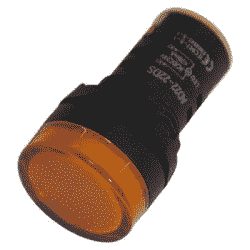

# DIY X 光机变 CT 扫描仪

> 原文：<https://hackaday.com/2019/02/20/diy-x-ray-machine-becomes-ct-scanner/>

一旦你建造了自己的 X 射线机器来拍摄物质内部的 2D 图像，下一步真的只有一个合乎逻辑的步骤:[建造自己的计算机断层扫描(CT)扫描仪](https://hackaday.io/project/163791-x-ray-ct-scanner)来获得 3D 重建。这正是[Fran Piernas]所做的，并记录在 hackaday.io 上。虽然最初的 X 射线机器构建处理的是高压和电离辐射等可怕的硬件，但这一次轮到了像逆 radon 变换这样的可怕数学。

我们在去年 12 月报道过的最初版本[，使用一个商用牙科 X 射线管和一个自制的 65 千伏电源来发送 X 射线穿过物体。透射的 X 射线是通过将射线转换成可见光的增感屏来观察的。其结果是一个类似于我们所熟悉的 2D 图像。](https://hackaday.com/2018/12/24/ambitious-homebrew-x-ray-machine-reveals-what-lies-within/)

为了创建一个物体的三维重建，你需要从不同角度拍摄的 X 射线图像。如果你不幸需要进行医学 CT 扫描，你会记得当 X 射线仪器在你周围旋转时，你一动不动地呆在隧道里。在这次建造中，[Fran]转而旋转物体，使用了一个可能曾经是微波炉的一部分的马达(我们都有的那些“神秘马达”中的一个)。当电机旋转物体时，通过记录 X 射线屏幕的视频可以简单地获得所需的图像序列。

[Fran]使用一种称为过滤反投影的技术从一系列视频帧中重建 3D 对象。在这种算法中，计算一种称为逆 Radon 变换的数学变换，从 X 射线穿过对象的多个反向投影轨迹中对 3D 体积中的密度求和。结果是物体的 x 射线吸收密度的体积模型。

What’s inside here?

到目前为止，[Fran]已经扫描了一些常见的家用物品，包括一个 LED 灯泡、一个点烟器和一个 LED 面板指示器。上图展示了用于重建 LED 指示灯的三种不同方法。扫描显示顶部有两个金属端子，体内似乎有一个电阻器和电容器。我们对结果印象深刻。

如果你想尝试 CT 重建，但缺乏资源、时间或必要的安全培训来建造自己的 X 射线扫描仪，你很幸运！[Fran]已经在 GitHub 上发布了这个项目的源代码[。在那里，你会找到麻省理工学院许可的过滤反投影 C++代码(使用 OpenCV ),以及一些样本图像和视频来测试算法。虽然我们建议您尝试 OpenCV 4.x，因为 selectROI()函数似乎在某些 3.x 版本中缺失，但是我们用简单的五行示例在几分钟内就完成了 2D 重建。](https://github.com/fpiernas/FBP)

幸运的是，[Fran]还在本周(太平洋标准时间 2019 年 2 月 20 日星期三中午)举办了 [X 射线和高压黑客聊天](https://hackaday.io/event/163583-x-rays-and-high-voltage-hack-chat)。如果你对这个话题感兴趣，一定要停下来问你所有的问题。