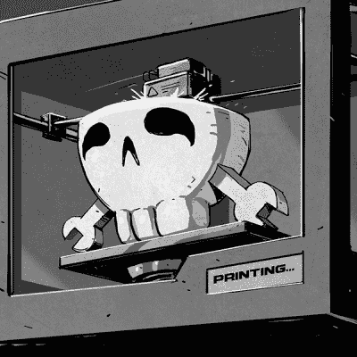

# DMCA 评论:修理权大获全胜，修补权零分

> 原文：<https://hackaday.com/2018/10/26/dmca-review-big-win-for-right-to-repair-zero-for-right-to-tinker/>

今年的[数字千年版权法案(DMCA)三年审查](https://s3.amazonaws.com/public-inspection.federalregister.gov/2018-23241.pdf) (PDF，法律术语)包含了一些好消息。特别是，打破产品的加密以修复它已经被认为是合法的，以前对逆向工程 3D 打印机固件使用您选择的灯丝的豁免已经扩大。infosec 社区在渗透测试方面得到了一些澄清，视频游戏图书馆员和档案管理员在在线游戏服务器软件方面大获全胜。

此外，更新先前豁免的[流程已经简化](https://copyright.gov/1201/)——过去要求每三年从头重新申请一次，现在除非情况发生重大变化，否则豁免将持续有效。这些变化，再加上[最高法院最近的裁决](https://www.eff.org/deeplinks/2017/05/supreme-court-victory-right-tinker-printer-cartridge-case)，标志着 DMCA 反规避条款中一些最严重的过度行为在颁布 20 年后被收回。我们不得不称赞这些发展。

然而，新的维修权利条款似乎仅限于将有问题的设备恢复到其原始规格；如果你想在你自己的东西上增加一个新功能，你还是不太走运。虽然这篇评论总体上支持开放技术以实现[公平使用](https://www.nolo.com/legal-encyclopedia/fair-use-rule-copyright-material-30100.html)，但他们没有批准 Bunnie Huang 关于允许解密 HDMI 电缆上使用的加密方法的申请，因此构建自己的 HDMI 设备以显示加密流仍然是不可能的。3D 打印机灯丝豁免的变化提醒人们整个事件的拼凑性质:它仍然只适用于 3D 打印机灯丝，而不是试图强制使用专有原料的其他设备。等等，什么？

最后，国会图书馆只有权决定哪些逆向工程行为构成了挫败反规避措施。该审查不*也不*涉及这样做所需的工具和信息。“制造和提供——或贩运——为规避目的而设计的产品和服务……”在《守则》的其他地方有所涉及。因此，虽然现在允许您解密您的 John Deere 软件来修理您的拖拉机，但尚不清楚设计和销售 ECU 解锁工具，甚至通过电子邮件向某人发送解密密钥是否合法。

我们能期待更多吗？当然可以！但在美国这么大的国家制定法律是许多不同利益之间的平衡行为，国会图书馆的裁决清楚地表明了他们是如何做出决定的，这值得称赞。如果你想深入研究，这项裁决本身值得一读，但要做好被明显的细枝末节淹没的准备。或者节省一点时间继续阅读——我们已经从黑客的角度获得了重点内容。

## 有权修理，但无权修补

对修理权的支持是本周裁决的重大胜利，奇怪的是，对儿童玩具固件进行黑客攻击的合法性源于农民修理拖拉机的原始工作。所有陆地车辆在 2015 年 (PDF)获得了[豁免，包括解密 ECU 和发动机诊断，“由授权车主承担”，不包括娱乐和远程信息处理子系统。有人认为，娱乐系统的豁免是为了防止人们把他们的汽车变成侵犯版权的移动机器。](https://www.gpo.gov/fdsys/pkg/FR-2015-10-28/pdf/2015-27212.pdf)

但是基于修理行业团体和想要修理拖拉机空调的农民的强烈游说，这些限制在今年被取消了。您不仅可以在任何必要的系统上工作，还可以授权他人代表您这样做。用例的类别“第 7 类:计算机程序-维修”已经扩展到包括“其他类型的软件支持设备，包括电器、计算机、玩具和其他物联网设备”。这对任何想用固件修复任何东西的人来说都是一件大事。

但是这是黑客、修补匠或者任何想用自己的设备做一些原创的人的胜利，而不是 T2 的胜利。特别是,“合法修改”一词被纳入了拟议的裁决草案，同时还有一项条款允许“获取、使用和传播规避工具，以促进诊断、修理和修改”。如上所述，规避工具不在本库的管辖范围内，所以没有关于工具的规定。虽然“合法修改”条款被保留在涉及车辆的特定章节中，但它被从设备和物联网章节中删除，理由是它“没有足够精确地定义，无法作为一个通用类别得出它可能不侵权的结论”。你仍然*不*被允许破解加密来修改或添加功能到你自己的设备上。这让我们大吃一惊。嘘！

## 解锁和越狱

如果您合法购买了手机、平板电脑、健身追踪器或类似产品，您现在可以解锁该软件以更换服务提供商。这扩展了之前仅限于手机的裁决，并取消了之前对手机使用的要求——这一条款旨在防止人们通过从运营商那里解开手机而不进行注册来转售亏损手机。

最近规定，手机可以越狱，以便安装主人想要的任何软件。EFF 希望将这一豁免扩展到语音助理设备(Echo、Siri、Home 等)。)以及启用或禁用设备的硬件或软件功能，他们如愿以偿。你现在可以在这些额外的平台上自由越狱和安装软件，这是一个巨大的胜利。

## 逆向工程和安全性

进入这一轮的一个大问题是 infosec 社区是否会更新其豁免，还有一些关于谁必须拥有与渗透测试相关的系统的问题。infosec 社区提出了许多建议，并获得了丰厚的回报！豁免相对简单:如果不违反任何适用法律，对“合法获得”的设备或“经所有者或运营商授权”的“善意安全研究”是豁免的。

## 软件和视频游戏档案

在过去的十年里，国会图书馆开始认真对待电子游戏。作为这一努力的一部分，他们已经通过了 DCMA 对非营利性图书馆和视频游戏档案馆的豁免。这是好消息。这一次，最大的问题是当服务器不复存在时，如何处理在线游戏。你可以复制或逆向工程服务器吗？答案是有限的“是”——只是为了保存的目的，并且是在图书馆的场所进行的，这对档案工作者来说是个好消息。但是如果你只是想玩游戏，那就不太好了。真扫兴。

## 3D 打印机灯丝

2015 年的豁免允许对 3D 打印机固件进行逆向工程，以击败有缺口的灯丝卷轴，让你可以用任何你想要的东西打印。差不多了。在 Stratasys 的压力下，它声称人们可以创建未指明的公共健康(非版权！)问题通过使用未经许可的灯丝，在原本合理的豁免中增加了一个条款:“该豁免不得延伸至任何在 3D 打印机上生产用于商业的商品或材料的计算机程序”。如果你打算出售零件，这将防止你黑掉灯丝卷轴的碎片，并从今年的豁免版本中删除。谢天谢地。

## HDMI, HDCP

黑客朋友 Bunnie Huang 喜欢入侵 HDMI 加密系统。假设您有一个通过 HDMI 推送的 CCTV 流，并且您只想在左上角覆盖日期和时间。或者，你可能是一名视频艺术家，喜欢摆弄来自现代机顶盒的视频。你不能，因为数据流是用高带宽数字内容保护(HDCP)加密的。《HDCP 万能钥匙》于 2010 年发布，其发行仍然违反 DMCA 法律，但这在目前已经是公开的秘密。

邦尼请求豁免破坏 HDCP 的合理使用申请，被拒绝了。我们喜欢邦尼，我们喜欢视频黑客，但我们也可以看到潜在的版权侵犯者的数量如何超过硬件黑客，因此“可能侵权”，只是没有多少合理使用。黑客们，如果你想在三年内看到这种豁免，开始构建公平使用 HDCP 应用程序——万能钥匙就在那里，而该库需要一个令人信服的理由来破解 HDCP。

## DMCA:一部过于宽泛的法律，通过豁免而稍有改善

这一轮的豁免到此为止。但是我们是怎么来到这里的呢？1998 年颁布的 DMCA 做了两件事。首先，它使我们的版权实践符合国际规范，并保护在线内容提供商在用户上传侵权内容时免于承担责任。正如我们所知，这可能拯救了互联网:如果提交的内容可能因为他们没有上传或控制的东西而被起诉，没有人会愿意托管这些内容。

其次，作为围绕 Napster 和音乐数字共享的狂热的一部分，DMCA 将破坏旨在保护版权作品的加密定为刑事犯罪，并禁止传播或销售旨在破坏这种加密的工具(或知识)。这一意在保护版权的“反规避”条款，打开了潘多拉的盒子。

突然间，记录喷墨墨盒上打印了多少页的受版权保护的固件受到了加密保护，为了重新填充和重新使用墨盒而破解加密成了违反反规避措施的罪行，直到 2017 年最高法院最终[裁定 OK。John Deere 极力主张](https://www.eff.org/deeplinks/2017/05/supreme-court-victory-right-tinker-printer-cartridge-case)[他们拖拉机的 ECU 中的代码受 DMCA](https://hackaday.com/2018/02/11/will-john-deere-finally-get-their-dmca-comeuppance/) 保护，试图阻止农民在法律制裁下操作他们的拖拉机。DMCA 宣布[为了更换运营商而越狱二手手机](https://www.cnet.com/news/what-the-dmca-cell-phone-unlock-ban-means-to-you-faq/)是非法的，因为订阅数据是受版权保护的，而且是加密的。

摆脱这种疯狂的方法是向国会图书馆申请豁免。事实上，上述所有反规避限制在过去都是通过豁免解除的。但是，正如你肯定已经注意到的，这些豁免是零敲碎打的，非常具体，并且每三年就会发生变化。例如，2012 年，[越狱手机转换运营商被合法化](https://arstechnica.com/tech-policy/2012/10/jailbreaking-now-legal-under-dmca-for-smartphones-but-not-tablets/)，但平板电脑却并非如此。现在，他们都被豁免了。2009 年，一项解密电子书的豁免被批准，这样盲人就可以在没有解锁版本的情况下使用朗读软件。2012 年，这一范围扩大到所有电子书，这一豁免仍然有效。直到最近，你才可以合法地破解你的 DRM 驱动的拖拉机，而且只有今年你才能雇佣一个独立的技工来做这件事。

在我看来，DMCA 的反规避条款是一部有缺陷的法律。它在一个不太相关的主题——加密——上立法，同时试图阻止另一种犯罪——侵犯版权——这在 DMCA 存在之前就已经是非法的了。正如我们在过去二十年中经常看到的无数滥用和豁免，它并没有达到预期的目的，而是为反竞争和反创新的商业战略提供了法律基础。然而，我不确定我是否对它的取消抱有希望，所以我会继续为我们能得到的每一个小小的豁免而欢呼。