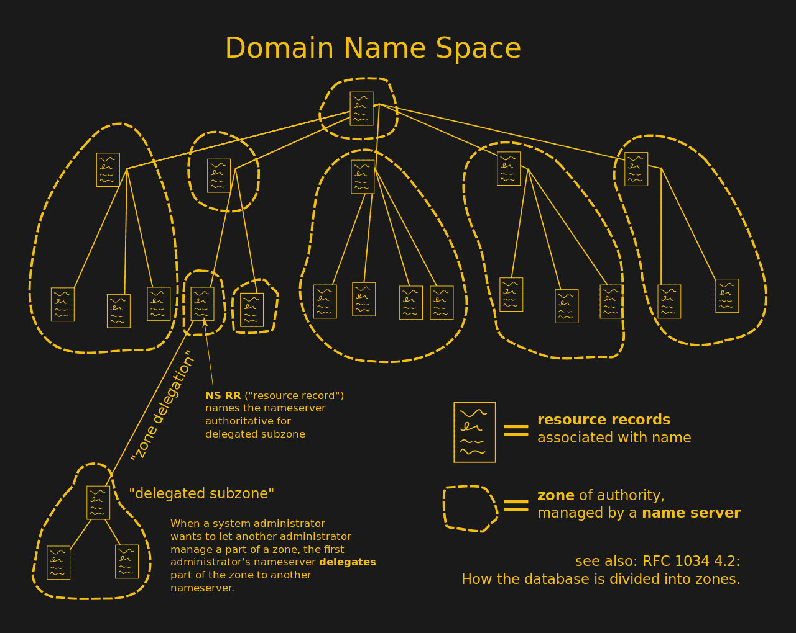
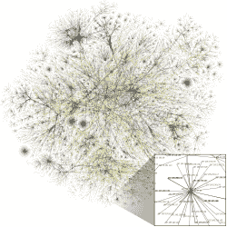
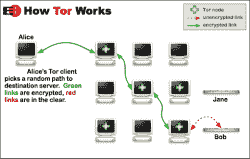

# HTTPS 域名系统是错误的部分解决方案

> 原文：<https://hackaday.com/2019/10/21/dns-over-https-is-the-wrong-partial-solution/>

自从互联网存在以来，开放性就一直是其定义特征之一，今天的许多流量仍然没有经过任何形式的加密。大多数对 HTML 页面和相关内容的请求都是纯文本的，得到的响应也是一样的，尽管 HTTPS 早在 1994 年就出现了。

但有时需要安全和/或隐私。虽然互联网流量加密在网上银行、购物中变得越来越普遍，但许多互联网协议的隐私保护方面并没有跟上步伐。特别是，当你通过主机名查找一个网站的 IP 地址时，DNS 请求几乎总是以纯文本的形式传输，这使得沿途的所有计算机和 ISP 都可以确定你浏览的是什么网站，即使一旦建立连接，你使用的是 HTTPS。

加密 DNS 请求的想法并不新鲜，最初的尝试始于 21 世纪初，以 DNSCrypt、DNS over TLS (DoT)等形式出现。Mozilla、Google 和其他一些大型互联网公司正在推动一种加密 DNS 请求的新方法:HTTPS DNS(DoH)。

DoH 不仅对 DNS 请求进行加密，而且还将其提供给“普通的”web 服务器，而不是 DNS 服务器，这使得 DNS 请求流量与普通的 HTTPS 基本上没有区别。这是一把双刃剑。虽然它保护 DNS 请求本身，就像 DNSCrypt 或 DoT 所做的那样，但它也使大公司负责安全的人无法监控 DNS 欺骗，并且它将关键网络功能的责任从操作系统转移到应用程序。它也不会隐藏你刚刚查询的网站的 IP 地址——毕竟你还是会去访问它。

与 DoT 相比，DoH 将你的浏览信息集中在几家公司:目前，Cloudflare 表示他们将在 24 小时内扔掉你的数据，而 Google 似乎打算保留你曾经想过要做的每一件事的每一个细节并将其货币化。

DNS 和隐私是重要的话题，所以我们将在这里深入探讨细节。

## 名称服务器和信任

[域名系统](https://en.wikipedia.org/wiki/Domain_Name_System)的概念可以追溯到其[阿帕网](https://en.wikipedia.org/wiki/ARPANET)时代，当时每个阿帕网节点上只有一个文本文件——称为主机。TXT–包含 ARPANET 上的系统名称到它们的数字地址的映射。当您自己编写这个文件时，很容易确定它是正确的。随着网络的发展，同时维护该文件的中央和本地副本变得不现实。到 20 世纪 80 年代初，人们开始努力创建一个系统来自动化这一过程。

第一个 DNS 名称服务器(Berkeley Internet Name Domain Server，或 [BIND](https://en.wikipedia.org/wiki/BIND) )是 1984 年由一群加州大学伯克利分校的学生编写的，基于 [RFC 882](https://tools.ietf.org/html/rfc882) 和 [RFC 883](https://tools.ietf.org/html/rfc883) 。到 1987 年，DNS 标准已经被修改了很多次，产生了 [RFC 1034](https://tools.ietf.org/html/rfc1034) 和 [RFC 1035](https://tools.ietf.org/html/rfc1035) ，从那以后基本上没有变化。

DNS 的基本结构是树状结构，其节点和叶子被细分为区域。 [DNS 根区域](https://en.wikipedia.org/wiki/DNS_root_zone)是顶级区域，由 13 个根服务器集群组成，形成权威的 DNS 根服务器。任何新设置的 DNS 服务器(例如，在 ISP 或公司)将最终从这些服务器中的至少一个获得其 DNS 记录。

每个进一步的 [DNS 区域](https://en.wikipedia.org/wiki/DNS_zone)向名称系统添加一个进一步的域。每个国家倾向于管理自己的域名，有特殊的域名(如。组织，。这些网站并不局限于由单独实体管理的任何特定国家。当使用 DNS 解析域名时，这意味着从域名开始(例如。com)，然后是名称(例如“google”)，最后是任何子域。如果所请求的数据还没有被缓存，这可能需要几次穿越 DNS 区域。

## DNSSEC:增加对 DNS 的信任

在我们开始加密 DNS 请求之前，确保我们与之对话的 [DNS 服务器是可信的](https://en.wikipedia.org/wiki/DNS_hijacking)是很重要的。这种需求在 20 世纪 90 年代变得清晰，最终形成了第一个可行的 [DNS 安全扩展](https://en.wikipedia.org/wiki/Domain_Name_System_Security_Extensions) (DNSSEC)标准( [RFC 2353](https://tools.ietf.org/html/rfc2535) )和修订后的 [RFC 4033](https://tools.ietf.org/html/rfc4033) (DNSSEC-bis)。

A map of the internet in 2006\. (Opte project, CC BY 2.5)

[DNSSEC](https://www.dnssec.net/) 的工作原理是用公钥加密对 DNS 查找记录进行签名。因此，DNS 记录的真实性可以通过 DNS 根区域的公钥来验证，在这种情况下，DNS 根区域是可信的第三方。域名所有者生成自己的密钥，由区域运营商签名并添加到 DNS 中。

虽然 DNSSEC 允许人们相对确定从 DNS 解析器获得的响应是真实的，但它确实要求在操作系统中启用 DNSSEC。不幸的是，很少有操作系统实现了不仅仅是“DNSSEC 感知”的 DNS 服务，这意味着它们实际上并不验证 DNS 响应。这意味着今天人们不能确定他们收到的 DNS 响应是真实的。

## 卫生部的问题

但是让我们假设你在用 DNSSEC。现在，您已经准备好对通信进行加密，以增加交易的隐私级别。让一个人的 DNS 查询对窥探的眼睛保密有许多动机。更无辜的原因包括躲避公司和 ISP 的过滤，防止跟踪一个人的上网习惯等等。更严重的动机包括避免因在互联网上表达自己的观点而受到政治迫害。自然，加密一个人的 DNS 查询可以防止人们窥探这些查询，但这忽略了 DNS 和其他通信协议的大多数更大的安全问题。

这里，主要的竞争者是使用 TLS 的 DoT 和使用 HTTPS 的 DoH。两者之间最明显的区别是它们运行的端口:DoT 有一个专用端口 TCP 853，而 DoH 在端口 443 上与其他 HTTPS 流量混合。这有一个值得怀疑的好处，即 DNS 查询根本不可区分，这意味着它取消了网络运营商(私人和企业)保护自己网络的选项，正如 DNS 背后的架构师之一 Paul Vixie，[去年在 Twitter](https://twitter.com/paulvixie/status/1053765281917661184) 上指出的那样。

第二个主要区别是，DoT 只是通过 TLS 连接发送 DNS 查询，而 DoH 本质上是 DNS-over-HTTP-over-TLS，这导致了它自己的 mime 媒体类型 *application/dns-message* 和显著增加的复杂性。通过将 DoH 与现有协议混合，这意味着每个 DNS 请求和响应都要通过 HTTPS 堆栈。对于嵌入式应用来说，这是一个噩梦般的场景，但它也与几乎所有现有的安全硬件不兼容。

DoT 的另一个优势是，它已经实现了，并且比 DoH 使用的时间长得多，有许多参与方，包括 [Cloudflare](https://developers.cloudflare.com/1.1.1.1/dns-over-tls/) ，Google，一些国家的 ISP 和标准 DNS 服务器软件，如 BIND 支持开箱即用的 DoT。在 Android Pie(版本 9，为那些保持跟踪的人)和更高版本上，如果选择的 DNS 解析器支持 DoT，默认情况下将使用 TLS 上的 DNS。

正当 DoT 最终获得牵引力时，为什么要转向 DoH 呢？通过让像 Firefox 这样的流氓应用绕过系统的基于点的 DNS，转而使用自己的基于 DoH 的 DNS 解析器，这导致了高度不透明的安全状况。正如我们现在看到的那样，DNS 解析将进入单个应用程序，这似乎是一个巨大的倒退。您知道每个应用程序使用哪个 DNS 解析器吗？如果它混在 TCP 端口 443 的流量中，你怎么知道呢？

## 加密不会停止追踪

HTTPS 域名系统背后的两大党派是 Cloudflare 和 Mozilla，后者制作了这个可爱的小卡通片,试图解释 DoH。不足为奇的是，他们完全没有提到 DNSSEC(尽管它在 RFC 8484 中被称为“至关重要的”)，而是提出了一种叫做可信递归解析器(TRR)的东西，这似乎基本上意味着“使用值得信赖的 DNS 解析器”，对于 Mozilla 来说，这意味着“Cloudflare”。

与 DoH 无关，他们提到了一个名为“QNAME minimization”的标准( [RFC 7816](https://tools.ietf.org/html/rfc7816) )，旨在减少 DNS 解析器发送给 DNS 的非关键信息的数量，正如[这篇 Verisign 博客文章](https://blog.verisign.com/security/minimum-disclosure-what-information-does-a-name-server-need-to-do-its-job/)所述。如前所述，该标准与 DoH 无关，甚至在没有任何 DNS 加密的情况下也能正常工作。像 DNSSEC 一样，它是 DNS 标准的进一步发展，提高了其安全性和隐私性。

问题出在“TRR 没有和卫生部一起解决什么问题？”节，但是。正如[专家](https://www.zdnet.com/article/dns-over-https-causes-more-problems-than-it-solves-experts-say/)多次指出的，加密 DNS 并不能防止跟踪。这样秘密解决的对 IP 地址的任何后续请求仍然清晰可见。每个人都会知道你在访问 Facebook.com，或者那个危险的持不同政见者网站。再多的 DNS 和互联网流量加密都无法隐藏对互联网这样的网络运行至关重要的信息。

## 未来互联网是单点故障？

Mozilla 对 IP 追踪问题的回答是本质上说没有问题，因为有[云](https://en.wikipedia.org/wiki/Cloud_computing)。随着越来越多的网站和内容分发网络(cdn)被集中到少数服务(Cloudflare、Azure、AWS 等)上。)，那单个 IP 的意义就变得越来越没有意义，你只要相信你挑的哪个云服务不偷你的数据，或者宕机一天。

今年，6 月 24 日发生了大规模的停机事件，当时威瑞森的[配置错误导致 Cloudflare、亚马逊、Linode 和许多其他公司在当天的大部分时间都不可用。今年 7 月 2 日，Cloudflare 作为一个整体](https://blog.cloudflare.com/how-verizon-and-a-bgp-optimizer-knocked-large-parts-of-the-internet-offline-today/)[宕机了大约半个小时](https://www.theregister.co.uk/2019/07/02/cloudflare_down/)，许多依赖其服务的网站也随之宕机。

巧合的是，微软的云托管 Office365 在同一天也出现了数小时的宕机，导致许多用户无法使用该服务。与此同时，在美国劳动节周末，AWS 的 US-East-1 数据中心的停电导致 1 TB 的客户数据消失，因为存储数据的硬件损坏了。显然，这个“互联网集中化是好事”的信息需要解决一些问题。

## 旧的又是新的

从很多方面来说，令人震惊的是，在整个关于隐私和跟踪的讨论中，没有提到虚拟专用网络(VPN)。这些解决了加密您的数据和 DNS 查询，隐藏您的 IP 地址等问题，只需移动您的电脑或其他互联网设备在互联网上的“存在”点。几十年来，VPN 一直被独裁政权中的持不同政见者非常普遍地用来绕过[的互联网审查](https://en.wikipedia.org/wiki/Internet_censorship)，以及像 [Tor network](https://en.wikipedia.org/wiki/Tor_%28anonymity_network%29) 这样的专门形式，是网络自由的一个关键要素。

如果一个人可以在 DoH 这样的方案中信任 Cloudflare 这样的大型商业实体，那么找到一个不会存储或出售你的数据的值得信赖的 VPN 提供商应该是一样容易的。更好的是，Opera 浏览器附带了一个免费的内置代理，它提供了 VPN 的许多好处。

简而言之，人们可以说 DoH 通过拙劣地做 DoT 已经做的事情来尊重它的缩写。更多的关注点应该是让 DNSSEC 和最小化点号和 QNAME 一起在任何地方被完全实现。如果你的目标是通过躲避追踪实现真正的隐私，那么你应该考虑 VPN，尤其是如果你是一个被困在某个独裁政权中的持不同政见者。