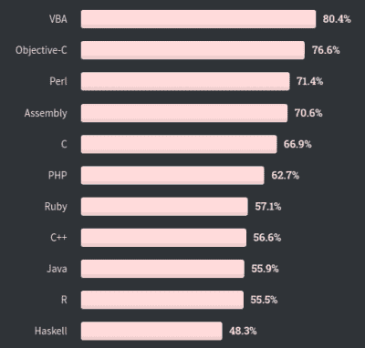

# PHP 有前途吗，或者 25 年足够了吗？

> 原文：<https://hackaday.com/2020/06/29/does-php-have-a-future-or-are-twenty-five-years-enough/>

1995 年 6 月，拉斯马斯·勒德尔夫在新闻组集团发表了一项声明。你还能[读到](https://groups.google.com/forum/m/#!msg/comp.infosystems.www.authoring.cgi/PyJ25gZ6z7A/M9FkTUVDfcwJ)。

25 年后的今天，PHP 已经变得无处不在。我敢打赌，对于本文的大多数读者来说，他们对 web 编程的第一次尝试涉及到了 PHP。

> 宣布个人主页工具(PHP 工具)1.0 版。
> 
> 这些工具是一组用 c 语言编写的小型紧密 cgi 二进制文件。

但是无论 PHP 拥有多么丰富的历史和广泛的用户基础，都不能成为它在一个快速发展的环境中使用的理由。虽然 PHP 将不可避免地出现在现有的应用程序中，但是它在新的站点中有前途吗？

在展望未来之前，我们必须首先调查 PHP 在过去是如何发展的。

## 开始

拉斯马斯·勒德尔夫最初创建 PHP 是为了跟踪访问他在线简历的用户。一旦源代码被发布，代码库被多次重写，PHP 开始流行起来，据报道，到 1998 年，1%的 T2 安装了 PHP。在这一点上，这种语言看起来一点也不像我们今天知道的。它完全是在`<!-- html comments -->`中写的，语法明显不同于现代版本。

Zeev Suraski 和 Andi Gutmans 尝试使用 PHP 建立业务，但发现它缺乏功能。与 Rasmus 合作，PHP 再次被重写并发布为 PHP 3.0。现在我们有所进展，PHP 3 安装在大约 10%的域名上。这也是 PHP 的意义从个人主页变成大家最喜欢的递归缩写“PHP:超文本预处理器”的点。这个版本和时期通常被认为是 PHP 巩固其未来地位的时期。在 PHP 3 和 4 之间，phpMyAdmin 被创建，Zeev 和 Andi 将他们的名字融合在一起，创建了 PHP 服务公司 Zend，古老的大象标志出现了。

剩下的就是历史了:PHP 4 之后不久 Drupal 就出现了；2003 年，我们有了 WordPress2004 年，哈佛来了一个叫马克的学生。

## 脸书和 PHP

脸书以 PHP 网站起家。但是当成千上万的用户变成数百万，数百万开始看起来像数十亿时，就有了成长的烦恼。

特别是，PHP 曾经是(现在仍然是)一种脚本语言。这对开发人员的工作效率来说很好，但对资源效率来说就不那么好了。所以在 2008 年，脸书开始为 PHP 开发 HipHop，一个 transpiler。非常简单，它解析 PHP，将其编译成 C++，然后将 C++编译成 x64。考虑到 PHP 是弱类型和动态的，这是一个不小的成就。但是结果不言自明:CPU 负载减少了 50%。

我敢肯定，你正在想象作为一名开发人员在脸书使用这种方法工作的恐惧。修改 PHP 代码，运行 transpiler，然后是编译器，敲敲你的手指，运行可执行文件，找到你需要回去修复的问题。这是一个相当长的迭代周期，这就是为什么脸书还开发了 HPHPi，一个与 transpiler/compiler (HPHPc)做相同工作的解释器，但只是用于开发。你可以想象，让两个项目保持同步是一件非常头疼的事情，因此在 2011 年，他们开发了 HipHop 虚拟机 HHVM。

HHVM 是一个 PHP 运行时。它使用 JIT (just-in-time)编译来提供两方面的优势。这很酷，如果你感兴趣的话，你可以在脸书自己的博客中了解更多。2014 年，随着专为 HHVM 打造的语言 Hack 的发明，迈出了下一大步。它既是 PHP 的超集又是子集，增加了可选的类型注释和额外的特性，比如异步架构。它还通过使用指定的类型提示使 HHVM 的 JIT 更加有效。很快，脸书公司的新代码以黑客形式编写，现有的代码随着时间的推移而被转换。 [Hack](https://github.com/facebook/hhvm/tree/master/hphp/hack) 和 [HHVM](https://github.com/facebook/hhvm) 都是开源的，今天还在积极维护。

脸书发现原生形式的 PHP 无法大规模使用，这是否意味着它是一门设计糟糕的语言？不，我不这么认为。我不相信当时存在的任何选择是为脸书所要求的规模或细节而创造的。然而，这并不能阻止人们用它来对抗 PHP。

## 仇恨

在更广泛的软件社区中，随着 PHP 变得越来越大，它不可避免地受到了越来越多的愤世嫉俗者的攻击。除此之外，客观地说，PHP 比大多数其他语言受到更多的憎恨。根据最近的 [2020 栈溢出开发者调查](https://insights.stackoverflow.com/survey/2020#technology-most-loved-dreaded-and-wanted-languages-dreaded)，PHP 是第六大令人恐惧的语言。为什么？

我不想在这里纠缠于技术细节，但是如果你这样做了， [PHP:糟糕设计的分形](https://eev.ee/blog/2012/04/09/php-a-fractal-of-bad-design/)，是 PHP 憎恨者的圣经博客。它写于 2012 年，其中提到的一些问题已经得到了解决，但许多问题仍未解决。(例如:为什么 2020 年没有原生异步支持？)

Stack Overflow 2020 survey of [most dreaded](https://insights.stackoverflow.com/survey/2020#technology-most-loved-dreaded-and-wanted-languages-dreaded) languages

我认为更普遍的问题在于语言的哲学。它是一个相当狭窄领域的工具，以一种复杂的方式实现。在理想的情况下，如果一个应用程序必须是复杂的，开发者应该在用户代码中看到这种复杂性，而不是语言本身。创建复杂的项目不需要复杂的工具。当我说 PHP 很复杂时，我并不是说它对初学者来说很难使用(事实上正好相反)，我是说它有不一致的命名约定和许多非常具体的函数，这两者都使得它很容易产生错误，直到运行时才被发现。但是这些仅仅是 PHP 时代的特性吗？虽然这可能是一个因素，但肯定不是仇恨的原因。毕竟，Python 创建于 1989 年，比 PHP 早六年，在栈溢出调查中名列第三，也是当今发展最快的语言之一。

谈到安全性，关于 PHP 站点上高于平均水平的漏洞数量是语言的错还是站点开发者的错，还存在一些争论。一方面，一种旨在吸引包括非程序员在内的广泛人群的编码语言总是会有问题，不管这种语言本身有什么优点。另一方面，PHP 试图以令人质疑的复杂方式修复基本的安全问题，例如首先用`escape_string()`修复 SQL 注入，然后通过添加`real_escape_string()`来修复漏洞，然后添加`addslashes()`、`mysql_escape_string()`、`pg_escape_string()`等等。将其添加到迷宫般的错误/异常处理中(是的，错误和异常是不同的)，如果您不精通该语言的细微差别，很容易出错。运行过时的、不受支持的 PHP 版本的网站数量仍然惊人的多，所以在未来的几年里，PHP 网站对黑客来说仍然是唾手可得的。

尽管如此，我并不认为这种语言的问题有很多人认为的那么大。尽管对 PHP 的抱怨有合理的理由，但在我看来，大部分耻辱是因为它的流行而被吸收的，而不是由个人推理的。

## 未来

这位作者很清楚在地址栏有`post.php`的页面中输入对该语言的评论具有讽刺意味。但这不是关于现有的网站。我不认为即使是最狂热的干草叉暴民会建议我们重写所有现有的 PHP 站点。问题是，2020 年 6 月，如果我要创建一个新网站，PHP 应该是我考虑的选项吗？

毫无疑问，当前的 web 开发趋势正在为单页面应用程序设定一条路线——在这种情况下，您的浏览器永远不会重新加载，而是通过 Javascript 使用来自闪电般速度的 API 调用的数据重新呈现页面来进行导航(例如:浏览 GitHub 或 Google Drive)。有一个不断增长的 Javascript 库、框架和工具的生态系统，用于在浏览器中构建反应式和高性能的应用程序——React 和 Vue 是最受欢迎的。

最终，PHP 是用于服务器端渲染的。这对大多数网站来说没问题，对许多人来说也是最好的选择。但是如果你在 2020 年建造新的东西，你必须接受这带来的限制。尽管 PHP 风格的服务器端渲染并没有消亡(大家都忘记 SEO 了吗？)，现代的站点很可能是同构的，也就是能够在服务器端和客户端渲染相同的 Javascript，使用 Next.js(对于 React)或者 Nuxt.js(对于 Vue)这样的框架，在服务器端把 PHP 淘汰出局。

但是我们不能忽视 PHP 也在发展的事实。自我宣传为“web 工匠的 PHP 框架”的 Laravel ，提供了一个安全快速创建 PHP 应用程序的 MVC 架构。它受到社会的高度尊重，并享有积极和快速的发展。此外，PHP 8 将于今年晚些时候发布，它有一系列新特性(其中许多在脸书部分看起来很熟悉)，比如 JIT、联合类型和改进的错误。

所以，祝你 25 岁生日快乐，PHP，你永远都是古怪的，而且毫无疑问还会持续很多年。你赋予了许多人权利，并在网络的崛起中发挥了关键作用。但是，如果人们正在其他地方寻找未来，也不要太沮丧，毕竟现在是 2020 年。