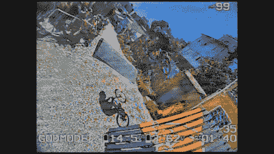

# 无人机拍摄智利的城市自行车赛需要一些奇特的无线电设备

> 原文：<https://hackaday.com/2022/04/27/drone-filming-chiles-urban-bike-race-takes-some-fancy-radio-gear/>

自数字硬件出现以来，无人机可能以最大的方式彻底改变了摄像世界。他们被用来拍摄那些不切实际或者完全不可能通过其他方式拍摄的照片。[荷兰无人机神]专门从事这类工作。当要在一个人口稠密的智利城市拍摄一场城市山地自行车赛时，他们必须使出一些厉害的技巧。

The FPV video feed was grainy, but good enough to keep the pilot on track. The drone carried a separate second camera for capturing high-quality footage of the run.

通常，在骑自行车的人后面运行无人机追踪摄像头需要一些良好的第一人称飞行技能和快速的无人机。然而，对于红牛瓦尔帕莱索塞罗阿巴霍城市速降赛来说，这还不够。狭窄的路线蜿蜒穿过厚厚的混凝土墙之间的楼梯，甚至穿过房屋，对保持信号完整性提出了巨大的挑战。没有清晰的视频信号，飞行员无法驾驶无人机不坠毁。

为了使这一切成为可能，该团队使用了各种技术来帮助对抗不合作的无线电环境。定向天线被用来瞄准球场的不同部分。此外，第二架无人机在赛道上空飞行，携带无线电中继器，有助于在建筑物阻挡飞行员信号的情况下，为跟踪骑手的相机无人机提供更好的视线接触。

即使做了所有这些工作，信号仍然不清晰，在某些地方会中断。然而，在穿越最糟糕的地区时，带着一点盲目的信念，[【荷兰无人机之神】](https://www.youtube.com/channel/UChZoJmuq8ymU88-wykIh9Nw)和【红牛】团队能够在 FPV(Thomas slav ik)跑下极其困难的城市道路时，一起拍摄到令人惊叹的他。

具体硬件的细节很少。然而，这是任何有经验的无人机制造商都可以轻而易举完成的事情。使用无人机中继器的想法特别令人兴奋，我们相信这可以帮助许多发现自己在困难的城市环境中工作的飞行员。

这些年来，我们已经看到了很多伟大的 FPV 故事，从 20 世纪 80 年代的早期实验到今天有趣的 DIY 驾驶舱建造。休息后的视频。

 [https://www.youtube.com/embed/13OtZFWdhwQ?version=3&rel=1&showsearch=0&showinfo=1&iv_load_policy=1&fs=1&hl=en-US&autohide=2&wmode=transparent](https://www.youtube.com/embed/13OtZFWdhwQ?version=3&rel=1&showsearch=0&showinfo=1&iv_load_policy=1&fs=1&hl=en-US&autohide=2&wmode=transparent)

