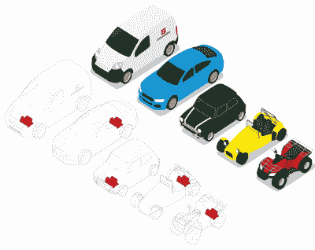

# 汽车转向电动汽车的动力下降

> 原文：<https://hackaday.com/2019/10/27/drop-in-motor-converts-car-to-ev/>

随着电动汽车的最新热潮，人们可能会很想买一辆旧的工程车，将它从燃气转换成电力。表面上看，这听起来很简单，但事实是有许多陷阱。如果你能找到一个现成的替换引擎就好了。根据[斯温顿的动力系统，你很快就能](https://swindonpowertrain.com/uk/news.aspx)。

基于他们现有的可以将 Mini 转换为 EV 的动力系统，横向动力系统重 70 公斤，如果它可以适合 Mini，它可能可以适合几乎任何东西。具体来说，它的宽度为 60 厘米，深度为 44 厘米，这意味着它可以轻松地放入一个大约两英尺的盒子中。高度可以小至 28 cm。该公司谈到将它安装在四轮自行车甚至装载平台上。它可以被认为是一种电动“板条箱发动机”——这是一个现成的安装动力装置的通用术语，顾名思义，它是装在板条箱里的。

 带有单速变速器、冷却系统和逆变器的动力系统重达 154 磅，可产生高达 110 马力的功率。我们不确定预期的电池组是什么，但据推测，它会有一些灵活性。

如果明年 6 月这些产品按计划上市，看看人们会如何整合它们将是一件有趣的事情。你会开差速器吗？你能使用两个或四个，每个驱动不同的车轮吗？原来我们可能只是汽车设计师。

如果你想看看他们用 Mini 做了什么，看看他们的经典款，号称最高时速 80 英里，续航里程 125 英里。我们已经看过了之前的[转换。如果转换不是你的事，你可以试着去](https://hackaday.com/2019/01/04/why-converting-classic-cars-to-electric-drive-is-a-thing/)[开源](https://hackaday.com/2014/06/11/open-source-electric-car-carben-produces-no-carbon/)，尽管那个项目看起来不是很活跃。