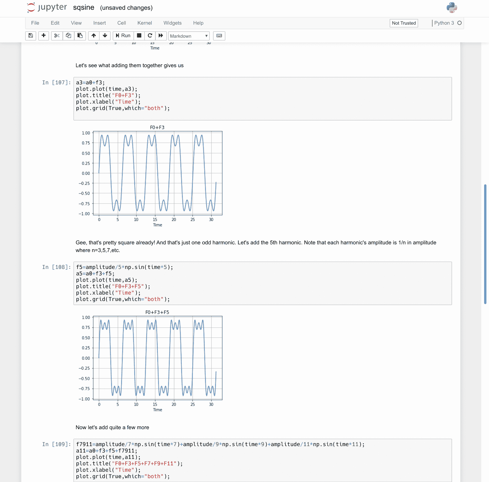
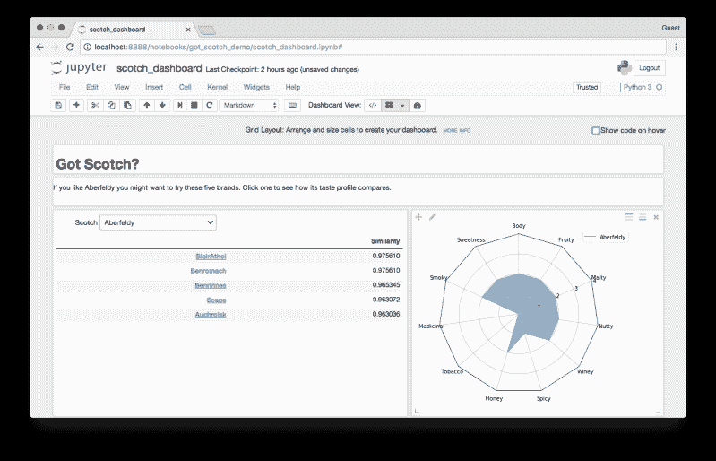
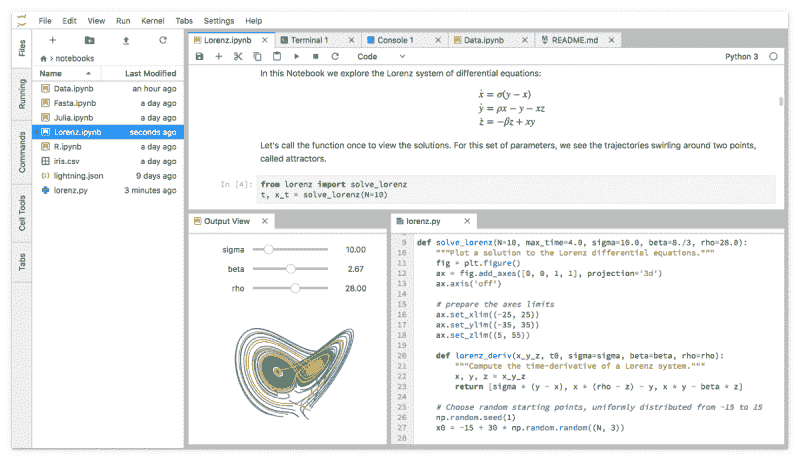

# Jupyter 笔记本点滴:信息时代如何记笔记

> 原文：<https://hackaday.com/2019/02/22/drops-of-jupyter-notebooks-how-to-keep-notes-in-the-information-age/>

我们的数字世界比它所取代的纸质世界更具互动性。这在 [Jupyter 笔记本](https://jupyter.org/)的特性中变得非常明显。重点是让你的数据变得美观、有条理、可交互、可共享。你只需要一点简单的编码就可以做到这一切。

我们已经通过从纸质电子表格转移到数字电子表格来利用计算机的能力，但是它们是有限的。我反复看到的一件事——偶尔也会为自己感到内疚——是滥用电子表格。也就是说，用一个电子表格程序来做一些我可能应该写一个程序来做的事情。当你想要一些快捷的东西，但不仅仅是电子表格时，你应该看看 Jupyter 笔记本。该系统通常与 Python 相关联，但它不是特定于 Python 的。有超过 [100 种语言](https://github.com/jupyter/jupyter/wiki/Jupyter-kernels)被支持——许多是社区开发的。你甚至可以为它安装一个 [C++解释器后端](https://github.com/QuantStack/xeus-cling)。由于客户端/服务器架构，与其他用户共享笔记本电脑非常简单。

理论上，你可以用 Jupyter 做任何你可以用 Python 做的事情。在实践中，人们似乎通过分析大型数据集、进行机器学习和类似的任务得到了很多锻炼。

## 优点:简单、强大、可扩展

这个想法很简单。想象一个支持 Markdown 的网页，它可以连接到一个后端(用 Jupyter 的话说，是一个内核)。后端可以在你的机器上运行，也可以远程运行，并且支持某种语言——通常是 Python。文档包含垂直排列的单元格(就像单个宽的电子表格列)。例如，我制作了一个简单的笔记本来解释一束正弦波如何叠加成方波:

[](https://hackaday.com/wp-content/uploads/2019/02/sqsine.png)

你可以在你的浏览器中试用[或者从](https://mybinder.org/v2/gh/wd5gnr/jupyter/master?filepath=sqsine.ipynb) [GitHub](https://github.com/wd5gnr/jupyter) 下载。您可以看到，您可以获得“实时”图形输出，以及文本和其他媒体。事实上，我没有很好地利用格式，但是您可以在文本单元格中使用 Markdown 做任何事情。

代码是非常标准的 Python。例如，这里有一个单元格:

```

a0=amplitude*np.sin(time);
plot.plot(time,a0);
plot.title(&quot;Fundamental&quot;);
plot.xlabel(&quot;Time&quot;);
plot.grid(True,which=&quot;both&quot;);

```

在文档的下面，您将看到您还可以部署小部件。例如，使用滑块来设置参数。我们一会儿将回到那个话题。除了小部件之外，您还可以获得允许您在网格中布局单元格的扩展。例如，这些通常用于创建如下所示的仪表板。事实上，有许多不同目的的[扩展](https://jupyter-contrib-nbextensions.readthedocs.io/en/latest/)。

[](https://hackaday.com/wp-content/uploads/2019/02/dashboards_intro.png)

## 缺点:支持非 Python 语言

非 Python 语言很难与 Jupyter 一起使用。我试着使用 C++解释器，发现开始有点困难。部分原因是因为 C++不喜欢增量运行——例如，重新定义事物使它不高兴。如果你想要 C++或 Fortran 或任何其他无数的选项，他们可能会或可能不会工作得很好。他们可能会也可能不会使用很多 Python 笔记本会用到的库。不要误解我。我还没有发现有完全不起作用的，但是比起使用 Python 内核，有时候还是不方便或者很难。

另一件让我感到奇怪的事情是，笔记本看起来最适合的任务并不总是它们最常用的。如果你仔细想想，笔记本实际上是一种文化编程的练习。然而，在我看来，大多数笔记本只是作为快捷的网络应用程序发送出去。当然，您可以共享页面的静态图像。您也可以共享只读版本。例如，GitHub 将在显示器上呈现一个笔记本。还有活页夹，可以让你分享一个互动版本。

Joel Bennet 做了他所谓的识字 devo PS——这类似于使用 Jupyter 和——最重要的——Powershell 进行识字编程。

 [https://www.youtube.com/embed/XssVyyLV9tg?version=3&rel=1&showsearch=0&showinfo=1&iv_load_policy=1&fs=1&hl=en-US&autohide=2&wmode=transparent](https://www.youtube.com/embed/XssVyyLV9tg?version=3&rel=1&showsearch=0&showinfo=1&iv_load_policy=1&fs=1&hl=en-US&autohide=2&wmode=transparent)


朱庇特不是魔法。它有助于快速构建具有特殊 web 界面的小 Python 应用程序。可能有不适合的项目。不是每个工作都需要锤子。不过，在你开始任何实质性的事情之前，做一点关于最佳实践的研究，你可以为自己省下一些悲伤。但是，你应该不断地问自己，是否有任何工具是给定工作的正确工具，而不是对所有事情都使用相同的工具。

## 丑陋的:Python 包管理

我发现这个系统依赖于 Python 很费力。我并不反对这种语言本身(尽管我个人更喜欢空白没有意义)。然而，确保 Python 拥有给定笔记本所需的一切往往是非常痛苦的。如果你计划分发，这就变成了确保每个人都有合适的包的另一层问题。在 Binder 上，你可以提供一个 requirements.txt 文件，告诉它你需要导入什么东西，所以这是可行的，但需要额外的步骤。

在本地安装程序的可靠方法是使用 Anaconda，当然，它创建了一个与普通 Python 环境完全不同的 Python 环境。是的，我知道 virtualenv。还有皮普。当然，我的 Linux 系统也有一个包管理器，它有 Jupyter 和所有 Python 库的版本。但是每个人都想用他们自己的包管理器来管理我的系统，我不知道该拿你的系统怎么办。

一旦你把它安装好了，就没问题了。如果你让它在 Binder 上工作，你应该很好，因为它为每个用户构建了一个新的 Docker 容器。然而，如果您真的打算分发复杂的笔记本，跨多个平台和 Python 版本的安装可能会带来风险。

## 小工具让它变得互动

如果您查看我的示例文档的最后两个代码单元(如上)，您将会看到我使用了一个 slider 小部件来让您交互式地调整等式和图表。这只是各种可用的小部件之一。

[](https://hackaday.com/wp-content/uploads/2019/02/slide.png)

如果你不挑剔，系统会为你建立一个功能的部件。您并不总是能够控制范围和步骤之类的事情，但是对于许多函数来说，您可以通过简单地调用 [interact](https://ipywidgets.readthedocs.io/en/stable/examples/Using%20Interact.html) 或者将它包含在函数中来获得一个合理的 UI:

```
@interact(x=True, y=1.0)
def g(x, y):
    return (x, y)
```

这将为 x 产生一个复选框，为 y 产生一个滑块。你会得到默认值，但在许多情况下，这是可以接受的。

## 最新的新闻

[](https://hackaday.com/wp-content/uploads/2019/02/jlab.png)

我一直在谈论传统笔记本，但下一代界面去年推出了。它被称为 JupyterLab，允许你使用其他工具，比如标签式界面中的编辑器。Binder 支持新的界面，如果你想让它快速旋转的话。

您可以使用新界面继续使用传统笔记本电脑，因此我们预计随着时间的推移，JupyterLab 的应用会越来越多。

## 所以…

应该用 Jupyter 吗？这就像问你是否应该使用锯子。如果你在砍柴，是的！如果你想把两块塑料连接起来，不，Jupyter 绝对适合这个利基市场——我们许多编写数学和数据密集型软件的人都在这个利基市场工作。事实上，您可以轻松地分发它，甚至可以与硬件接口，这使得它对于需要快速而强大的东西的项目很有吸引力。

虽然除了 Python 之外的一些语言是二等公民，但是有许多选择，您可以绕过任何限制。因此，即使你不是 Python 大师，你仍然会想把这个超级笔记本系统添加到你的工具箱中。