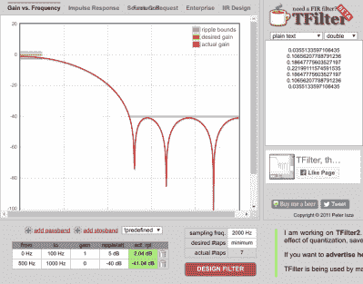
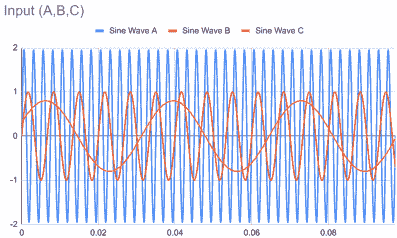
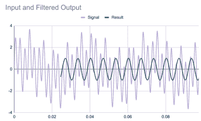

# dsp 电子表格红外滤波

> 原文：<https://hackaday.com/2019/10/03/dsp-spreadsheet-fir-filtering/>

有一句老话:告诉我，我会忘记，教我，我可能会记住，让我参与，我学习。我在很大程度上对此感到内疚——我从来不喜欢课堂学习。但是，如果我构建一些东西或编写一些代码，我更有可能理解它是如何工作的以及为什么。

像 Matlab 和 Jupyter 这样的电路仿真和软件工作簿对于能够在没有大量开销的情况下构建东西来说是非常棒的。但是这些都有一些学习曲线，并且经常使用巧妙的技巧、抽象或库调用来掩盖真正发生的事情。有时候，在电子表格中构建东西更容易。事实上，我经常做一些电路设计电子表格，甚至是数字设计，因为它迫使我创建一个数学模型，这反过来又帮助我理解真正发生了什么。

在本文中，我将使用 Google Sheets——尽管您可以在任何电子表格中使用相同的技巧——来生成一些数据，并对其应用有限脉冲响应(FIR)滤波器。当然，如果你有一个仪器的数据表，同样的技术也可以工作。

这是关于发展直觉和理解信号处理的系列文章的第一篇，主要使用电子表格。你可能不会从中获得太多的实际用途——尽管如果你将传感器的数据记录到电子表格中，并希望过滤读数，这可能是你的常用技术。出于需要，我们需要学习一些关于数学上产生信号的知识，但是由于这相当容易，我将把细节推迟到以后的文章中。然而，对于我们想要做的任何信号处理工作，我们都需要滤波器。我们有几种滤波器，这篇文章是关于 FIR 滤波器的。

## 关于罗斯福

FIR 代表有限脉冲响应，是一种看似神奇的数字滤波器。有很多方法可以解释它，但事实是:做一个非常简单。这个想法就是取一堆权重，把你的数据乘以权重，然后求和。权重被称为抽头，它们只是数字。抽头越多，过滤效果就越好。

举个愚蠢的例子，假设你有数据，你有 3 个抽头值:1.1，-0.035，0.336。这些值存储在一个名为 TAPS 的数组中，与另一个名为 DATA 的数组一起使用。要运行计算，请跳过前两个时间点(此计算必须有三个数据点)，并从第三个值开始计算:

```
FILTERED[2]=DATA[2]*TAPS[0]+DATA[1]*TAPS[1]+DATA[0]*TAPS[2]
```

就这样。即时过滤器。不过，有两件事。一是，真正的滤波器会有更多的抽头。这很简单。另一件事是我们从哪里得到点击的值？

原来[那完全是一篇文章](https://en.wikipedia.org/wiki/Finite_impulse_response)。然而，有一个简单实用的答案:请计算机为我们解答。有很多程序可以计算点击量，至少有一个名为 [t-filter](http://t-filter.engineerjs.com/) 的网站。

## 计算抽头的简单方法

让我们手算一个愚蠢的例子。打开 t-filter 网站，移至屏幕底部。首先要挑选的是采样频率。在这里输入 2000。我将保持较低的采样率，以使我们的电子表格更易于管理。

您可以将通带或阻带添加到左下角的表格中，但只需从“预定义”下拉列表中选择“低通”即可。该页面可能会要求您允许继续。你将得到一个普通的低通滤波器，单位增益高达 400 Hz，允许 5dB 的纹波。还有一个 500 赫兹至 1000 赫兹的阻带。由于采样速率为 2 kHz，超过一半是没有意义的。“期望点击次数”框应该已经显示了“最小”，这几乎总是你想要的，除非你想点击更少的次数。


将 400 Hz“至”频率更改为 100 Hz，并按下标有“设计滤波器”的红色大按钮您会看到右边有七个数字，以及一个滤波器响应图。在底部，你会看到它采取了 7 次点击和实际的波纹数字实现。

注意 100 赫兹和 500 赫兹之间的区域是“过渡带”过滤器不必满足该领域的任何目标。一般来说，过渡带越窄，需要的抽头就越多。例如，如果您将通带设置为 0 到 100 Hz，阻带设置为 110 Hz 到 1000 Hz，您将获得 203 个抽头(并且运行时间也很长)。

除了拍子之外，您还可以使用顶部附近的选项卡查看滤波器实现和脉冲响应的一些示例代码。

## 回到您的常规电子表格

如果你点击 t-filter 上的“源代码”标签，你会得到 C 代码，但这不是我们这次要找的。然而，我们可以很容易地在电子表格中映射计算。我在 Google Sheets 上做了一个电子表格。采样速率超过单元格 J1。前三行让你设置三个正弦波混合在一起。您可以在 B 栏中设置频率，在 F 栏中设置振幅，在 h 栏中设置相位。如果您不想要某个特定的频率，可以将其振幅设置为零。

 [](https://hackaday.com/2019/10/03/dsp-spreadsheet-fir-filtering/waveabc/)  [](https://hackaday.com/2019/10/03/dsp-spreadsheet-fir-filtering/filter-3/) 

在电子表格中，您会发现两个图表(如果您在小显示器上，您可能需要向右滚动)。第一个图表显示了三个信号——至少是前几个。

第二张图显示了三个信号的总和以及 g 列的滤波输出。该数据是根据 E 列的信号和 f 列的抽头计算的。您可以直接从 t-filter 站点复制并粘贴到 f 列。使用 INDIRECT 函数，工作表足够智能，无论有多少抽头，都可以计算出正确的值。这是如何工作的(这是来自 G 列的随机行):

```
=IF(ROW()<$J$3,"",SUMPRODUCT(INDIRECT($K$3),INDIRECT("E" & ((ROW()+1)-$J$2 & ":E" & ROW()))))
```

单元格$J$3 是可以有有效输出的第一行，所以如果我们比它早，答案是什么也没有。这让我们有足够的历史来完成所有点击的整个计算。

然而，如果这个单元格是一个活的单元格，我们将在$K$3 中得到间接引用。这是对滤镜拍子的引用，并根据您粘贴的内容动态更改。K3 的公式很简单:`="F5:F" & (J2+4)`

J2 是点击计数(使用计数功能),而 4 只是一个固定的偏移量，因为 F5 是第一次点击。在 J2 这里没有美元符号，因为我假设你不会复制这个公式，尽管它们不会造成伤害。但是，在前面的公式中，我们不希望电子表格相对于新位置调整 J2，所以那里需要美元符号。

相同的间接技巧计算 E 列中信号输入的范围。它从最早的样本开始，运行到当前样本，再次使用 J2 的长度。一旦设置了两个范围(抽头和原始数据)，简单地调用 SUMPRODUCT 就可以完成所有的计算。就是这样。真的就这么简单。唯一困难的部分是适应不同数量的水龙头。

我添加了几个标签，上面有不同滤波器的抽头:高通、低通和带通。使用默认信号(400 Hz、150 Hz 和 30 Hz)，您应该能够成功滤除每一个信号。

## 抓住一个波浪

电子表格的波形生成部分依赖于众所周知的公式:`y=A(t)*Sin(ωt+Φ)`这将是下一篇文章的主题。

在这个公式中，y 是输出，t 是时间，A(t)是时间 t 时的幅度(在我们的例子中是常数)，ω是以弧度/秒为单位的频率(以 Hz 为单位的频率乘以 2*π)，φ是以弧度为单位的相位。

如果您想了解当您试图输出高于两倍采样速率的信号时，混叠会产生什么影响，这就是您的机会。尝试在单元格 B1 中输入 2000 Hz，然后将相位更改为几个不同的值。

您可能认为您可以将电子表格导出到 Excel，并且您可以——在某种程度上。图形有点难看，但更糟糕的是，在 Excel 2007 和 Excel Online 中，间接函数阻塞了 G 列。半小时后，我发现有时(但只是有时)在间接调用中使用 ROW()会导致问题，但我最终放弃了。

顺便说一句，如果你对这种数字滤波的工作原理更感兴趣，你可能会比阅读来自[Lavry Engineering]的这篇非常直观的[论文](http://lavryengineering.com/pdfs/lavry-understanding-fir-filters.pdf)更糟糕。如果你喜欢你的过滤老派，看看我们的[不要害怕过滤器](https://hackaday.com/2017/03/08/dont-fear-the-filter-lowpass-edition/)功能，以及【比尔】采取通用[模拟过滤器](https://hackaday.com/2015/01/13/universal-active-filters-part-1/)。

下一个电子表格？内部信号生成。敬请关注。